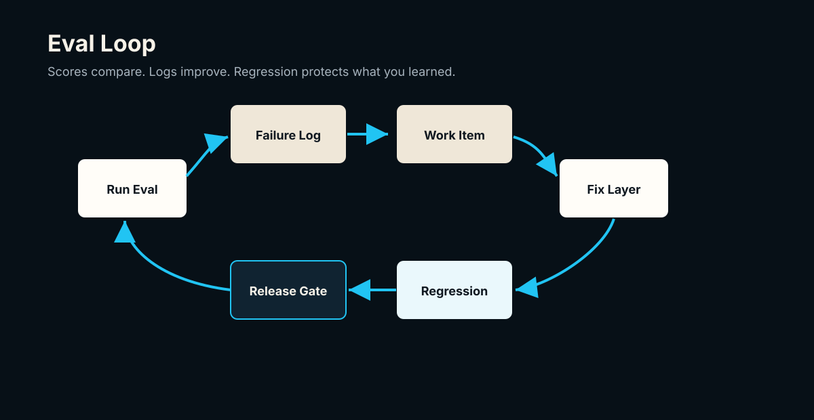

## Chapter 6: One Good Output Does Not Mean Your Prompt Works

### Learning promise

By the end of this chapter, you will be able to turn an encouraging prompt demo into a small, designed evaluation set. You will know what one successful output proves, what it does not prove, and how to define cases that expose the failures your product cannot afford to hide.

The most dangerous prompt test is the one that looks good.

You paste in one document. The model returns clean JSON. Most fields are right. The response parses. You feel momentum. That moment is useful: it proves the model can perform the task on that input under those conditions.

It proves nothing about the range of inputs your product will receive.

A prompt is not a fixed function in the ordinary software sense. Its behavior depends on the model, decoding settings, system instructions, source quality, document layout, surrounding context, and the exact mixture of easy and ambiguous evidence in the input. A single example samples one point from that space. Calling the prompt reliable from that point is like testing a boarding pass scanner with one pristine PDF and declaring that it handles travel documents.

The first-principles question is not, "Did this output look good?" It is, "What behavior must remain correct as relevant conditions change?"

For an airline-ticket extractor, relevant conditions include:

- a clean PDF and a compressed mobile screenshot
- one passenger and several passengers
- a visible terminal and a missing terminal
- city names that require airport-code normalization
- a rescheduled itinerary containing old and new flight details
- low-quality OCR that confuses `0` with `O`
- an email containing both a payment receipt and an itinerary
- a document in which a critical field is genuinely absent

This is why the first eval set should be designed, not merely sampled. Random production files can help later, especially for drift detection. At the beginning, random selection often gives you many easy cases and few cases that distinguish an honest extractor from a plausible guesser.

### The cumulative case: from demo to testable claim

We will use one airline-ticket workflow throughout the next five chapters. The source document begins as follows:

```text
Passenger: Riya Mehta
Booking Ref / PNR: H7K29Q
Flight: AI 202
Date: 12 Aug 2026
Departure: Delhi
Arrival: Bengaluru
Departure Time: 09:40
Terminal: not shown
Baggage: not shown
```

The first prompt run extracts the passenger, PNR, flight, date, route, and time correctly. It also returns `Terminal 3` and `15kg` of baggage. The output is complete, consistent, and wrong in exactly the way polished AI output is dangerous: the two unsupported values look ordinary.

If you test only the visible fields, this run appears successful. If you test the product behavior, the run fails. The extractor was asked to extract, but it inferred.

Turn that observation into a case:

```yaml
case_id: AIR-001
document_type: airline_ticket
layout_family: plain_text_itinerary
risk_tags:
  - missing_terminal
  - missing_baggage
  - normalization_required
expected_behavior:
  terminal:
    value: null
    status: not_present_in_document
  baggage:
    value: null
    status: not_present_in_document
  origin:
    raw_value: Delhi
    normalized_value: DEL
  destination:
    raw_value: Bengaluru
    normalized_value: BLR
must_not:
  - infer terminal
  - infer baggage allowance
```

Notice that the case specifies behavior, not just strings. It distinguishes absence from extraction failure, preserves raw values, checks normalization, and states forbidden behavior. That is an eval contract rather than a golden-output snapshot.

### Implementation pattern: a deliberately small matrix



Start with a matrix of risks and document conditions. Forty cases is a useful first target when you have enough source material, but the principle matters more than the number.

```python
from dataclasses import dataclass


@dataclass(frozen=True)
class EvalCase:
    case_id: str
    source_path: str
    risk_tags: tuple[str, ...]
    expected_route: str


CASES = [
    EvalCase("AIR-001", "fixtures/air-001.txt",
             ("missing_terminal", "missing_baggage"), "accept_with_warning"),
    EvalCase("AIR-002", "fixtures/air-002.png",
             ("low_quality_ocr", "critical_field_visible"), "extract_or_review"),
    EvalCase("AIR-003", "fixtures/air-003.pdf",
             ("multi_passenger", "entity_merge_trap"), "extract"),
    EvalCase("AIR-004", "fixtures/air-004.eml",
             ("old_and_new_itinerary", "stale_value_trap"), "review"),
]


def coverage(cases: list[EvalCase]) -> set[str]:
    return {tag for case in cases for tag in case.risk_tags}


REQUIRED_RISKS = {
    "missing_terminal",
    "low_quality_ocr",
    "entity_merge_trap",
    "stale_value_trap",
}

assert REQUIRED_RISKS <= coverage(CASES)
```

The assertion does not prove that the eval set is complete. It prevents a quiet regression in its design: removing the only case for a known risk without noticing.

Run the same cases more than once when model outputs are nondeterministic. A prompt that passes once and fails twice has different operational meaning from one that passes repeatedly. Store the model version, prompt version, pipeline version, and run identifier with every result. Otherwise, you cannot reproduce the behavior you are discussing.

### Establish the baseline before improving anything

The first run should capture the current workflow exactly as it exists. Resist the urge to repair every failure while you are still discovering it. A baseline preserves the behavior that motivated the eval, shows the starting distribution of failures, and gives later changes something honest to beat.

For every case, store the source by stable identifier, the complete configuration, the raw model response, the parsed response, validator results, and final product action. Sensitive source content still needs appropriate access controls; reproducibility is not permission to duplicate private data casually.

```yaml
run_id: baseline-ticket-v1-001
eval_set_version: airline_starter_v1
prompt_version: ticket_prompt_v4
model_id: configured_model_snapshot
pipeline_version: ticket_pipeline_v2
decoding:
  temperature: 0
case_results_path:
```

Record observations before interpreting them. For `AIR-001`, the observation is "terminal and baggage contain values despite no supporting source span." The hypothesis might be "the prompt rewards completeness." The fix may be a prompt rule, evidence validator, routing change, or all three. Keeping observation, hypothesis, and intervention separate prevents a clean story from outrunning the evidence.

Preserve clean passes too. When you add a do-not-infer rule, visible-terminal cases must still extract terminals. Improvement means correcting the target failure without sacrificing behavior the product already depends on.

### Reusable artifact: eval case intake card

Use this card whenever a demo, bug report, reviewer correction, or production incident suggests a new case:

```yaml
case_id:
source_artifact:
document_type:
layout_family:
included_because:
risk_tags: []
input_quality:
expected_route:
expected_behavior: {}
must_not: []
downstream_consequence_if_wrong:
ground_truth_owner:
last_reviewed:
```

The `included_because` field matters. An eval set should be legible as product memory, not a folder whose contents nobody can explain.

### Exercise: break your best example

1. Choose the single input you currently use to demonstrate your prompt.
2. List the assumptions that make it easy: format, language, entity count, image quality, fields present, and lack of ambiguity.
3. Create four variants, each changing one assumption.
4. For each variant, define the expected value, status, evidence requirement, and route.
5. Add one `must_not` rule that protects against a plausible but unsupported answer.
6. Run the current workflow and classify the failures without changing the prompt yet.

**Expected outcome:** a five-case starter set containing the original clean case and four purposeful challenges. You should be able to say which behavior each case protects and why a passing result would matter to the product.

### Common failure modes

**Collecting examples without expected behavior.** A folder of documents is test data, not yet an eval. Every case needs a decision about what should happen.

**Making every case an edge case.** You need clean expected-success cases too. They catch regressions caused by fixes aimed at difficult inputs.

**Treating exact JSON equality as truth.** Object ordering, optional metadata, and valid normalization can differ while product behavior remains correct. Compare typed fields and policies.

**Using synthetic cases as the entire set.** Synthetic cases are useful for targeted traps, but they do not replace messy source artifacts and reviewer-confirmed failures.

**Changing the prompt while labeling the data.** First capture the baseline. Otherwise, you erase evidence of the behavior that motivated the case.

One good output answers, "Can this work once?" A designed eval begins answering, "Does it behave correctly where it matters?" But that question still contains an unresolved word: *correctly*. The next chapter turns correctness from intuition into a product contract.

## Chapter 7: Ground Truth Is A Product Contract

### Learning promise

By the end of this chapter, you will be able to define ground truth as a versioned agreement about values, evidence, statuses, and actions. You will also be able to separate source transcription from normalization so that your eval does not punish valid transformations or reward lost evidence.

Ground truth is not merely "the correct answer."

It is the product's agreement about what counts as correct.

That distinction matters because documents rarely contain values in the exact representation a downstream system needs. A ticket may say `Delhi`; an itinerary API may require `DEL`. A date may appear as `12 Aug 2026`; a database may require `2026-08-12`. A terminal may be absent, which is different from unreadable, unknown, or not applicable.

From first principles, an extraction system makes several different claims:

1. **Source claim:** these characters or pixels appear in the document.
2. **Interpretation claim:** this source span represents a particular field.
3. **Normalization claim:** the source value maps to a canonical value under a named rule set.
4. **Evidence claim:** the result can be traced to the source.
5. **Decision claim:** the result is safe to accept, warn about, reject, or review.

Collapsing those claims into one string creates ambiguity. If the expected origin is `BOM` and the model returns `Mumbai`, did extraction fail? No. If the expected origin is `Mumbai` and the pipeline returns only `BOM`, did it succeed? Perhaps not; the raw evidence has been discarded.

The contract should preserve both.

### The cumulative case: specify the airline ticket

For `AIR-001`, the source gives us `Delhi` and `Bengaluru`. The product stores IATA codes, but it must retain the source text and the mapping used.

```json
{
  "field": "origin",
  "raw_value": "Delhi",
  "normalized_value": "DEL",
  "status": "normalized",
  "evidence": ["Departure: Delhi"],
  "normalization_source": "iata_airports_v2026_07"
}
```

Terminal requires a different contract:

```json
{
  "field": "terminal",
  "raw_value": null,
  "normalized_value": null,
  "status": "not_present_in_document",
  "evidence": [],
  "action": "accept_with_warning"
}
```

The empty evidence list is not an instrumentation omission. It is consistent with the claim that the field is absent. By contrast, a `supported` status with no evidence would violate the contract.

Now define field policy explicitly:

```yaml
document_type: airline_ticket
contract_version: gt_airline_ticket_v3
critical_fields:
  - passenger_name
  - pnr
  - flight_number
  - departure_date
  - origin
  - destination
reviewable_fields:
  - departure_time
  - terminal
optional_fields:
  - baggage
do_not_infer:
  - pnr
  - terminal
  - baggage
normalization:
  origin: iata_airports_v2026_07
  destination: iata_airports_v2026_07
```

This contract does more than label an answer key. It states what the system owes the user. A missing PNR blocks acceptance. A missing baggage allowance does not. An absent terminal must not be fabricated. A city name may be normalized, but the source value must survive.

### Implementation pattern: validate invariants, not appearances

Represent ground-truth fields as typed records and validate relationships among their properties.

```python
from dataclasses import dataclass, field
from typing import Literal

Status = Literal[
    "supported", "normalized", "not_present_in_document",
    "unreadable", "ambiguous", "requires_review"
]


@dataclass(frozen=True)
class TruthField:
    raw_value: str | None
    normalized_value: str | None
    status: Status
    evidence: tuple[str, ...] = field(default_factory=tuple)
    normalization_source: str | None = None

    def validate(self) -> None:
        if self.status in {"supported", "normalized"} and not self.evidence:
            raise ValueError("Supported values require source evidence")
        if self.status == "normalized" and not self.normalization_source:
            raise ValueError("Normalized values require a versioned source")
        if self.status == "not_present_in_document" and self.raw_value is not None:
            raise ValueError("Absent fields cannot carry a raw value")
```

These invariants catch contradictions before a model is scored. They also make policy changes visible. If the team later decides that terminal absence must route to review, the expected `action` changes even though the source document does not.

That is why ground truth needs versions. At minimum, store:

```yaml
ground_truth_version: gt_airline_ticket_v3
schema_version: ticket_extraction_v2
review_policy_version: review_rules_2026_07
normalization_data_version: iata_airports_v2026_07
```

Do not silently relabel old cases after a policy change. Create a new version, record the reason, and rerun the baseline. Otherwise, a score change may reflect a changed definition rather than a changed system.

### Adjudicate the contract, not the model output

Ground-truth work should be source-first. The adjudicator sees the document, field definition, and product policy before candidate outputs whenever practical. Otherwise, a polished candidate can anchor the reviewer toward its wording.

Use a consistent sequence:

1. Locate the exact source span or establish that none exists.
2. Transcribe the raw value without normalization.
3. Apply the named normalization rule, if one exists.
4. Assign the evidence status.
5. Apply missing, ambiguity, and review policy.
6. Record any unresolved interpretation as a contract question.

For `AIR-001`, this produces `Delhi` first and `DEL` second. For terminal, it produces no source span, a `null` raw value, and `not_present_in_document`. The adjudicator must not reason from knowledge of typical airline terminals because terminal is a do-not-infer field.

When two reviewers disagree, capture why:

```yaml
disagreement:
  category: policy_ambiguity
  reviewer_a: not_present_in_document
  reviewer_b: unreadable
  source_observation: document explicitly says "Terminal: not shown"
  adjudicated_label: not_present_in_document
  contract_change_required: false
```

Other useful categories include source ambiguity, transcription error, normalization conflict, field-definition ambiguity, and review-policy ambiguity. Their rates reveal which parts of the contract need clearer examples.

The goal is not to eliminate judgment by pretending every document is obvious. The goal is to make judgment inspectable, repeatable, and connected to a product decision.

That discipline protects future reviewers. They can reconstruct why a label exists without relying on the memory of the person who created it.

### Reusable artifact: ground-truth decision record

Use one record for every field whose interpretation could reasonably be disputed:

```yaml
field:
contract_version:
source_example:
raw_value:
normalized_value:
allowed_statuses: []
evidence_required: true
do_not_infer: false
missing_value_action:
ambiguity_action:
normalization_source:
downstream_use:
decision_owner:
decision_reason:
examples_of_acceptable_output: []
examples_of_unacceptable_output: []
revisit_when:
```

The record turns reviewer disagreement into a resolvable product question. If two careful reviewers choose different answers, do not average their opinions and call that truth. Inspect the contract. The disagreement may reveal unclear source evidence, an undefined normalization rule, or a missing policy state.

### Exercise: adjudicate one ambiguous field

1. Choose a field your team has corrected inconsistently.
2. Write the source value exactly as shown.
3. List all representations that could plausibly be returned.
4. Separate raw extraction from normalization.
5. Define what happens when the field is absent, unreadable, and ambiguous.
6. State whether inference is allowed and what evidence is required.
7. Assign versions to the field contract, review policy, and normalization source.
8. Ask another reviewer to apply the rule without additional explanation.

**Expected outcome:** a decision record that leads two reviewers to the same result on at least three examples: present, absent, and ambiguous. Any remaining disagreement should be expressible as a specific contract question rather than "it looks right to me."

### Common failure modes

**Treating the model's most common answer as truth.** Frequency is not evidence. Ground truth comes from source inspection and product policy.

**Keeping only normalized values.** This destroys the trail needed to determine whether extraction or lookup logic failed.

**Using `null` for every uncertain state.** `not_present`, `unreadable`, `ambiguous`, and `not_applicable` require different product actions.

**Changing labels without versioning.** You can no longer compare runs or explain why a previously passing case fails.

**Ignoring reviewer disagreement.** Disagreement is often a diagnostic signal that the product contract is incomplete.

Ground truth defines correctness, but a correct/incorrect label is still too coarse to guide engineering. The next chapter classifies failures by what went wrong, where it went wrong, and how much the product should care.

## Chapter 8: Not All Extraction Errors Are Equal

### Learning promise

By the end of this chapter, you will be able to build an error taxonomy that distinguishes product risk from technical cause. You will know how to route failures to the layer that can actually fix them instead of turning every bad result into another prompt edit.

Accuracy hides risk.

Suppose an airline-ticket eval contains ten fields and the system gets nine right. The dashboard reports 90 percent accuracy. That number is mathematically valid and operationally incomplete.

Which field failed?

A missing optional meal preference may have no downstream consequence. A wrong PNR may attach the itinerary to the wrong booking. A hallucinated baggage allowance may create a customer-facing promise the source never made. A wrong terminal may send a traveler to the wrong place. Four errors can each subtract one point from accuracy while carrying radically different costs.

First principles give us two axes:

- **Severity:** what happens to the user or workflow if this failure reaches production?
- **Failure type:** what relationship between source, output, and policy was broken?

Severity helps decide whether to block, warn, or tolerate. Failure type helps decide what to fix. Do not combine them into a single vague label such as `incorrect`.

### The cumulative case: classify what the clean JSON concealed

Return to `AIR-001`. The extractor returns the correct PNR, route, date, and passenger. It invents terminal and baggage. It also emits `DEL` and `BLR` without preserving `Delhi` and `Bengaluru`.

There are at least three failures:

```yaml
failures:
  - field: terminal
    error_type: unsupported_inference
    severity: high
    owning_layer: evidence_gate_and_routing_policy
  - field: baggage
    error_type: unsupported_inference
    severity: high
    owning_layer: evidence_gate_and_routing_policy
  - field: origin
    error_type: raw_value_loss
    severity: medium
    owning_layer: output_schema
```

Calling all three "wrong extraction" would send the team toward the prompt. That would be a poor diagnosis. The model may need clearer instructions, but the durable fixes belong in different places: a do-not-infer policy and evidence gate for terminal and baggage; a schema requirement for raw and normalized values; a versioned lookup layer for airport codes.

The owning layer matters because a better prompt does not fix a stale lookup table. A model upgrade does not fix a reviewer policy that rewards completion. A schema validator does not detect that the wrong passenger's PNR was attached to the right passenger.

### Implementation pattern: classify error, severity, and owner separately

Define a controlled taxonomy instead of allowing free-text labels.

```yaml
error_types:
  missing_supported_value:
    default_owner: extraction
  unsupported_inference:
    default_owner: evidence_policy
  wrong_extraction:
    default_owner: extraction
  field_swap:
    default_owner: extraction_schema
  multi_entity_merge:
    default_owner: segmentation
  normalization_error:
    default_owner: normalization_data
  raw_value_loss:
    default_owner: output_schema
  evidence_missing:
    default_owner: evidence_linker
  review_policy_mismatch:
    default_owner: review_policy
  routing_error:
    default_owner: workflow_policy
  stop_condition_error:
    default_owner: workflow_policy

severity_levels:
  critical: unsafe final decision or wrong entity
  high: customer-visible or operationally damaging
  medium: recoverable degradation or traceability loss
  low: optional presentation issue with no decision impact
```

Then produce a failure record at evaluation time:

```python
from dataclasses import dataclass
from typing import Literal

Severity = Literal["critical", "high", "medium", "low"]


@dataclass(frozen=True)
class EvalFailure:
    case_id: str
    field: str
    error_type: str
    severity: Severity
    owning_layer: str
    expected: object
    actual: object
    evidence: tuple[str, ...]
    downstream_consequence: str
```

Keep `severity` explicit even if each field has a default. Context can change risk. A missing departure time might be medium severity in an archival itinerary and critical in an airport-transfer workflow. The field name alone cannot carry the whole product decision.

Useful aggregate views follow from this structure:

```text
Failures by severity
Failures by error type
Failures by owning layer
Critical failures by document layout
Unsupported inference by field
Normalization failures by lookup-table version
Reviewer overrides by contract version
```

Those views convert an eval from a verdict into an engineering queue. If unsupported inference clusters around absent fields, strengthen evidence and stop policies. If normalization errors cluster after a data update, inspect the lookup layer. If multi-entity merges cluster in group bookings, segment entities before extraction.

### Confirm the root cause before assigning the fix

An owning layer is a routing hypothesis, not proof. Confirm it with a targeted experiment. If origin normalization is wrong, inspect the raw extraction. When the raw value matches the source and only the canonical code is wrong, rerun the normalizer with the same value and lookup version. That isolates the data layer without another model call.

For unsupported terminal inference, test the layers in sequence:

```text
1. Did OCR or native parsing contain a terminal value?
2. Did the extractor return a terminal without evidence?
3. Did the evidence validator reject or accept it?
4. Did routing call fallback after evidence was known to be absent?
5. Did final-decision logic allow the value through?
```

One visible failure can expose several defects. A prompt may produce an unsupported value, the validator may miss it, and routing may compound the error with fallback. Fixing only the prompt leaves the system fragile to the next model version.

Turn confirmed cause into a behavioral work item:

```yaml
title: Block unsupported values for absent do-not-infer fields
source_case: AIR-001
confirmed_layers: [evidence_validator, routing_policy]
acceptance_criteria:
  - terminal and baggage are null when source evidence is absent
  - no fallback runs for those fields
  - visible terminal values still extract with evidence
verification_cases: [AIR-001, AIR-005-visible-terminal]
```

This is more durable than "improve hallucinations." It names the broken decision, protects the clean path, and creates a finite regression check.

Once verified, update the failure record with the confirmed cause without replacing the original observation. The history shows how the team learned.

### Reusable artifact: failure triage card

```yaml
failure_id:
case_id:
run_id:
field:
error_type:
severity:
owning_layer:
expected:
actual:
source_evidence:
downstream_consequence:
reproducible: true
suspected_root_cause:
proposed_fix:
regression_case:
owner:
status:
```

Use the card after classification, not in place of investigation. `suspected_root_cause` should remain a hypothesis until a targeted check confirms it.

### Exercise: decompose a score

1. Take ten recent failed fields or create ten representative failures from your starter eval.
2. Label each with error type, severity, owning layer, and downstream consequence.
3. Group them by error type and by owner.
4. Identify the largest group and the highest-severity group. They may not be the same.
5. Choose one systemic fix for each group.
6. Add a regression case for the highest-severity failure.
7. Recalculate the result using both flat field accuracy and counts by severity.

**Expected outcome:** a triage table that makes at least two different priorities visible: the most frequent problem and the most dangerous problem. You should also have one assigned, testable work item whose owner is a pipeline layer rather than the generic label "AI."

### Common failure modes

**Inventing dozens of overlapping labels.** A taxonomy that reviewers cannot apply consistently becomes decorative metadata. Start with a compact list and add a class only when it changes diagnosis or action.

**Encoding cause in severity.** `critical` says how much the failure matters, not why it happened.

**Blaming every failure on the model.** Inspect OCR, parsing, segmentation, schemas, evidence linking, normalization data, routing, and review policy.

**Prioritizing only by frequency.** A rare wrong-entity error may deserve attention before hundreds of harmless formatting differences.

**Recording failures without regression cases.** The taxonomy should create controlled improvement, not a better-written incident archive.

An error taxonomy tells you what broke and what it could cost. It still does not tell you whether the system, as a whole, is better. The next chapter replaces the one-number leaderboard with a decision-oriented scorecard.

## Chapter 9: Accuracy Alone Is Not An Eval Strategy

### Learning promise

By the end of this chapter, you will be able to choose metrics from the decision an eval must support. You will build a scorecard that keeps critical correctness, unsupported inference, evidence coverage, and workflow behavior visible instead of hiding them inside one average.

Accuracy is a starting point. It is not a strategy.

A strategy answers a decision question. Are you selecting a default model? Deciding whether a prompt change can ship? Testing whether fallback recovers critical fields? Measuring whether a new evidence gate reduces unsupported inference? Detecting production drift?

Each decision needs different evidence.

Flat field accuracy calculates the proportion of fields that meet a correctness rule. It is useful because it is simple and comparable. It is weak because it assumes each field and each error contributes equally. The moment your product has critical fields, optional fields, abstentions, evidence requirements, or human review, that assumption fails.

From first principles, an eval metric should preserve the distinction that matters to the decision. If unsupported inference is a release blocker, do not average it away. If review capacity is limited, measure escalation. If normalization is a separate layer, score extraction and normalization separately.

### The cumulative case: two systems, one misleading winner

Evaluate two versions of the airline-ticket workflow on the designed set:

```text
System A
Field accuracy: 95%
Critical-field accuracy: 98%
Unsupported inference rate: 8%
Evidence-link coverage: 76%
Schema validity: 100%

System B
Field accuracy: 92%
Critical-field accuracy: 97%
Unsupported inference rate: 1%
Evidence-link coverage: 99%
Schema validity: 99.5%
```

System A wins the flat leaderboard. System B may be the better product system.

On `AIR-001`, System A fills terminal and baggage and receives credit under a completion-oriented scorer. System B returns `not_present_in_document`, preserves raw route values, and links supported fields to source spans. If the product contract says terminal and baggage are do-not-infer fields, System A has not won. The scoring policy has rewarded the wrong behavior.

The eval should therefore expose a vector of measures rather than manufacture a universal number:

- critical-field correctness
- optional-field correctness
- unsupported inference rate
- evidence-link coverage
- schema validity
- raw-value preservation
- normalization correctness
- review escalation rate
- fallback recovery and fallback damage
- routing and stop-condition correctness

A team may create a weighted summary for sorting experiments. That summary must not erase hard constraints. A system with one unsupported PNR can fail the release gate even if its weighted score is higher.

### Implementation pattern: metrics plus invariants

Separate continuous metrics from non-negotiable policies.

```yaml
decision: choose_candidate_for_shadow_run

metrics:
  critical_field_accuracy:
    direction: maximize
  optional_field_accuracy:
    direction: maximize
  evidence_link_coverage:
    direction: maximize
  normalization_correctness:
    direction: maximize
  review_escalation_rate:
    direction: observe

hard_constraints:
  schema_validity: ">= 0.995"
  unsupported_inference_on_critical_fields: "== 0"
  wrong_entity_assignments: "== 0"
  required_regression_cases: "all_pass"
```

Implement the constraints as code, not dashboard color conventions:

```python
def gate(metrics: dict[str, float], regressions_pass: bool) -> list[str]:
    failures: list[str] = []
    if metrics["schema_validity"] < 0.995:
        failures.append("schema_validity")
    if metrics["critical_unsupported_inference"] != 0:
        failures.append("critical_unsupported_inference")
    if metrics["wrong_entity_assignments"] != 0:
        failures.append("wrong_entity_assignments")
    if not regressions_pass:
        failures.append("required_regressions")
    return failures
```

The result should say *why* a candidate failed. `release_score: 81` is not an operational explanation. `blocked by one wrong-entity assignment in AIR-037` is.

Use denominators carefully. Evidence-link coverage should normally apply to fields whose statuses claim support or normalization, not to fields correctly marked absent. Unsupported inference rate should report the number of inferred unsupported values over opportunities to infer, with field and severity slices. Every rate should be reconstructable from stored case-level results.

### Define every metric as a reproducible query

A metric name is not a definition. Two teams can report "field accuracy" while one excludes absent fields, the other counts correct abstentions, and neither notices the mismatch. For each metric, write the unit, eligible population, numerator, denominator, treatment of missing results, and required slices.

```yaml
metric: evidence_link_coverage
unit: field
eligible_population:
  statuses: [supported, normalized]
numerator: eligible fields with at least one valid source span
denominator: all eligible fields
missing_case_result: exclude_and_report
slices: [field, severity, layout_family]
```

For unsupported inference, report both count and rate. The count preserves the absolute number of unsafe outputs. The rate supports comparison across differently sized runs. Keep both visible, especially when the eval set changes.

Repeated-run ranges can help when model behavior varies, but statistical language must not create false certainty. Forty designed cases provide strong diagnostic value and weak evidence about exact production prevalence. State what the set represents: known risks, representative layouts, or a sampled production window.

Metrics also need interpretation. A lower review rate may mean automation improved, or it may mean the workflow stopped escalating uncertainty. Pair it with correction rate, critical escape count, and routing correctness. Higher completion may mean better extraction or more unsupported inference.

Retain case-level records beneath every chart. When a metric moves, the team should be able to answer which cases moved and whether the change reflects product improvement, data relabeling, or run variation.

Always compare against a baseline that represents a real alternative:

- the current production workflow
- parser and rules only
- the current model without fallback
- a smaller model with deterministic gates
- manual review for the fields being automated

Define the baseline before the leaderboard. Otherwise, you can crown a winner without showing that it improves on what users already have.

Read the worst cases as well as the summary before promoting a candidate. Averages describe the set; individual severe failures determine whether the workflow has earned trust for the decision in front of you.

### Reusable artifact: decision-oriented eval brief

```yaml
eval_name:
decision_to_make:
candidate_changes: []
baseline:
eval_set_version:
contract_versions: []
primary_metrics: []
diagnostic_metrics: []
hard_constraints: []
slices:
  - document_type
  - layout_family
  - risk_tag
  - field_severity
minimum_evidence_for_decision:
known_blind_spots: []
decision_owner:
```

Write this before running the comparison. It prevents choosing metrics after seeing which candidate they favor.

### Exercise: design a scorecard backward from a decision

1. Write one decision your next eval must support.
2. Name the current baseline and the candidate change.
3. Select no more than five primary metrics that directly inform the decision.
4. Add diagnostic metrics that explain failures without deciding the release by themselves.
5. Define at least two hard constraints.
6. Choose slices that could reveal a hidden regression.
7. Apply the scorecard to a hypothetical candidate with higher accuracy but worse unsupported inference.

**Expected outcome:** a one-page eval brief that produces a defensible `adopt`, `continue testing`, or `reject` decision. Another reader should be able to explain why the decision follows from the metrics and constraints without relying on your intuition.

### Common failure modes

**Optimizing the metric after seeing results.** This turns evaluation into justification. Define the decision and rules first.

**Building one composite score too early.** Weighting creates apparent precision and can hide release-blocking behavior.

**Reporting only overall averages.** Slice by risk, layout, entity count, and field severity to expose concentrated failures.

**Ignoring abstention quality.** A system that marks unsupported fields absent may have lower completion and higher trust.

**Comparing candidates without a real baseline.** Model A beating Model B does not show that either improves the product workflow.

The scorecard now reflects correctness and risk. Yet a technically strong workflow can still be unusable if each document is slow, expensive, or labor-intensive. The next chapter adds the operating cost of trust to the eval.

## Chapter 10: Cost, Latency, And Review Effort Belong In The Eval

### Learning promise

By the end of this chapter, you will be able to evaluate an AI workflow as an operating system rather than a model benchmark. You will connect quality to model cost, end-to-end latency, fallback use, and human correction effort, then choose a workflow that can sustain the trust level your product requires.

An AI workflow can be accurate and still be wrong for the product.

If it takes too long, costs too much, or sends too much work to review, it may not survive real use. This does not mean cheap and fast always wins. It means cost, latency, and review effort are part of the product contract rather than cleanup work after model selection.

The first-principles unit is not the price of one model call. It is the cost of reaching one acceptable final decision.

That cost can include:

- document parsing and OCR
- default-model input and output tokens
- retries after schema failure
- fallback calls
- deterministic lookups
- queueing and end-to-end latency
- reviewer time
- second review after disagreement
- correction and reprocessing
- support or operational handling when a wrong value escapes

A cheaper call can produce a more expensive workflow if it escalates many documents. A larger model can reduce review but still be wasteful on easy cases. A fallback can improve critical-field recovery or simply add latency before the same review decision.

Human review is not free because it does not appear on the model invoice. It consumes attention, training, tooling, and quality control. More importantly, review effort is not binary. Checking one highlighted field with evidence is different from reconstructing an entire itinerary from a poor scan.

### The cumulative case: measure the workflow around AIR-001

Compare three setups across the designed airline-ticket set:

```text
Setup A: small model only
Critical-field accuracy: 94%
Unsupported inference: 6%
Average model cost: low
p95 latency: low
Review rate: 31%

Setup B: large model only
Critical-field accuracy: 97%
Unsupported inference: 3%
Average model cost: high
p95 latency: medium
Review rate: 17%

Setup C: small model, evidence gate, targeted fallback
Critical-field accuracy: 97%
Unsupported inference: 1%
Average model cost: medium
p95 latency: medium
Review rate: 11%
```

Setup C appears promising, but the aggregate is not enough. On `AIR-001`, the evidence gate should recognize that terminal and baggage are absent and do-not-infer. Calling fallback cannot create missing evidence, so the correct action is to stop and accept with warning. If Setup C calls fallback anyway, it adds cost and latency while increasing hallucination risk.

On a different case, `AIR-002`, low-quality OCR may omit a visible flight number. OCR repair or targeted fallback can access better evidence and prevent review. The same extra step that is wasteful for `AIR-001` may be valuable for `AIR-002`.

The operating question is therefore not "Is fallback expensive?" It is "For which evidence states does fallback improve the final decision enough to justify its cost and delay?"

### Implementation pattern: a per-document workflow ledger

Capture cost and timing at every stage, then connect them to quality and final action.

```json
{
  "run_id": "run-2026-07-15-0042",
  "case_id": "AIR-001",
  "pipeline_version": "ticket_pipeline_v5",
  "stages": [
    {"name": "ocr", "latency_ms": 180, "cost_usd": 0.002},
    {"name": "default_extraction", "latency_ms": 920, "cost_usd": 0.006},
    {"name": "evidence_gate", "latency_ms": 12, "cost_usd": 0.0}
  ],
  "fallback_used": false,
  "stop_reason": "do_not_infer_field_absent",
  "review_required": false,
  "final_decision": "accept_with_warning",
  "quality": {
    "critical_fields_correct": true,
    "unsupported_inference_count": 0
  }
}
```

For reviewed cases, add a structured review record:

```yaml
review:
  fields_presented: 2
  evidence_pre_highlighted: true
  queue_wait_ms: 180000
  active_review_ms: 42000
  corrected_fields: 1
  reviewer_disagreement: false
  outcome: corrected_and_accepted
  correction_reason: low_quality_ocr
```

Measure both queue time and active review time. Queue time shapes user latency; active time shapes staffing cost. Also track fields presented. A 20 percent document review rate can represent very different workloads depending on whether reviewers inspect one uncertain field or every extracted value.

Calculate expected cost per acceptable document, not merely average inference cost:

```text
expected operating cost
= model and infrastructure cost
+ review probability x average active review cost
+ reprocessing probability x average reprocessing cost
+ estimated escape handling for measured failure classes
```

The final term is difficult to estimate and should not be fabricated. Where reliable business data does not exist, report it as unknown and keep high-severity escape counts visible as a hard constraint. False precision is not evidence.

### Convert review effort into a capacity decision

Review metrics become useful when they connect to expected volume. At 10,000 documents per week, a 12 percent review rate and 45 seconds of active work per review create 15 hours of review before queue management, disagreement, and rework. State the volume assumption; do not present the capacity result as timeless.

Review design can change economics without changing the model. Showing one uncertain field beside a highlighted source span is different from sending the whole document with an undifferentiated "check this" request. Track fields presented, evidence availability, active time, and correction reason.

Capacity also has a threshold effect. A workflow may cope at average volume and collapse during a surge because queues grow faster than they clear. Evaluate expected throughput, peak volume, and maximum tolerable queue time. Unnecessary escalation can delay critical cases behind work the system should have accepted or rejected automatically.

Slice operational metrics by case type. Clean tickets, low-quality scans, multi-passenger itineraries, and missing-field traps have different cost profiles. An average can hide a route that is efficient for common inputs and catastrophically slow for one growing segment.

### Reusable artifact: workflow economics sheet

```yaml
workflow_candidate:
eval_set_version:
quality:
  critical_field_accuracy:
  unsupported_inference_rate:
  evidence_link_coverage:
operations:
  average_model_cost_per_document:
  p50_end_to_end_latency_ms:
  p95_end_to_end_latency_ms:
  retry_rate:
  fallback_rate:
  review_document_rate:
  average_fields_per_review:
  average_active_review_ms:
  reviewer_correction_rate:
  reviewer_disagreement_rate:
slices: []
capacity_assumptions:
unknown_costs: []
decision:
decision_reason:
```

Keep assumptions next to the conclusion. If reviewer cost or expected volume changes, the decision may change even when model quality does not.

### Exercise: choose a workflow under constraints

1. Select two model or pipeline configurations you can run on the same eval set.
2. Record stage-level latency and model cost for each case.
3. Record fallback, retry, and review decisions.
4. For reviewed cases, estimate active review time using a small timed sample; label the estimate and sample size.
5. Compare quality and operations by risk slice, not only overall average.
6. Define one quality constraint, one latency limit, and one review-capacity limit.
7. Choose the candidate that satisfies the constraints and explain why the other candidate loses.

**Expected outcome:** a workflow economics sheet and a decision that can be challenged with explicit assumptions. You should know whether the preferred candidate wins because of quality, reduced review, lower cost, lower latency, or a deliberate tradeoff among them.

### Common failure modes

**Tracking token price but not total workflow cost.** Retries, OCR, fallback, and review can dominate the model call.

**Treating every review as equal.** Record fields inspected, evidence availability, active time, corrections, and disagreement.

**Optimizing averages while ignoring tails.** Users experience p95 latency and difficult-document queues, not only the mean.

**Calling fallback on missing evidence.** More computation cannot extract a value the source does not contain. It may only create a cleaner guess.

**Inventing financial certainty.** Separate measured cost, estimated cost, and unknown consequence. Use high-severity failures as constraints when monetary impact is not evidenced.

**Choosing the cheapest workflow before applying quality gates.** Cost optimization begins among candidates that satisfy the product's trust requirements.

At this point, the eval can describe correctness, risk, cost, latency, and human effort. The next architectural question is what the workflow should do when uncertainty appears: continue, repair, fall back, review, or stop. Chapter 11 turns those choices into policies that must themselves earn evidence.
