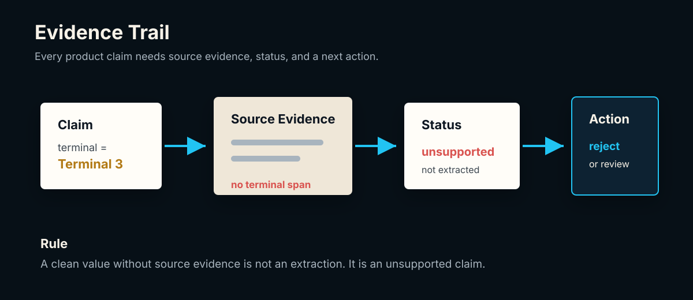
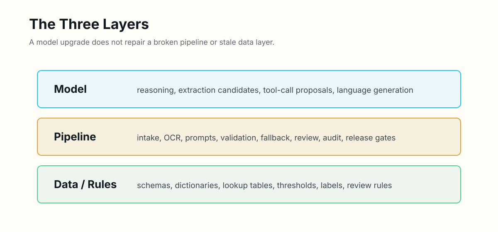
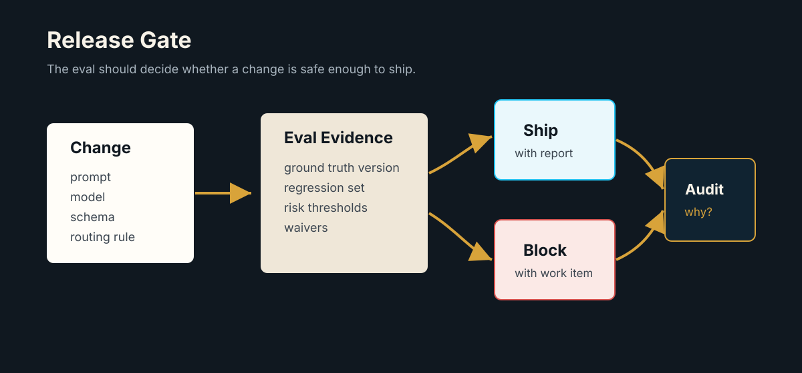

# No Claim Without Evidence

## How to Build AI Systems You Can Verify

By Pranay Suyash

---

## Copyright Page

Copyright (c) 2026 Pranay Suyash. All rights reserved.

No part of this book may be reproduced or distributed without permission, except brief quotations used in reviews, commentary, or educational discussion.

This book is practical engineering commentary, not legal, financial, medical, or compliance advice. Apply the ideas with the judgment required by your product, users, data, and operating environment.

---

## Table Of Contents

1. Introduction: The Evidence Habit
2. Chapter 1: No Claim Without Evidence
3. Chapter 2: Premature Confidence Is The Real Bug
4. Chapter 3: Narrow Questions Beat Broad Prompts
5. Chapter 4: The Pipeline Matters More Than The Model
6. Chapter 5: Deterministic Gates Before Model Calls
7. Chapter 6: One Good Output Does Not Mean Your Prompt Works
8. Chapter 7: Ground Truth Is A Product Contract
9. Chapter 8: Not All Extraction Errors Are Equal
10. Chapter 9: Accuracy Alone Is Not An Eval Strategy
11. Chapter 10: Cost, Latency, And Review Effort Belong In The Eval
12. Chapter 11: Fallbacks, Routing, And Stop Conditions Need Evals
13. Chapter 12: Eval Logs Matter More Than Scores
14. Chapter 13: Your Eval Set Is Product Memory
15. Chapter 14: Confidence, Evidence, And Human Review Build Trust
16. Chapter 15: Test The Pipeline, Not Just The Model
17. Chapter 16: Observability Is The Product Interface
18. Chapter 17: Agents Need Action Evals
19. Chapter 18: Data And Configuration Are Product Code
20. Chapter 19: Your Eval Should Become A Release Gate
21. Appendix A: The Airline Ticket Extraction Case Study
22. Appendix B: Practical Templates
23. Notes And Sources

---

## Introduction: The Evidence Habit

Most AI product mistakes do not start with a bad model.

They start with an unsupported claim.

The prompt worked once, so the prompt works.

The JSON parsed, so the extraction is correct.

The model sounded confident, so the answer is trustworthy.

The demo looked good, so the feature is ready.

The eval score went up, so the product improved.

Every one of those sentences may be true. None of them is proven by the sentence itself.

This book is about the habit that separates a promising AI demo from a system you can improve, operate, and ship:

> No claim without evidence.

That rule sounds simple. It is not. It changes how you write prompts, design schemas, build fallbacks, structure review, read eval scores, and decide whether a release is safe enough to ship.

The context for this book is practical. Imagine a system that extracts structured fields from airline tickets, receipts, invoices, medical documents, customer emails, or support transcripts. The user does not care that the model generated clean JSON. The user cares whether the flight number, PNR, terminal, amount, passenger name, and date are correct enough for the next workflow step.

A clean output is not the same as a true output.

An LLM can produce a field that looks plausible but is not supported by the source document. A fallback model can fill a blank field by guessing. A reviewer can accept a value because it feels right. A benchmark can report high accuracy while hiding the one failure mode that would damage user trust.

That is why AI engineering needs more than prompts. It needs evidence paths.

OpenAI's evals documentation frames evaluations as tests that check whether model outputs meet criteria you define, especially when changing models or applications.[^openai-evals-docs] NIST's AI Risk Management Framework places validity, reliability, accountability, transparency, and explainability inside the larger question of trustworthy AI systems.[^nist-ai-rmf] Google's production ML guidance describes systems made of data, validation, serving, monitoring, and feedback components rather than a model alone.[^google-prod-ml]

Those sources point in the same direction: the product is not the model call. The product is the system around it.

This book is a field guide for that system. Each chapter has a learning promise, a concrete implementation pattern, an artifact you can reuse, an exercise, common failure modes, and a bridge to the next design decision. One airline-ticket workflow develops across the book so that the ideas compound instead of resetting chapter by chapter.

It starts with the evidence habit, then moves through LLM pipelines, eval design, extraction errors, review workflows, product memory, agent actions, observability, data and configuration discipline, and release gates. It is written for builders who are close enough to the work to feel the pain: solo founders, AI engineers, product-minded developers, PMs who want real technical leverage, and operators who need AI output they can actually trust.

The goal is not to prove that a model is impressive.

The goal is to decide whether the system is safe enough to trust, improve, or ship.

---

## Chapter 1: No Claim Without Evidence

### Learning promise

By the end of this chapter, you will be able to separate a plausible AI output from a supported product claim. You will define a field-level evidence record, apply it to an airline-ticket extraction, and decide what the system should do when the document is silent.

The first rule is not about AI.

It is about engineering honesty.

Do not say the bug is fixed unless you reproduced the original failure and verified the new behavior. Do not say the tests pass unless the tests were run. Do not say the UI works unless it was inspected in the real surface where the user will see it. Do not say an extraction is correct unless the value can be traced to the source.

That last sentence is where the rule becomes an AI product rule.

AI systems are unusually vulnerable to unsupported claims because their output often looks finished. It has grammar. It has structure. It has confidence. It fills in missing context in a way humans find natural.

But naturalness is not correctness.

### A claim is a value plus a reason to trust it

Start from first principles. A product does not merely display values; it causes people and systems to act on them. A flight number may drive a status lookup. A departure date may schedule a notification. A baggage allowance may become a customer-facing promise. The moment an extracted value affects a decision, the value is a claim.

A claim has at least four parts:

1. **Value:** What does the system say?
2. **Provenance:** Where did that value come from?
3. **Interpretation:** Was it copied, normalized, inferred, or reviewed?
4. **Decision:** What may the product do with it?

This gives us a practical definition of correctness. A value is not ready merely because it matches a schema. It is ready when the value and its provenance satisfy the product's policy for the action that follows.

Consider the ticket we will use throughout these chapters:

```text
Passenger: Riya Mehta
Booking Ref / PNR: H7K29Q
Flight: AI 202
Date: 12 Aug 2026
Departure: Delhi
Arrival: Bengaluru
Departure Time: 09:40
Terminal: not shown
Baggage: not shown
```

The model returns:

```json
{
  "passenger_name": "Riya Mehta",
  "flight_number": "AI 202",
  "departure_date": "2026-08-12",
  "origin": "DEL",
  "destination": "BLR",
  "pnr": "H7K29Q",
  "terminal": "Terminal 3",
  "baggage": "15kg"
}
```

At a glance, this looks good. It is complete. It is clean. It has the right shape. But terminal and baggage are unsupported. The document explicitly does not show them.

If the workflow accepts those values, it has crossed a line. The model did not extract. It inferred.

Extraction means the value came from the source. Normalization means a supported source value was transformed under a declared rule, such as `Delhi` to `DEL`. Inference means the value came from reasoning, prior knowledge, or a guess. Inference is not always wrong; some products need it. But inference must be labeled and governed by a different contract. A ticket extractor should not quietly turn guesses into document facts.

### Implementation pattern: the evidence record

The smallest useful implementation is a field record that travels with the value:



```json
{
  "field": "terminal",
  "raw_value": null,
  "normalized_value": null,
  "status": "not_present",
  "evidence": [],
  "action": "accept_with_warning",
  "notes": "Do not infer from airport or route"
}
```

Compare that with a supported and normalized field:

```json
{
  "field": "origin",
  "raw_value": "Delhi",
  "normalized_value": "DEL",
  "status": "normalized",
  "evidence": ["Departure: Delhi"],
  "action": "accept",
  "notes": "Mapped with iata_airports_v2026_07"
}
```

The record does not require elaborate infrastructure. Evidence may begin as an exact text span. For images, it may become a page number and bounding box. For email, it may be a message ID and quoted span. What matters is that an operator can move backward from the product claim to the source.

Evidence also needs a negative vocabulary. An empty evidence array is ambiguous by itself. Did the linker fail? Was the source unreadable? Was the value not present? Use explicit statuses such as:

- `supported`
- `normalized`
- `inferred`
- `not_present`
- `unreadable`
- `ambiguous`
- `conflicting`
- `requires_review`

These are not decorative labels. Each should map to a permitted action. For example, `supported` may flow downstream, `normalized` may flow with both raw and normalized values preserved, `inferred` may be prohibited for a PNR, and `ambiguous` may route to review.

The strength of evidence should also match the consequence of the claim. A missing meal preference may need only an honest `not_present` label. A PNR used to retrieve or modify a booking needs exact evidence, strict character preservation, and possibly review after an OCR conflict. Evidence engineering is therefore not the demand that every field receive maximum ceremony. It is the practice of matching proof to risk.

This proportionality keeps the habit usable. If every optional field triggers review, operators learn to ignore warnings. If every critical field flows through on plausibility, users absorb the risk. Define the consequence first, then require enough evidence to authorize it. The question is not "How confident does the answer sound?" It is "What evidence must exist before this particular action is allowed?"

### Reusable artifact: the claim-evidence ledger

Use this template before deciding whether an AI output is acceptable:

```yaml
claim_id:
document_id:
field:
value:
claim_type: extracted | normalized | inferred | human_corrected
source_locator:
evidence_excerpt:
evidence_status: supported | not_present | unreadable | ambiguous | conflicting
product_policy:
decision: accept | accept_with_warning | reject | review
decision_reason:
verified_by:
verified_at:
```

The ledger creates a discipline: every accepted claim must answer "why may the product trust this?" It also gives future evals something concrete to score: evidence coverage, unsupported inference, review decisions, and policy compliance.

### Common failure modes

**Completeness bias.** Teams reward filled fields and treat `null` as failure. The model learns, directly or indirectly, that a plausible guess looks better than honest absence.

**Evidence as explanation.** A sentence such as "Terminal 3 is common for this route" explains a guess; it does not prove the value was on the ticket. Evidence must point to the source, not to the model's rationale.

**Normalization without raw value.** Storing only `DEL` erases whether the document said `Delhi`, `DEL`, or something else. Preserve both so extraction and mapping failures can be separated.

**One confidence score.** A number such as `0.92` does not tell you whether the field was observed, inferred, normalized, or disputed. Status and provenance must carry the semantics.

**Evidence captured but ignored.** A system can store evidence and still accept values with no evidence. The decision policy must enforce the record.

### Exercise: audit the ticket claims

1. Create one ledger entry each for `pnr`, `origin`, `terminal`, and `baggage`.
2. Label each claim as extracted, normalized, or unsupported.
3. Choose an action for each field.
4. Write one sentence explaining why `Terminal 3` cannot be accepted even if it happens to be factually correct in the real world.

**Expected outcome:** `pnr` is supported and accepted; `origin` preserves raw `Delhi`, normalizes to `DEL`, and is accepted; `terminal` and `baggage` have no source evidence, become `not_present`, and are either accepted with a warning or reviewed according to product policy. Your explanation should distinguish real-world truth from document-supported truth: the extraction product is claiming what the document says, not what external knowledge suggests.

The best AI systems are not the ones that always answer. They are the ones that know what kind of answer they are giving. The next chapter examines the deeper bug that appears when a product forgets this distinction: it grants trust before the output has earned it.

## Chapter 2: Premature Confidence Is The Real Bug

### Learning promise

By the end of this chapter, you will be able to identify where uncertainty is accidentally converted into certainty. You will replace a single "valid" flag with an operational status model and design downstream permissions that reflect what the system actually knows.

Most early AI failures look like model failures.

The model hallucinated. The prompt was vague. The fallback chose the wrong field. The output parser broke.

Those may be the visible failures. Underneath them is often a deeper bug: premature confidence.

Premature confidence is what happens when a system acts as if an uncertain output has already earned trust. It is not merely a model behavior. It is a transition error in the product: uncertain input enters one side, but a trusted fact emerges without an evidence-producing step in between.

### Where confidence leaks into a system

Premature confidence appears in code:

```python
terminal = model_output["terminal"]
booking.terminal = terminal
```

The assignment silently treats presence as proof. The system should instead ask whether the value is supported and whether its status permits the write:

```python
record = verify_field(
    field="terminal",
    candidate=model_output.get("terminal"),
    source=document_text,
    policy=field_policies["terminal"],
)

if record.action == "accept":
    booking.terminal = record.normalized_value or record.raw_value
elif record.action == "review":
    review_queue.add(record)
```

It appears in product language. "Your travel details are verified" is a stronger statement than "We extracted six details and flagged two for review." The first describes a completed assurance process. The second describes the evidence that actually exists.

It appears in dashboards that show a green check because JSON parsed successfully. It appears in APIs that omit uncertainty because downstream clients prefer simple strings. It appears in demos where every blank is filled because an incomplete screen looks less impressive.

All of these collapse different questions:

- Did the model return a value?
- Did the output match the expected type?
- Does the source support the value?
- Did normalization preserve the meaning?
- May the product act on the value?

Each question requires different evidence. A JSON schema can prove that `terminal` is a string or `null`. It cannot prove that `Terminal 3` appears in the document. Type correctness is not semantic correctness, and semantic correctness is not yet authorization for a downstream action.

### Confidence is a state, not a mood

The word *confidence* often tempts teams toward a floating-point score. But a score without semantics is difficult to operate. What should a workflow do with `0.83`? Is that high for a passenger name? Low for baggage? Was the number produced by the model, an OCR engine, a calibrator, or a heuristic?

A better starting point is a finite set of states with explicit transitions:

```text
candidate
  -> supported
  -> normalized
  -> not_present
  -> unreadable
  -> ambiguous
  -> conflicting
  -> requires_review
  -> rejected
```

These states describe knowledge, not emotion. They also make policy executable. A supported passenger name can be shown. A normalized airport code can be used if the raw value is retained. An ambiguous departure time can be shown with a warning or held for review. An unsupported terminal is rejected even when the string looks plausible.

For the cumulative ticket, the schema-valid output contains two dangerous values:

```json
{
  "terminal": "Terminal 3",
  "baggage": "15kg"
}
```

Both strings satisfy their types. Neither satisfies the source contract. The honest representation is:

```json
{
  "terminal": {
    "value": null,
    "status": "not_present",
    "action": "accept_with_warning"
  },
  "baggage": {
    "value": null,
    "status": "not_present",
    "action": "accept_with_warning"
  }
}
```

The second output looks less complete. It is more correct.

This is why evals must reward restraint. If scoring rewards only populated fields, the model is penalized for saying "not present." If reviewers are asked to minimize blanks, they will approve guesses. If product copy hides review and uncertainty, the organization will optimize for a green surface instead of a trustworthy workflow.

The fix is not pessimism. The fix is explicit confidence.

There are two dimensions here that should not be collapsed. The first is **epistemic state**: what the system knows about the relationship between value and source. The second is **product consequence**: what happens if the value is wrong. A supported optional note and a supported PNR share an epistemic state but not a risk level. An ambiguous terminal and an ambiguous PNR share uncertainty but may require different actions.

Model the dimensions separately. Let status describe knowledge, field policy describe consequence, and the decision function combine them. This prevents a single threshold from pretending that all fields, users, and downstream actions have the same tolerance for error.

### Implementation pattern: status-driven permissions

Define field policy separately from model output:

```yaml
fields:
  pnr:
    allowed_statuses: [supported]
    on_violation: review
    do_not_infer: true
  origin:
    allowed_statuses: [supported, normalized]
    on_violation: review
    preserve_raw_value: true
  terminal:
    allowed_statuses: [supported, not_present]
    on_violation: reject_field
    do_not_infer: true
  baggage:
    allowed_statuses: [supported, not_present]
    on_violation: reject_field
    do_not_infer: true
```

Then make downstream behavior a pure decision over the record and policy:

```python
def decide(record: FieldRecord, policy: FieldPolicy) -> str:
    if record.status not in policy.allowed_statuses:
        return policy.on_violation
    if policy.do_not_infer and record.status == "inferred":
        return policy.on_violation
    if record.status == "not_present":
        return "accept_with_warning"
    return "accept"
```

The model proposes values. The policy grants permissions. This boundary prevents model fluency from becoming product authority.

### Reusable artifact: confidence transition table

```yaml
status: supported
meaning: exact source evidence supports the raw value
required_evidence: source locator and excerpt
allowed_actions: [display, persist, use_downstream]
forbidden_actions: []
next_states: [normalized, conflicting, requires_review]

status: inferred
meaning: value is derived without direct source support
required_evidence: derivation inputs and inference rule
allowed_actions: [display_if_labeled]
forbidden_actions: [present_as_extracted, use_for_critical_decision]
next_states: [supported, rejected, requires_review]

status: not_present
meaning: source was readable but did not contain the field
required_evidence: completed source search or extractor coverage record
allowed_actions: [display_as_missing, accept_with_warning]
forbidden_actions: [fill_by_guess]
next_states: [supported, requires_review]
```

Extend this table for every status your product uses. If a status has no defined meaning or permitted action, it is presentation, not control.

### Common failure modes

**Schema equals truth.** Schema validation proves shape, not source support.

**Model confidence equals evidence.** A model's self-reported certainty is another model output. It may inform routing, but it cannot replace provenance.

**Boolean verification.** A single `verified: true` erases whether a value was extracted, normalized, or human-corrected.

**UI stronger than the backend.** The backend says `requires_review`, while the interface says "confirmed." Customer-facing language must preserve the actual state.

**Statuses without enforcement.** Records carry `inferred`, but downstream code consumes the value anyway. States matter only when they change behavior.

**Endless review.** Routing every uncertainty to a person avoids automation rather than managing risk. Policies should distinguish critical, reviewable, and optional fields.

### Exercise: find the premature transition

1. Draw the path for `terminal` from model response to stored booking record.
2. Mark each step where the system could check evidence, apply policy, or request review.
3. Identify the first step that currently treats the string as trusted.
4. Replace that step with a status transition and an allowed action.
5. Write the exact UI sentence shown to the user.

**Expected outcome:** the raw candidate never writes directly to the booking. It becomes `not_present` after the evidence check, the policy blocks inference, and the product either omits the terminal or says that it was not shown on the ticket. The UI does not claim all details are verified.

Once confidence becomes explicit, the next challenge is evaluation. A twenty-field extraction is still too broad to judge reliably as one object. The next chapter shows how to turn an impressive-looking output into narrow claims that people and tests can actually verify.

## Chapter 3: Narrow Questions Beat Broad Prompts

### Learning promise

By the end of this chapter, you will know how to decompose a broad AI task into verifiable claims. You will build a claim matrix for the airline ticket, write narrow extraction and review questions, and use failures to identify the layer that owns the fix.

Broad prompts feel powerful:

```text
Extract all useful information from this ticket.
```

That prompt can produce a beautiful response. It can also hide the hardest question: what counts as correct?

Narrow questions are easier to verify:

```text
What is the flight number exactly as shown on the ticket?
```

```text
Is a terminal printed on the ticket?
Return only supported, not_present, unreadable, or ambiguous.
```

```text
What exact source span supports the PNR value?
```

The narrow question does not make the model smarter. It makes the task more inspectable.

### Decompose outputs into atomic claims

Verification requires a defined proposition and a way to decide whether it holds. "Extract all useful information" provides neither. *Useful* depends on the product. *All* has no practical stopping rule. A reviewer cannot know whether omitted information was irrelevant, missed, or never requested.

An atomic claim has one subject, one value or state, and one evidence requirement. For example:

```text
Claim: The PNR is H7K29Q.
Evidence requirement: an exact source span labeled PNR or booking reference.
Decision rule: exact character match after whitespace normalization.
```

The ticket output may contain twenty fields, but the eval should not treat it as one blob. Evaluate passenger name, flight number, origin, destination, departure date, departure time, terminal, PNR, baggage, and the evidence for each field as separate claims.

Each claim also has a different failure cost. A wrong PNR can break a booking lookup. A missing optional meal preference may have no downstream effect. A hallucinated baggage allowance may create a customer-facing promise that cannot be fulfilled. A normalized airport code may be correct even when it differs from the printed city name.

Narrowness reveals those differences.

### The cumulative ticket as a claim matrix

Build a claim matrix before tuning the prompt:

| Field | Narrow question | Expected source state | Transformation | Risk |
|---|---|---|---|---|
| `passenger_name` | What passenger name is printed? | supported | preserve text | critical |
| `pnr` | What booking reference is printed? | supported | trim spaces only | critical |
| `flight_number` | What flight number is printed? | supported | canonical spacing | critical |
| `departure_date` | What departure date is printed? | supported | ISO date | critical |
| `origin` | What departure location is printed? | supported | city to IATA lookup | critical |
| `destination` | What arrival location is printed? | supported | city to IATA lookup | critical |
| `departure_time` | What departure time is printed? | supported | 24-hour format | reviewable |
| `terminal` | Is a terminal printed? | not present | none | reviewable, do not infer |
| `baggage` | Is baggage allowance printed? | not present | none | optional, do not infer |

This matrix separates four contracts that broad prompts often mix together: observation, absence detection, transformation, and risk. It lets you test a model even if production uses one multi-field request, because each returned field is scored against its own question and rule.

### Implementation pattern: claim-oriented output

A prompt can require one record per claim:

```text
For each requested field:
1. Return the value exactly as shown, or null.
2. Choose one source_status: supported, not_present, unreadable, ambiguous.
3. Quote the shortest exact evidence span that supports the value.
4. Do not infer terminal, baggage, or PNR.
5. Do not normalize values in this step.

Requested fields: passenger_name, pnr, flight_number, departure_date,
origin, destination, departure_time, terminal, baggage.
```

The output schema can preserve the same shape for every field:

```json
{
  "field": "pnr",
  "raw_value": "H7K29Q",
  "source_status": "supported",
  "evidence": "Booking Ref / PNR: H7K29Q"
}
```

Then normalization runs separately. This matters because a wrong `DEL` can arise from two different failures: the extractor read the source incorrectly, or the lookup mapped a correct raw value incorrectly. If the first step returns both observation and normalization, the failure boundary disappears.

Narrow questions also improve human review. Do not ask "Does this output look correct?" Show one claim and one decision:

```text
Field: terminal
Candidate value: Terminal 3
Source evidence: none
Policy: terminal must not be inferred
Question: Is this value supported by the ticket?
Allowed decisions: accept | reject | mark unreadable | mark ambiguous
Expected action for this case: reject
```

A reviewer can answer that consistently. The broad question invites impressionistic review: correct-looking fields hide the unsupported one.

### Debugging by claim and layer

When a broad extraction fails, teams often edit the prompt first. A narrow claim lets you locate the owning layer:

- No text was available: intake or OCR.
- The source span was visible but the raw value was wrong: extraction.
- The raw value was correct but `DEL` was wrong: normalization data.
- The evidence was empty but the value was accepted: policy enforcement.
- The field should have gone to review but did not: routing.
- The reviewer made an inconsistent decision: review policy or training.

This classification avoids prompt churn. A better prompt does not repair an airport lookup table, and a larger model does not fix a review interface that hides evidence.

### Reusable artifact: claim decomposition worksheet

```yaml
field:
product_question:
atomic_claim:
source_states: [supported, not_present, unreadable, ambiguous]
expected_value:
evidence_requirement:
allowed_transformation:
do_not_infer:
risk_class: critical | reviewable | optional
acceptance_rule:
failure_owner:
review_question:
```

Complete this worksheet for every field that can affect a user, an operator, or a downstream system. Fields with no acceptance rule are not ready for reliable evaluation.

### Common failure modes

**Decomposing by JSON keys only.** A key can still combine extraction, normalization, confidence, and action. Separate the claims inside it.

**Prompt fragmentation without product logic.** Calling the model once per field may increase cost without improving evaluation. Narrowness is primarily a contract and scoring technique; production batching is a separate optimization.

**Fuzzy evidence requirements.** "The answer is somewhere on page one" is not enough for a critical field. Define exact spans or bounded regions.

**Ignoring negative claims.** Detecting that terminal is not present is a real task. Do not score only populated values.

**Same tolerance for every field.** Date punctuation may normalize harmlessly; one wrong PNR character may be a total failure.

**Reviewing the whole document at once.** Reviewers anchor on the clean majority and miss the dangerous minority.

### Exercise: turn one prompt into testable claims

1. Start with: "Extract all useful travel details from this ticket."
2. Write narrow questions for `pnr`, `origin`, `terminal`, and `baggage`.
3. Define the accepted source states and transformations for each.
4. Create one automated assertion and one reviewer question for `terminal`.
5. Assign an owning layer to these failures: wrong raw origin, correct raw origin but wrong IATA code, unsupported terminal accepted.

**Expected outcome:** each field has a bounded question, evidence requirement, and decision rule. The terminal assertion checks for `not_present` with no inferred value. Failure ownership maps respectively to extraction, normalization data, and policy or routing.

If you cannot state the claim narrowly, you cannot evaluate it precisely. Once claims are inspectable, however, another fact becomes obvious: the model is only one place where those claims can fail. The next chapter expands the unit of design from the model call to the complete product pipeline.

## Chapter 4: The Pipeline Matters More Than The Model

### Learning promise

By the end of this chapter, you will be able to map an AI feature as an end-to-end decision pipeline, locate ownership for each failure, and compare system designs using safety, cost, latency, and review effort rather than raw model accuracy alone.

A common AI product question is:

Which model should we use?

A better question is:

What pipeline turns uncertain model output into a trustworthy product decision?

The model is one component. The pipeline decides what the model sees, what it is asked to do, how its output is checked, what happens when it fails, and what evidence reaches the user or reviewer.

### The evaluated object is the workflow

From first principles, reliability is a property of the path from input to consequence. If a model extracts `Delhi` correctly but a stale lookup maps it to the wrong airport, the user still receives the wrong result. If the final output is correct but a fallback cost makes the feature economically unusable, the product still fails. If a reviewer fixes the result but the correction is never logged, the same failure returns.

For document extraction, the pipeline may include:

1. file intake
2. document type detection
3. OCR or native text extraction
4. layout parsing
5. field extraction
6. schema validation
7. evidence linking
8. normalization
9. status labeling
10. fallback routing
11. human review
12. final decision
13. audit logging
14. regression capture

The model may participate in several stages. It does not own all of them.



That is why "we upgraded the model" is rarely a complete product answer. A stronger model may reduce extraction errors while producing more plausible unsupported inference. It may change formatting, refusal, or uncertainty behavior. It may improve the clean demo while increasing latency or review effort on messy documents.

The pipeline must absorb model variation. It encodes what must be extracted, what may be missing, what must never be inferred, what can be normalized, what requires review, what blocks downstream use, and what becomes a regression case.

It must also preserve partial success. Real documents rarely fail as a single unit. The ticket may contain a supported passenger name and flight number, an airport value that needs normalization, an unreadable departure time, and an absent terminal. Treating the entire document as either passed or failed discards useful evidence or accepts too much risk.

A pipeline should therefore carry field-level states into a document-level decision. It may accept the itinerary, warn about optional absence, and route one critical claim to review. That decision must be explainable: which fields passed, which were withheld, what fallback ran, and what a person must do next. Partial failure is not an edge case to hide. It is a normal product state to design.

### Follow the cumulative ticket through the pipeline

The ticket enters as a PDF. Native text extraction yields the source shown in prior chapters. Document classification labels it `airline_ticket`. The extractor produces raw claim records. Evidence linking verifies exact spans. Normalization maps `Delhi` to `DEL` and `Bengaluru` to `BLR`. Policy marks terminal and baggage as `not_present` and blocks fallback because both are do-not-infer fields. The final decision accepts the critical itinerary fields and exposes optional absence without inventing values.

Represent the run as stage results rather than one opaque response:

```json
{
  "run_id": "RUN-AIR-001",
  "document_id": "AIR-001",
  "stages": [
    {"name": "text_extraction", "status": "passed", "output_ref": "text:v1"},
    {"name": "classification", "status": "passed", "value": "airline_ticket"},
    {"name": "claim_extraction", "status": "passed", "model": "default"},
    {"name": "evidence_linking", "status": "passed", "coverage": 1.0},
    {"name": "normalization", "status": "passed", "table": "iata_airports_v2026_07"},
    {"name": "policy", "status": "passed", "blocked_inferences": 2},
    {"name": "final_decision", "status": "accepted_with_warnings"}
  ]
}
```

Now a failure is diagnosable. If evidence coverage drops, inspect the linker. If a raw field is wrong, inspect OCR and extraction. If `Delhi` maps incorrectly, inspect the versioned lookup. If an absent terminal triggers fallback, inspect policy and routing.

### Model choice inside system choice

Suppose two configurations process the same eval set:

| Configuration | Critical accuracy | Unsupported inference | p95 latency | Review rate |
|---|---:|---:|---:|---:|
| Large model, one broad call | 98% | 4% | 4.8 s | 7% |
| Smaller model plus gates | 97% | 0.3% | 2.1 s | 9% |

There is no universally correct choice, but raw accuracy no longer settles it. If unsupported baggage claims have high customer cost, the gated pipeline may be better. If review capacity is scarce, you may improve routing rather than replacing the extractor. The useful comparison is system behavior against product risk.

A parser plus targeted model call may beat a general document prompt. A fallback that runs only when evidence likely exists may beat a fallback that fills every blank. A review path that records correction reasons may improve faster than full automation that silently accepts uncertainty.

The pipeline is where product judgment lives.

### Implementation pattern: typed stage contracts

Give every stage an input contract, output contract, failure behavior, and evidence:

```yaml
stage: normalize_airports
input:
  required: [origin.raw_value, destination.raw_value]
output:
  required: [raw_value, normalized_value, lookup_version, status]
preconditions:
  - source_status == supported
success:
  - normalized value exists in canonical IATA table
failure_routes:
  unknown_lookup: review
  conflicting_lookup: review
  missing_raw_value: stop
observability:
  - lookup_version
  - rule_id
  - latency_ms
```

Then orchestrate stages explicitly:

```python
text = extract_text(document)
doc_type = classify_document(text)
claims = extract_claims(text, schema_for(doc_type))
linked = link_evidence(claims, text)
normalized = normalize(linked, lookup_registry)
decision = apply_policy(normalized, policy_for(doc_type))
record_run(document, text, claims, normalized, decision)
```

This code is intentionally unsurprising. Reliability comes from visible contracts and controlled transitions, not from hiding the workflow inside one clever call.

### Reusable artifact: pipeline stage card

```yaml
stage_name:
purpose:
owner:
input_contract:
output_contract:
deterministic_or_model_backed:
model_and_prompt_version:
data_or_config_dependencies:
preconditions:
validation:
failure_modes:
retry_policy:
fallback_policy:
stop_conditions:
review_route:
observability:
eval_cases:
downstream_consumers:
```

Complete one card per stage. Together, the cards expose hidden ownership, duplicate logic, missing validation, and places where model behavior has been mistaken for product policy.

### Common failure modes

**Model leaderboard architecture.** The team chooses the highest-scoring model before defining the pipeline, field risks, or operational constraints.

**One prompt owns the product.** Detection, extraction, normalization, policy, and explanation are combined in one untestable call.

**Fallback as a second source of truth.** The fallback returns a replacement document object and overwrites correct default fields. Fallback should be scoped to specific failed claims.

**No stage provenance.** The final value exists, but nobody can tell which model, prompt, parser, or lookup produced it.

**Counting pipeline failures as model failures.** Empty OCR, stale dictionaries, and routing mistakes pollute model evaluation and lead to the wrong fix.

**Happy-path observability.** Success is logged, but retries, blocked inferences, partial results, and review corrections are not.

### Exercise: design the ticket workflow

1. Draw stages from ticket upload to final itinerary display.
2. For each stage, list one input, one output, one failure, and one observable event.
3. Place the model call or calls.
4. Assign these failures to stages: empty extracted text, `AI 202` read as `AI 2022`, `Delhi` mapped to the wrong code, terminal guess accepted, reviewer correction lost.
5. Choose one metric beyond accuracy that could change your model decision.

**Expected outcome:** failures map to text extraction, claim extraction, normalization, policy, and audit or feedback capture. The model is visible but not treated as the entire system. Your additional metric may be unsupported inference rate, p95 latency, per-document cost, or review rate, with a clear reason it matters.

If you treat model selection as the whole problem, every failure looks like a reason to switch models. If you treat the pipeline as the product, every failure becomes a clue about which layer needs to improve. The next chapter begins strengthening those layers with the cheapest and most explainable controls: deterministic gates.

## Chapter 5: Deterministic Gates Before Model Calls

### Learning promise

By the end of this chapter, you will be able to decide which checks belong outside generative reasoning, implement pre-call and post-call gates, and define stop and routing behavior for failed checks. You will finish the first working control plan for the airline-ticket pipeline.

Do not call a model just because you can.

Some decisions are better handled by deterministic gates.

A deterministic gate is a check whose expected behavior is defined by a rule rather than open-ended generation: file type allowed or not, document text empty or not, required page present or not, JSON schema valid or not, date parseable or not, airport code in the approved table or not, field evidence present or not.

These gates protect the model from being asked to solve problems that are really input, validation, or product-contract problems.

### Why gates come first

A model call consumes probabilistic reasoning. Use it when the system must interpret language, layout, ambiguity, or context. Do not spend it on facts the program can establish directly and reproducibly.

From first principles, a deterministic gate offers four advantages:

1. The rule is inspectable.
2. The same input produces the same decision.
3. Failure can carry a precise reason code.
4. Tests can cover the decision without model variance.

Gates can run before a model, after a model, or between model-backed stages. A pre-call gate protects input quality and avoids impossible work. A post-call gate protects downstream systems from malformed, unsupported, or disallowed output. An inter-stage gate decides whether fallback or review can actually improve the result.

The design question is not "Can code do this perfectly?" It is "Is there a stable product rule that should remain true regardless of model behavior?" If yes, encode the rule outside the prompt.

### Implementation pattern: pre-call gates for the ticket

Before asking for ticket fields, check whether extraction is possible:

```python
from dataclasses import dataclass

@dataclass(frozen=True)
class GateResult:
    passed: bool
    reason: str
    route: str

def ticket_input_gate(file_type: str, text: str) -> GateResult:
    if file_type not in {"application/pdf", "image/png", "image/jpeg"}:
        return GateResult(False, "unsupported_file_type", "reject")
    if not text.strip():
        return GateResult(False, "document_text_empty", "ocr_repair")

    terms = {"pnr", "booking ref", "flight", "passenger"}
    matches = [term for term in terms if term in text.lower()]
    if len(matches) < 2:
        return GateResult(False, "ticket_signals_insufficient", "classify_or_review")

    return GateResult(True, "ticket_input_ready", "extract")
```

For our source, text is present and several ticket signals exist, so the gate routes to extraction. If text were empty, calling the model with an empty string would add cost and could invite fabricated output. The correct next step is OCR repair or review, not a stronger prompt.

The gate should log its observed facts:

```json
{
  "gate": "ticket_input_ready",
  "passed": true,
  "observations": {
    "document_text_present": true,
    "ticket_like_terms_found": ["pnr", "flight", "passenger"]
  },
  "route": "extract"
}
```

### Post-call gates for evidence and normalization

After extraction, validate shape, source support, and known transformations. Do not combine them into one generic `valid` flag.

```python
DO_NOT_INFER = {"pnr", "terminal", "baggage"}

def evidence_gate(record: dict) -> GateResult:
    field = record["field"]
    value = record.get("raw_value")
    evidence = record.get("evidence", [])
    status = record["source_status"]

    if status == "supported" and (value is None or not evidence):
        return GateResult(False, "supported_without_evidence", "review")
    if field in DO_NOT_INFER and status == "inferred":
        return GateResult(False, "inference_forbidden", "reject_field")
    if status == "not_present" and value is not None:
        return GateResult(False, "value_present_for_absent_field", "reject_field")
    return GateResult(True, "evidence_policy_satisfied", "continue")
```

For `terminal = Terminal 3` with no evidence, the gate rejects the field. For `terminal = null`, `source_status = not_present`, it passes and allows an honest warning. Importantly, the system does not call fallback merely to fill the blank. More computation cannot recover evidence that the readable source does not contain.

Normalization gets its own gate and versioned data dependency:

```yaml
gate: airport_normalization
input:
  raw_origin: Delhi
  raw_destination: Bengaluru
lookup_table: iata_airports_v2026_07
checks:
  - raw values have supported evidence
  - normalized codes exist in the canonical table
  - mapping is unambiguous for the document context
output:
  origin: DEL
  destination: BLR
on_unknown: review
on_conflict: review
```

If the model extracts `DLH` while the source says `Delhi`, prompting it to "be more careful" does not create a dependable correction. Compare the supported raw value against the canonical lookup. If the lookup itself is wrong, the failure belongs to data configuration, not extraction.

### Gates, fallback, and stop conditions

A failed gate needs a route. Otherwise it is only a warning in a log.

Use a small decision table:

| Condition | Route | Why |
|---|---|---|
| Text empty | OCR repair | Better source evidence may become available |
| Critical field missing, evidence likely visible | Targeted fallback | Another extractor may recover it |
| Optional field absent from readable source | Stop with warning | More calls cannot create source evidence |
| Do-not-infer field returned without evidence | Reject field | Plausibility is not extraction |
| Critical evidence ambiguous | Human review | Product risk exceeds automation certainty |
| Airport lookup unknown | Review or data work item | Model should not invent canonical data |

This is the beginning of an honest routing system. It knows not only how to continue, but when to stop.

### Reusable artifact: deterministic gate specification

```yaml
gate_id:
stage: pre_model | post_model | inter_stage
purpose:
inputs:
rule:
pass_reason:
fail_reasons:
on_pass:
on_fail:
retry_allowed:
fallback_allowed:
stop_condition:
data_dependencies:
observability:
test_cases:
owner:
```

A gate specification should make three things reviewable: the invariant it enforces, the evidence it observes, and the route produced by failure. Avoid vague gates such as `quality_ok`; use reason codes that tell an operator what happened.

### Common failure modes

**Rules hidden in prompts.** "Never infer baggage" appears only in prompt text, so no downstream control catches violations.

**Gate without route.** The validator reports an error, but code continues with the original value.

**Overusing regular expressions.** Determinism is not a license to force ambiguous language into brittle parsing. Use gates for stable rules and models for genuine interpretation.

**Stale lookup tables.** Deterministic does not mean correct. Version, test, and observe data dependencies.

**Retrying absence.** Fallback is called when a readable document lacks the field. The result is a cleaner hallucination, not recovered evidence.

**One giant gate.** A single pass or fail hides whether the problem was schema, evidence, normalization, or policy.

**No adversarial tests.** Clean documents pass, but malformed files, empty OCR, conflicting codes, and unsupported values are not exercised.

### Exercise: build the first gate plan

1. Write three pre-call gates for the ticket workflow.
2. Write three post-call gates, including one for a do-not-infer field.
3. Give every failure a reason code and route.
4. Add tests for empty text, unsupported terminal, correct origin normalization, and unknown airport lookup.
5. Decide whether each failure should retry, fallback, review, reject, or stop with a warning.

**Expected outcome:** empty text routes to OCR repair without a model call; an unsupported terminal is rejected or converted to `not_present`; `Delhi` maps to `DEL` with raw value and lookup version preserved; an unknown airport does not produce a guessed code and routes to review or a data work item. Every failed gate has an observable reason and a defined next action.

A better prompt does not fix a missing validation gate. At this point, the ticket system has evidence records, explicit confidence states, narrow claims, a visible pipeline, and deterministic controls. The next chapter can now ask a harder question: how do we know whether the model-backed portions work across varied documents rather than on one convincing example? That is where one good output stops being proof and becomes the first case in an eval set.

---

## Chapter 6: One Good Output Does Not Mean Your Prompt Works

### Learning promise

By the end of this chapter, you will be able to turn an encouraging prompt demo into a small, designed evaluation set. You will know what one successful output proves, what it does not prove, and how to define cases that expose the failures your product cannot afford to hide.

The most dangerous prompt test is the one that looks good.

You paste in one document. The model returns clean JSON. Most fields are right. The response parses. You feel momentum. That moment is useful: it proves the model can perform the task on that input under those conditions.

It proves nothing about the range of inputs your product will receive.

A prompt is not a fixed function in the ordinary software sense. Its behavior depends on the model, decoding settings, system instructions, source quality, document layout, surrounding context, and the exact mixture of easy and ambiguous evidence in the input. A single example samples one point from that space. Calling the prompt reliable from that point is like testing a boarding pass scanner with one pristine PDF and declaring that it handles travel documents.

The first-principles question is not, "Did this output look good?" It is, "What behavior must remain correct as relevant conditions change?"

For an airline-ticket extractor, relevant conditions include:

- a clean PDF and a compressed mobile screenshot
- one passenger and several passengers
- a visible terminal and a missing terminal
- city names that require airport-code normalization
- a rescheduled itinerary containing old and new flight details
- low-quality OCR that confuses `0` with `O`
- an email containing both a payment receipt and an itinerary
- a document in which a critical field is genuinely absent

This is why the first eval set should be designed, not merely sampled. Random production files can help later, especially for drift detection. At the beginning, random selection often gives you many easy cases and few cases that distinguish an honest extractor from a plausible guesser.

### The cumulative case: from demo to testable claim

We will use one airline-ticket workflow throughout the next five chapters. The source document begins as follows:

```text
Passenger: Riya Mehta
Booking Ref / PNR: H7K29Q
Flight: AI 202
Date: 12 Aug 2026
Departure: Delhi
Arrival: Bengaluru
Departure Time: 09:40
Terminal: not shown
Baggage: not shown
```

The first prompt run extracts the passenger, PNR, flight, date, route, and time correctly. It also returns `Terminal 3` and `15kg` of baggage. The output is complete, consistent, and wrong in exactly the way polished AI output is dangerous: the two unsupported values look ordinary.

If you test only the visible fields, this run appears successful. If you test the product behavior, the run fails. The extractor was asked to extract, but it inferred.

Turn that observation into a case:

```yaml
case_id: AIR-001
document_type: airline_ticket
layout_family: plain_text_itinerary
risk_tags:
  - missing_terminal
  - missing_baggage
  - normalization_required
expected_behavior:
  terminal:
    value: null
    status: not_present_in_document
  baggage:
    value: null
    status: not_present_in_document
  origin:
    raw_value: Delhi
    normalized_value: DEL
  destination:
    raw_value: Bengaluru
    normalized_value: BLR
must_not:
  - infer terminal
  - infer baggage allowance
```

Notice that the case specifies behavior, not just strings. It distinguishes absence from extraction failure, preserves raw values, checks normalization, and states forbidden behavior. That is an eval contract rather than a golden-output snapshot.

### Implementation pattern: a deliberately small matrix


Start with a matrix of risks and document conditions. Forty cases is a useful first target when you have enough source material, but the principle matters more than the number.

```python
from dataclasses import dataclass


@dataclass(frozen=True)
class EvalCase:
    case_id: str
    source_path: str
    risk_tags: tuple[str, ...]
    expected_route: str


CASES = [
    EvalCase("AIR-001", "fixtures/air-001.txt",
             ("missing_terminal", "missing_baggage"), "accept_with_warning"),
    EvalCase("AIR-002", "fixtures/air-002.png",
             ("low_quality_ocr", "critical_field_visible"), "extract_or_review"),
    EvalCase("AIR-003", "fixtures/air-003.pdf",
             ("multi_passenger", "entity_merge_trap"), "extract"),
    EvalCase("AIR-004", "fixtures/air-004.eml",
             ("old_and_new_itinerary", "stale_value_trap"), "review"),
]


def coverage(cases: list[EvalCase]) -> set[str]:
    return {tag for case in cases for tag in case.risk_tags}


REQUIRED_RISKS = {
    "missing_terminal",
    "low_quality_ocr",
    "entity_merge_trap",
    "stale_value_trap",
}

assert REQUIRED_RISKS <= coverage(CASES)
```

The assertion does not prove that the eval set is complete. It prevents a quiet regression in its design: removing the only case for a known risk without noticing.

Run the same cases more than once when model outputs are nondeterministic. A prompt that passes once and fails twice has different operational meaning from one that passes repeatedly. Store the model version, prompt version, pipeline version, and run identifier with every result. Otherwise, you cannot reproduce the behavior you are discussing.

### Establish the baseline before improving anything

The first run should capture the current workflow exactly as it exists. Resist the urge to repair every failure while you are still discovering it. A baseline preserves the behavior that motivated the eval, shows the starting distribution of failures, and gives later changes something honest to beat.

For every case, store the source by stable identifier, the complete configuration, the raw model response, the parsed response, validator results, and final product action. Sensitive source content still needs appropriate access controls; reproducibility is not permission to duplicate private data casually.

```yaml
run_id: baseline-ticket-v1-001
eval_set_version: airline_starter_v1
prompt_version: ticket_prompt_v4
model_id: configured_model_snapshot
pipeline_version: ticket_pipeline_v2
decoding:
  temperature: 0
case_results_path:
```

Record observations before interpreting them. For `AIR-001`, the observation is "terminal and baggage contain values despite no supporting source span." The hypothesis might be "the prompt rewards completeness." The fix may be a prompt rule, evidence validator, routing change, or all three. Keeping observation, hypothesis, and intervention separate prevents a clean story from outrunning the evidence.

Preserve clean passes too. When you add a do-not-infer rule, visible-terminal cases must still extract terminals. Improvement means correcting the target failure without sacrificing behavior the product already depends on.

### Reusable artifact: eval case intake card

Use this card whenever a demo, bug report, reviewer correction, or production incident suggests a new case:

```yaml
case_id:
source_artifact:
document_type:
layout_family:
included_because:
risk_tags: []
input_quality:
expected_route:
expected_behavior: {}
must_not: []
downstream_consequence_if_wrong:
ground_truth_owner:
last_reviewed:
```

The `included_because` field matters. An eval set should be legible as product memory, not a folder whose contents nobody can explain.

### Exercise: break your best example

1. Choose the single input you currently use to demonstrate your prompt.
2. List the assumptions that make it easy: format, language, entity count, image quality, fields present, and lack of ambiguity.
3. Create four variants, each changing one assumption.
4. For each variant, define the expected value, status, evidence requirement, and route.
5. Add one `must_not` rule that protects against a plausible but unsupported answer.
6. Run the current workflow and classify the failures without changing the prompt yet.

**Expected outcome:** a five-case starter set containing the original clean case and four purposeful challenges. You should be able to say which behavior each case protects and why a passing result would matter to the product.

### Common failure modes

**Collecting examples without expected behavior.** A folder of documents is test data, not yet an eval. Every case needs a decision about what should happen.

**Making every case an edge case.** You need clean expected-success cases too. They catch regressions caused by fixes aimed at difficult inputs.

**Treating exact JSON equality as truth.** Object ordering, optional metadata, and valid normalization can differ while product behavior remains correct. Compare typed fields and policies.

**Using synthetic cases as the entire set.** Synthetic cases are useful for targeted traps, but they do not replace messy source artifacts and reviewer-confirmed failures.

**Changing the prompt while labeling the data.** First capture the baseline. Otherwise, you erase evidence of the behavior that motivated the case.

One good output answers, "Can this work once?" A designed eval begins answering, "Does it behave correctly where it matters?" But that question still contains an unresolved word: *correctly*. The next chapter turns correctness from intuition into a product contract.

## Chapter 7: Ground Truth Is A Product Contract

### Learning promise

By the end of this chapter, you will be able to define ground truth as a versioned agreement about values, evidence, statuses, and actions. You will also be able to separate source transcription from normalization so that your eval does not punish valid transformations or reward lost evidence.

Ground truth is not merely "the correct answer."

It is the product's agreement about what counts as correct.

That distinction matters because documents rarely contain values in the exact representation a downstream system needs. A ticket may say `Delhi`; an itinerary API may require `DEL`. A date may appear as `12 Aug 2026`; a database may require `2026-08-12`. A terminal may be absent, which is different from unreadable, unknown, or not applicable.

From first principles, an extraction system makes several different claims:

1. **Source claim:** these characters or pixels appear in the document.
2. **Interpretation claim:** this source span represents a particular field.
3. **Normalization claim:** the source value maps to a canonical value under a named rule set.
4. **Evidence claim:** the result can be traced to the source.
5. **Decision claim:** the result is safe to accept, warn about, reject, or review.

Collapsing those claims into one string creates ambiguity. If the expected origin is `BOM` and the model returns `Mumbai`, did extraction fail? No. If the expected origin is `Mumbai` and the pipeline returns only `BOM`, did it succeed? Perhaps not; the raw evidence has been discarded.

The contract should preserve both.

### The cumulative case: specify the airline ticket

For `AIR-001`, the source gives us `Delhi` and `Bengaluru`. The product stores IATA codes, but it must retain the source text and the mapping used.

```json
{
  "field": "origin",
  "raw_value": "Delhi",
  "normalized_value": "DEL",
  "status": "normalized",
  "evidence": ["Departure: Delhi"],
  "normalization_source": "iata_airports_v2026_07"
}
```

Terminal requires a different contract:

```json
{
  "field": "terminal",
  "raw_value": null,
  "normalized_value": null,
  "status": "not_present_in_document",
  "evidence": [],
  "action": "accept_with_warning"
}
```

The empty evidence list is not an instrumentation omission. It is consistent with the claim that the field is absent. By contrast, a `supported` status with no evidence would violate the contract.

Now define field policy explicitly:

```yaml
document_type: airline_ticket
contract_version: gt_airline_ticket_v3
critical_fields:
  - passenger_name
  - pnr
  - flight_number
  - departure_date
  - origin
  - destination
reviewable_fields:
  - departure_time
  - terminal
optional_fields:
  - baggage
do_not_infer:
  - pnr
  - terminal
  - baggage
normalization:
  origin: iata_airports_v2026_07
  destination: iata_airports_v2026_07
```

This contract does more than label an answer key. It states what the system owes the user. A missing PNR blocks acceptance. A missing baggage allowance does not. An absent terminal must not be fabricated. A city name may be normalized, but the source value must survive.

### Implementation pattern: validate invariants, not appearances

Represent ground-truth fields as typed records and validate relationships among their properties.

```python
from dataclasses import dataclass, field
from typing import Literal

Status = Literal[
    "supported", "normalized", "not_present_in_document",
    "unreadable", "ambiguous", "requires_review"
]


@dataclass(frozen=True)
class TruthField:
    raw_value: str | None
    normalized_value: str | None
    status: Status
    evidence: tuple[str, ...] = field(default_factory=tuple)
    normalization_source: str | None = None

    def validate(self) -> None:
        if self.status in {"supported", "normalized"} and not self.evidence:
            raise ValueError("Supported values require source evidence")
        if self.status == "normalized" and not self.normalization_source:
            raise ValueError("Normalized values require a versioned source")
        if self.status == "not_present_in_document" and self.raw_value is not None:
            raise ValueError("Absent fields cannot carry a raw value")
```

These invariants catch contradictions before a model is scored. They also make policy changes visible. If the team later decides that terminal absence must route to review, the expected `action` changes even though the source document does not.

That is why ground truth needs versions. At minimum, store:

```yaml
ground_truth_version: gt_airline_ticket_v3
schema_version: ticket_extraction_v2
review_policy_version: review_rules_2026_07
normalization_data_version: iata_airports_v2026_07
```

Do not silently relabel old cases after a policy change. Create a new version, record the reason, and rerun the baseline. Otherwise, a score change may reflect a changed definition rather than a changed system.

### Adjudicate the contract, not the model output

Ground-truth work should be source-first. The adjudicator sees the document, field definition, and product policy before candidate outputs whenever practical. Otherwise, a polished candidate can anchor the reviewer toward its wording.

Use a consistent sequence:

1. Locate the exact source span or establish that none exists.
2. Transcribe the raw value without normalization.
3. Apply the named normalization rule, if one exists.
4. Assign the evidence status.
5. Apply missing, ambiguity, and review policy.
6. Record any unresolved interpretation as a contract question.

For `AIR-001`, this produces `Delhi` first and `DEL` second. For terminal, it produces no source span, a `null` raw value, and `not_present_in_document`. The adjudicator must not reason from knowledge of typical airline terminals because terminal is a do-not-infer field.

When two reviewers disagree, capture why:

```yaml
disagreement:
  category: policy_ambiguity
  reviewer_a: not_present_in_document
  reviewer_b: unreadable
  source_observation: document explicitly says "Terminal: not shown"
  adjudicated_label: not_present_in_document
  contract_change_required: false
```

Other useful categories include source ambiguity, transcription error, normalization conflict, field-definition ambiguity, and review-policy ambiguity. Their rates reveal which parts of the contract need clearer examples.

The goal is not to eliminate judgment by pretending every document is obvious. The goal is to make judgment inspectable, repeatable, and connected to a product decision.

That discipline protects future reviewers. They can reconstruct why a label exists without relying on the memory of the person who created it.

### Reusable artifact: ground-truth decision record

Use one record for every field whose interpretation could reasonably be disputed:

```yaml
field:
contract_version:
source_example:
raw_value:
normalized_value:
allowed_statuses: []
evidence_required: true
do_not_infer: false
missing_value_action:
ambiguity_action:
normalization_source:
downstream_use:
decision_owner:
decision_reason:
examples_of_acceptable_output: []
examples_of_unacceptable_output: []
revisit_when:
```

The record turns reviewer disagreement into a resolvable product question. If two careful reviewers choose different answers, do not average their opinions and call that truth. Inspect the contract. The disagreement may reveal unclear source evidence, an undefined normalization rule, or a missing policy state.

### Exercise: adjudicate one ambiguous field

1. Choose a field your team has corrected inconsistently.
2. Write the source value exactly as shown.
3. List all representations that could plausibly be returned.
4. Separate raw extraction from normalization.
5. Define what happens when the field is absent, unreadable, and ambiguous.
6. State whether inference is allowed and what evidence is required.
7. Assign versions to the field contract, review policy, and normalization source.
8. Ask another reviewer to apply the rule without additional explanation.

**Expected outcome:** a decision record that leads two reviewers to the same result on at least three examples: present, absent, and ambiguous. Any remaining disagreement should be expressible as a specific contract question rather than "it looks right to me."

### Common failure modes

**Treating the model's most common answer as truth.** Frequency is not evidence. Ground truth comes from source inspection and product policy.

**Keeping only normalized values.** This destroys the trail needed to determine whether extraction or lookup logic failed.

**Using `null` for every uncertain state.** `not_present`, `unreadable`, `ambiguous`, and `not_applicable` require different product actions.

**Changing labels without versioning.** You can no longer compare runs or explain why a previously passing case fails.

**Ignoring reviewer disagreement.** Disagreement is often a diagnostic signal that the product contract is incomplete.

Ground truth defines correctness, but a correct/incorrect label is still too coarse to guide engineering. The next chapter classifies failures by what went wrong, where it went wrong, and how much the product should care.

## Chapter 8: Not All Extraction Errors Are Equal

### Learning promise

By the end of this chapter, you will be able to build an error taxonomy that distinguishes product risk from technical cause. You will know how to route failures to the layer that can actually fix them instead of turning every bad result into another prompt edit.

Accuracy hides risk.

Suppose an airline-ticket eval contains ten fields and the system gets nine right. The dashboard reports 90 percent accuracy. That number is mathematically valid and operationally incomplete.

Which field failed?

A missing optional meal preference may have no downstream consequence. A wrong PNR may attach the itinerary to the wrong booking. A hallucinated baggage allowance may create a customer-facing promise the source never made. A wrong terminal may send a traveler to the wrong place. Four errors can each subtract one point from accuracy while carrying radically different costs.

First principles give us two axes:

- **Severity:** what happens to the user or workflow if this failure reaches production?
- **Failure type:** what relationship between source, output, and policy was broken?

Severity helps decide whether to block, warn, or tolerate. Failure type helps decide what to fix. Do not combine them into a single vague label such as `incorrect`.

### The cumulative case: classify what the clean JSON concealed

Return to `AIR-001`. The extractor returns the correct PNR, route, date, and passenger. It invents terminal and baggage. It also emits `DEL` and `BLR` without preserving `Delhi` and `Bengaluru`.

There are at least three failures:

```yaml
failures:
  - field: terminal
    error_type: unsupported_inference
    severity: high
    owning_layer: evidence_gate_and_routing_policy
  - field: baggage
    error_type: unsupported_inference
    severity: high
    owning_layer: evidence_gate_and_routing_policy
  - field: origin
    error_type: raw_value_loss
    severity: medium
    owning_layer: output_schema
```

Calling all three "wrong extraction" would send the team toward the prompt. That would be a poor diagnosis. The model may need clearer instructions, but the durable fixes belong in different places: a do-not-infer policy and evidence gate for terminal and baggage; a schema requirement for raw and normalized values; a versioned lookup layer for airport codes.

The owning layer matters because a better prompt does not fix a stale lookup table. A model upgrade does not fix a reviewer policy that rewards completion. A schema validator does not detect that the wrong passenger's PNR was attached to the right passenger.

### Implementation pattern: classify error, severity, and owner separately

Define a controlled taxonomy instead of allowing free-text labels.

```yaml
error_types:
  missing_supported_value:
    default_owner: extraction
  unsupported_inference:
    default_owner: evidence_policy
  wrong_extraction:
    default_owner: extraction
  field_swap:
    default_owner: extraction_schema
  multi_entity_merge:
    default_owner: segmentation
  normalization_error:
    default_owner: normalization_data
  raw_value_loss:
    default_owner: output_schema
  evidence_missing:
    default_owner: evidence_linker
  review_policy_mismatch:
    default_owner: review_policy
  routing_error:
    default_owner: workflow_policy
  stop_condition_error:
    default_owner: workflow_policy

severity_levels:
  critical: unsafe final decision or wrong entity
  high: customer-visible or operationally damaging
  medium: recoverable degradation or traceability loss
  low: optional presentation issue with no decision impact
```

Then produce a failure record at evaluation time:

```python
from dataclasses import dataclass
from typing import Literal

Severity = Literal["critical", "high", "medium", "low"]


@dataclass(frozen=True)
class EvalFailure:
    case_id: str
    field: str
    error_type: str
    severity: Severity
    owning_layer: str
    expected: object
    actual: object
    evidence: tuple[str, ...]
    downstream_consequence: str
```

Keep `severity` explicit even if each field has a default. Context can change risk. A missing departure time might be medium severity in an archival itinerary and critical in an airport-transfer workflow. The field name alone cannot carry the whole product decision.

Useful aggregate views follow from this structure:

```text
Failures by severity
Failures by error type
Failures by owning layer
Critical failures by document layout
Unsupported inference by field
Normalization failures by lookup-table version
Reviewer overrides by contract version
```

Those views convert an eval from a verdict into an engineering queue. If unsupported inference clusters around absent fields, strengthen evidence and stop policies. If normalization errors cluster after a data update, inspect the lookup layer. If multi-entity merges cluster in group bookings, segment entities before extraction.

### Confirm the root cause before assigning the fix

An owning layer is a routing hypothesis, not proof. Confirm it with a targeted experiment. If origin normalization is wrong, inspect the raw extraction. When the raw value matches the source and only the canonical code is wrong, rerun the normalizer with the same value and lookup version. That isolates the data layer without another model call.

For unsupported terminal inference, test the layers in sequence:

```text
1. Did OCR or native parsing contain a terminal value?
2. Did the extractor return a terminal without evidence?
3. Did the evidence validator reject or accept it?
4. Did routing call fallback after evidence was known to be absent?
5. Did final-decision logic allow the value through?
```

One visible failure can expose several defects. A prompt may produce an unsupported value, the validator may miss it, and routing may compound the error with fallback. Fixing only the prompt leaves the system fragile to the next model version.

Turn confirmed cause into a behavioral work item:

```yaml
title: Block unsupported values for absent do-not-infer fields
source_case: AIR-001
confirmed_layers: [evidence_validator, routing_policy]
acceptance_criteria:
  - terminal and baggage are null when source evidence is absent
  - no fallback runs for those fields
  - visible terminal values still extract with evidence
verification_cases: [AIR-001, AIR-005-visible-terminal]
```

This is more durable than "improve hallucinations." It names the broken decision, protects the clean path, and creates a finite regression check.

Once verified, update the failure record with the confirmed cause without replacing the original observation. The history shows how the team learned.

### Reusable artifact: failure triage card

```yaml
failure_id:
case_id:
run_id:
field:
error_type:
severity:
owning_layer:
expected:
actual:
source_evidence:
downstream_consequence:
reproducible: true
suspected_root_cause:
proposed_fix:
regression_case:
owner:
status:
```

Use the card after classification, not in place of investigation. `suspected_root_cause` should remain a hypothesis until a targeted check confirms it.

### Exercise: decompose a score

1. Take ten recent failed fields or create ten representative failures from your starter eval.
2. Label each with error type, severity, owning layer, and downstream consequence.
3. Group them by error type and by owner.
4. Identify the largest group and the highest-severity group. They may not be the same.
5. Choose one systemic fix for each group.
6. Add a regression case for the highest-severity failure.
7. Recalculate the result using both flat field accuracy and counts by severity.

**Expected outcome:** a triage table that makes at least two different priorities visible: the most frequent problem and the most dangerous problem. You should also have one assigned, testable work item whose owner is a pipeline layer rather than the generic label "AI."

### Common failure modes

**Inventing dozens of overlapping labels.** A taxonomy that reviewers cannot apply consistently becomes decorative metadata. Start with a compact list and add a class only when it changes diagnosis or action.

**Encoding cause in severity.** `critical` says how much the failure matters, not why it happened.

**Blaming every failure on the model.** Inspect OCR, parsing, segmentation, schemas, evidence linking, normalization data, routing, and review policy.

**Prioritizing only by frequency.** A rare wrong-entity error may deserve attention before hundreds of harmless formatting differences.

**Recording failures without regression cases.** The taxonomy should create controlled improvement, not a better-written incident archive.

An error taxonomy tells you what broke and what it could cost. It still does not tell you whether the system, as a whole, is better. The next chapter replaces the one-number leaderboard with a decision-oriented scorecard.

## Chapter 9: Accuracy Alone Is Not An Eval Strategy

### Learning promise

By the end of this chapter, you will be able to choose metrics from the decision an eval must support. You will build a scorecard that keeps critical correctness, unsupported inference, evidence coverage, and workflow behavior visible instead of hiding them inside one average.

Accuracy is a starting point. It is not a strategy.

A strategy answers a decision question. Are you selecting a default model? Deciding whether a prompt change can ship? Testing whether fallback recovers critical fields? Measuring whether a new evidence gate reduces unsupported inference? Detecting production drift?

Each decision needs different evidence.

Flat field accuracy calculates the proportion of fields that meet a correctness rule. It is useful because it is simple and comparable. It is weak because it assumes each field and each error contributes equally. The moment your product has critical fields, optional fields, abstentions, evidence requirements, or human review, that assumption fails.

From first principles, an eval metric should preserve the distinction that matters to the decision. If unsupported inference is a release blocker, do not average it away. If review capacity is limited, measure escalation. If normalization is a separate layer, score extraction and normalization separately.

### The cumulative case: two systems, one misleading winner

Evaluate two versions of the airline-ticket workflow on the designed set:

```text
System A
Field accuracy: 95%
Critical-field accuracy: 98%
Unsupported inference rate: 8%
Evidence-link coverage: 76%
Schema validity: 100%

System B
Field accuracy: 92%
Critical-field accuracy: 97%
Unsupported inference rate: 1%
Evidence-link coverage: 99%
Schema validity: 99.5%
```

System A wins the flat leaderboard. System B may be the better product system.

On `AIR-001`, System A fills terminal and baggage and receives credit under a completion-oriented scorer. System B returns `not_present_in_document`, preserves raw route values, and links supported fields to source spans. If the product contract says terminal and baggage are do-not-infer fields, System A has not won. The scoring policy has rewarded the wrong behavior.

The eval should therefore expose a vector of measures rather than manufacture a universal number:

- critical-field correctness
- optional-field correctness
- unsupported inference rate
- evidence-link coverage
- schema validity
- raw-value preservation
- normalization correctness
- review escalation rate
- fallback recovery and fallback damage
- routing and stop-condition correctness

A team may create a weighted summary for sorting experiments. That summary must not erase hard constraints. A system with one unsupported PNR can fail the release gate even if its weighted score is higher.

### Implementation pattern: metrics plus invariants

Separate continuous metrics from non-negotiable policies.

```yaml
decision: choose_candidate_for_shadow_run

metrics:
  critical_field_accuracy:
    direction: maximize
  optional_field_accuracy:
    direction: maximize
  evidence_link_coverage:
    direction: maximize
  normalization_correctness:
    direction: maximize
  review_escalation_rate:
    direction: observe

hard_constraints:
  schema_validity: ">= 0.995"
  unsupported_inference_on_critical_fields: "== 0"
  wrong_entity_assignments: "== 0"
  required_regression_cases: "all_pass"
```

Implement the constraints as code, not dashboard color conventions:

```python
def gate(metrics: dict[str, float], regressions_pass: bool) -> list[str]:
    failures: list[str] = []
    if metrics["schema_validity"] < 0.995:
        failures.append("schema_validity")
    if metrics["critical_unsupported_inference"] != 0:
        failures.append("critical_unsupported_inference")
    if metrics["wrong_entity_assignments"] != 0:
        failures.append("wrong_entity_assignments")
    if not regressions_pass:
        failures.append("required_regressions")
    return failures
```

The result should say *why* a candidate failed. `release_score: 81` is not an operational explanation. `blocked by one wrong-entity assignment in AIR-037` is.

Use denominators carefully. Evidence-link coverage should normally apply to fields whose statuses claim support or normalization, not to fields correctly marked absent. Unsupported inference rate should report the number of inferred unsupported values over opportunities to infer, with field and severity slices. Every rate should be reconstructable from stored case-level results.

### Define every metric as a reproducible query

A metric name is not a definition. Two teams can report "field accuracy" while one excludes absent fields, the other counts correct abstentions, and neither notices the mismatch. For each metric, write the unit, eligible population, numerator, denominator, treatment of missing results, and required slices.

```yaml
metric: evidence_link_coverage
unit: field
eligible_population:
  statuses: [supported, normalized]
numerator: eligible fields with at least one valid source span
denominator: all eligible fields
missing_case_result: exclude_and_report
slices: [field, severity, layout_family]
```

For unsupported inference, report both count and rate. The count preserves the absolute number of unsafe outputs. The rate supports comparison across differently sized runs. Keep both visible, especially when the eval set changes.

Repeated-run ranges can help when model behavior varies, but statistical language must not create false certainty. Forty designed cases provide strong diagnostic value and weak evidence about exact production prevalence. State what the set represents: known risks, representative layouts, or a sampled production window.

Metrics also need interpretation. A lower review rate may mean automation improved, or it may mean the workflow stopped escalating uncertainty. Pair it with correction rate, critical escape count, and routing correctness. Higher completion may mean better extraction or more unsupported inference.

Retain case-level records beneath every chart. When a metric moves, the team should be able to answer which cases moved and whether the change reflects product improvement, data relabeling, or run variation.

Always compare against a baseline that represents a real alternative:

- the current production workflow
- parser and rules only
- the current model without fallback
- a smaller model with deterministic gates
- manual review for the fields being automated

Define the baseline before the leaderboard. Otherwise, you can crown a winner without showing that it improves on what users already have.

Read the worst cases as well as the summary before promoting a candidate. Averages describe the set; individual severe failures determine whether the workflow has earned trust for the decision in front of you.

### Reusable artifact: decision-oriented eval brief

```yaml
eval_name:
decision_to_make:
candidate_changes: []
baseline:
eval_set_version:
contract_versions: []
primary_metrics: []
diagnostic_metrics: []
hard_constraints: []
slices:
  - document_type
  - layout_family
  - risk_tag
  - field_severity
minimum_evidence_for_decision:
known_blind_spots: []
decision_owner:
```

Write this before running the comparison. It prevents choosing metrics after seeing which candidate they favor.

### Exercise: design a scorecard backward from a decision

1. Write one decision your next eval must support.
2. Name the current baseline and the candidate change.
3. Select no more than five primary metrics that directly inform the decision.
4. Add diagnostic metrics that explain failures without deciding the release by themselves.
5. Define at least two hard constraints.
6. Choose slices that could reveal a hidden regression.
7. Apply the scorecard to a hypothetical candidate with higher accuracy but worse unsupported inference.

**Expected outcome:** a one-page eval brief that produces a defensible `adopt`, `continue testing`, or `reject` decision. Another reader should be able to explain why the decision follows from the metrics and constraints without relying on your intuition.

### Common failure modes

**Optimizing the metric after seeing results.** This turns evaluation into justification. Define the decision and rules first.

**Building one composite score too early.** Weighting creates apparent precision and can hide release-blocking behavior.

**Reporting only overall averages.** Slice by risk, layout, entity count, and field severity to expose concentrated failures.

**Ignoring abstention quality.** A system that marks unsupported fields absent may have lower completion and higher trust.

**Comparing candidates without a real baseline.** Model A beating Model B does not show that either improves the product workflow.

The scorecard now reflects correctness and risk. Yet a technically strong workflow can still be unusable if each document is slow, expensive, or labor-intensive. The next chapter adds the operating cost of trust to the eval.

## Chapter 10: Cost, Latency, And Review Effort Belong In The Eval

### Learning promise

By the end of this chapter, you will be able to evaluate an AI workflow as an operating system rather than a model benchmark. You will connect quality to model cost, end-to-end latency, fallback use, and human correction effort, then choose a workflow that can sustain the trust level your product requires.

An AI workflow can be accurate and still be wrong for the product.

If it takes too long, costs too much, or sends too much work to review, it may not survive real use. This does not mean cheap and fast always wins. It means cost, latency, and review effort are part of the product contract rather than cleanup work after model selection.

The first-principles unit is not the price of one model call. It is the cost of reaching one acceptable final decision.

That cost can include:

- document parsing and OCR
- default-model input and output tokens
- retries after schema failure
- fallback calls
- deterministic lookups
- queueing and end-to-end latency
- reviewer time
- second review after disagreement
- correction and reprocessing
- support or operational handling when a wrong value escapes

A cheaper call can produce a more expensive workflow if it escalates many documents. A larger model can reduce review but still be wasteful on easy cases. A fallback can improve critical-field recovery or simply add latency before the same review decision.

Human review is not free because it does not appear on the model invoice. It consumes attention, training, tooling, and quality control. More importantly, review effort is not binary. Checking one highlighted field with evidence is different from reconstructing an entire itinerary from a poor scan.

### The cumulative case: measure the workflow around AIR-001

Compare three setups across the designed airline-ticket set:

```text
Setup A: small model only
Critical-field accuracy: 94%
Unsupported inference: 6%
Average model cost: low
p95 latency: low
Review rate: 31%

Setup B: large model only
Critical-field accuracy: 97%
Unsupported inference: 3%
Average model cost: high
p95 latency: medium
Review rate: 17%

Setup C: small model, evidence gate, targeted fallback
Critical-field accuracy: 97%
Unsupported inference: 1%
Average model cost: medium
p95 latency: medium
Review rate: 11%
```

Setup C appears promising, but the aggregate is not enough. On `AIR-001`, the evidence gate should recognize that terminal and baggage are absent and do-not-infer. Calling fallback cannot create missing evidence, so the correct action is to stop and accept with warning. If Setup C calls fallback anyway, it adds cost and latency while increasing hallucination risk.

On a different case, `AIR-002`, low-quality OCR may omit a visible flight number. OCR repair or targeted fallback can access better evidence and prevent review. The same extra step that is wasteful for `AIR-001` may be valuable for `AIR-002`.

The operating question is therefore not "Is fallback expensive?" It is "For which evidence states does fallback improve the final decision enough to justify its cost and delay?"

### Implementation pattern: a per-document workflow ledger

Capture cost and timing at every stage, then connect them to quality and final action.

```json
{
  "run_id": "run-2026-07-15-0042",
  "case_id": "AIR-001",
  "pipeline_version": "ticket_pipeline_v5",
  "stages": [
    {"name": "ocr", "latency_ms": 180, "cost_usd": 0.002},
    {"name": "default_extraction", "latency_ms": 920, "cost_usd": 0.006},
    {"name": "evidence_gate", "latency_ms": 12, "cost_usd": 0.0}
  ],
  "fallback_used": false,
  "stop_reason": "do_not_infer_field_absent",
  "review_required": false,
  "final_decision": "accept_with_warning",
  "quality": {
    "critical_fields_correct": true,
    "unsupported_inference_count": 0
  }
}
```

For reviewed cases, add a structured review record:

```yaml
review:
  fields_presented: 2
  evidence_pre_highlighted: true
  queue_wait_ms: 180000
  active_review_ms: 42000
  corrected_fields: 1
  reviewer_disagreement: false
  outcome: corrected_and_accepted
  correction_reason: low_quality_ocr
```

Measure both queue time and active review time. Queue time shapes user latency; active time shapes staffing cost. Also track fields presented. A 20 percent document review rate can represent very different workloads depending on whether reviewers inspect one uncertain field or every extracted value.

Calculate expected cost per acceptable document, not merely average inference cost:

```text
expected operating cost
= model and infrastructure cost
+ review probability x average active review cost
+ reprocessing probability x average reprocessing cost
+ estimated escape handling for measured failure classes
```

The final term is difficult to estimate and should not be fabricated. Where reliable business data does not exist, report it as unknown and keep high-severity escape counts visible as a hard constraint. False precision is not evidence.

### Convert review effort into a capacity decision

Review metrics become useful when they connect to expected volume. At 10,000 documents per week, a 12 percent review rate and 45 seconds of active work per review create 15 hours of review before queue management, disagreement, and rework. State the volume assumption; do not present the capacity result as timeless.

Review design can change economics without changing the model. Showing one uncertain field beside a highlighted source span is different from sending the whole document with an undifferentiated "check this" request. Track fields presented, evidence availability, active time, and correction reason.

Capacity also has a threshold effect. A workflow may cope at average volume and collapse during a surge because queues grow faster than they clear. Evaluate expected throughput, peak volume, and maximum tolerable queue time. Unnecessary escalation can delay critical cases behind work the system should have accepted or rejected automatically.

Slice operational metrics by case type. Clean tickets, low-quality scans, multi-passenger itineraries, and missing-field traps have different cost profiles. An average can hide a route that is efficient for common inputs and catastrophically slow for one growing segment.

### Reusable artifact: workflow economics sheet

```yaml
workflow_candidate:
eval_set_version:
quality:
  critical_field_accuracy:
  unsupported_inference_rate:
  evidence_link_coverage:
operations:
  average_model_cost_per_document:
  p50_end_to_end_latency_ms:
  p95_end_to_end_latency_ms:
  retry_rate:
  fallback_rate:
  review_document_rate:
  average_fields_per_review:
  average_active_review_ms:
  reviewer_correction_rate:
  reviewer_disagreement_rate:
slices: []
capacity_assumptions:
unknown_costs: []
decision:
decision_reason:
```

Keep assumptions next to the conclusion. If reviewer cost or expected volume changes, the decision may change even when model quality does not.

### Exercise: choose a workflow under constraints

1. Select two model or pipeline configurations you can run on the same eval set.
2. Record stage-level latency and model cost for each case.
3. Record fallback, retry, and review decisions.
4. For reviewed cases, estimate active review time using a small timed sample; label the estimate and sample size.
5. Compare quality and operations by risk slice, not only overall average.
6. Define one quality constraint, one latency limit, and one review-capacity limit.
7. Choose the candidate that satisfies the constraints and explain why the other candidate loses.

**Expected outcome:** a workflow economics sheet and a decision that can be challenged with explicit assumptions. You should know whether the preferred candidate wins because of quality, reduced review, lower cost, lower latency, or a deliberate tradeoff among them.

### Common failure modes

**Tracking token price but not total workflow cost.** Retries, OCR, fallback, and review can dominate the model call.

**Treating every review as equal.** Record fields inspected, evidence availability, active time, corrections, and disagreement.

**Optimizing averages while ignoring tails.** Users experience p95 latency and difficult-document queues, not only the mean.

**Calling fallback on missing evidence.** More computation cannot extract a value the source does not contain. It may only create a cleaner guess.

**Inventing financial certainty.** Separate measured cost, estimated cost, and unknown consequence. Use high-severity failures as constraints when monetary impact is not evidenced.

**Choosing the cheapest workflow before applying quality gates.** Cost optimization begins among candidates that satisfy the product's trust requirements.

At this point, the eval can describe correctness, risk, cost, latency, and human effort. The next architectural question is what the workflow should do when uncertainty appears: continue, repair, fall back, review, or stop. Chapter 11 turns those choices into policies that must themselves earn evidence.

---

## Chapter 11: Fallbacks, Routing, And Stop Conditions Need Evals

**Learning promise:** By the end of this chapter, you will be able to define and test a routing policy that knows when another model call can recover evidence, when human review can resolve ambiguity, and when the only honest action is to stop.

Fallback is not automatically safer.

Sometimes fallback fixes the output. Sometimes fallback creates a cleaner hallucination. The difference is not model quality alone. The difference is the routing rule that decided another call was justified, and the stop condition that decided when computation could no longer create evidence.

Start from first principles. A document-extraction system receives evidence and produces claims. A model call can transform available evidence: it can locate text the first pass missed, repair malformed structure, or interpret a difficult layout. It cannot make an absent fact become present. If a ticket does not show a terminal, a stronger model may produce a more plausible terminal, but plausibility is not support.

This gives us three distinct decisions:

1. **Accept:** the current result satisfies the product contract.
2. **Continue:** another bounded step has a credible way to improve the evidence or interpretation.
3. **Stop or review:** further automation cannot resolve the uncertainty safely.

Routing chooses among processing paths. A stop condition prevents the system from continuing when the next path has no legitimate source of information. Both are product policies, so both need evals.

### Continue Only When The Next Step Has A Job

The cumulative airline-ticket case contains this source:

```text
Passenger: Riya Mehta
Booking Ref / PNR: H7K29Q
Flight: AI 202
Date: 12 Aug 2026
Departure: Delhi
Arrival: Bengaluru
Departure Time: 09:40
Terminal: not shown
Baggage: not shown
```

The contract marks `pnr`, `terminal`, and `baggage` as do-not-infer fields. It also marks flight number as critical and terminal as reviewable. Imagine two first-pass failures.

In the first, the extractor returns no flight number even though `Flight: AI 202` is visible. An OCR crop or targeted fallback has a job: recover visible evidence that the first path missed.

In the second, the extractor returns no terminal because the source contains none. A fallback has no evidence-recovery job. If it returns `Terminal 3`, it has not repaired the extraction. It has violated the contract.

The key routing question is therefore not, “Is a field empty?” It is, “Why is the field empty, and can the next step access information that could resolve that reason?”

Useful evidence states include:

- `supported`: visible evidence supports the value.
- `likely_present`: the document region or layout suggests evidence exists but extraction missed it.
- `not_present_in_document`: the source does not contain the field.
- `unreadable`: the source may contain the field, but image quality prevents a reliable reading.
- `ambiguous`: multiple readings are supported.
- `conflicting`: the source contains incompatible values.
- `not_applicable`: the field does not apply to this document.

These states should drive actions. `likely_present` may justify OCR repair or fallback. `ambiguous` may justify narrow human review. `not_present_in_document` on a do-not-infer field should stop automation. `not_applicable` should stop without warning the user about a nonexistent problem.

### An Executable Routing Pattern

Keep routing policy outside prompt prose so it can be versioned, inspected, and tested. A compact configuration might look like this:

```yaml
routing_policy_version: route_ticket_v2
rules:
  - when:
      field_policy: do_not_infer
      evidence_status: not_present_in_document
    action: stop_and_mark_not_present

  - when:
      field_severity: critical
      evidence_status: likely_present
      attempts_lt: 2
    action: targeted_fallback

  - when:
      field_severity: critical
      evidence_status: [unreadable, ambiguous, conflicting]
    action: human_review

  - when:
      field_severity: optional
      evidence_status: not_present_in_document
    action: accept_with_warning

  - when:
      schema_status: invalid
      attempts_lt: 2
    action: schema_repair

default_action: stop_and_review_policy_gap
```

The default matters. An unmatched state should not silently fall through to “call the largest model.” It should expose a policy gap.

The eval must judge the chosen action as well as the final value:

```yaml
case_id: AIR-146
field: terminal
evidence_status: not_present_in_document
field_policy: do_not_infer
expected_action: stop_and_mark_not_present
actual_action: targeted_fallback
fallback_result: Terminal 3
final_decision: reject_unsupported_inference
route_result: fail
```

Contrast that with a justified continuation:

```yaml
case_id: AIR-147
field: flight_number
evidence_status: likely_present
field_severity: critical
expected_action: targeted_fallback
actual_action: targeted_fallback
fallback_result:
  value: AI 202
  evidence: "Flight: AI 202"
route_result: pass
```

A workflow eval should track false escalation and missed escalation. False escalation means the system continued when it should have stopped, adding cost, latency, or unsupported inference. Missed escalation means it stopped when fallback or review could have recovered a critical value.

### Make Policy Precedence Explicit

Real cases can match several rules. An absent terminal is reviewable, do-not-infer, and missing. If a generic "reviewable missing field" rule runs before the do-not-infer rule, the workflow may create unnecessary review or fallback. Define precedence as part of the policy: evidence prohibitions first, critical recovery second, ambiguity review third, optional-field handling fourth, and a visible default last.

Test collisions deliberately. For every high-risk rule, create a case that also matches a broader rule and assert which one wins. Log the matched rule identifier, not only the resulting action. This turns an invisible ordering accident into a reproducible decision. It also lets a policy reviewer answer a vital question: did the system stop because the evidence required it, or merely because a default happened to run first?

### Reusable Artifact: Route Decision Record

Use this record for every nontrivial branch:

```yaml
route_decision:
  case_id:
  field:
  field_severity: critical | reviewable | optional
  field_policy: infer_allowed | do_not_infer
  evidence_status:
  current_value:
  available_next_steps:
  selected_action:
  expected_action:
  reason:
  attempt_number:
  added_cost:
  added_latency_ms:
  final_value:
  final_evidence:
  decision_result: pass | fail
  failure_type: false_escalation | missed_escalation | none
```

This artifact makes the decision layer visible. It also gives the team a concrete object to aggregate: which fields over-trigger fallback, which layouts need OCR repair, and which review paths never change the outcome.

### Common Failure Modes

**Routing on blankness alone.** A missing critical value, an absent optional value, and an unreadable value are not the same state.

**Using model confidence as evidence status.** A low-confidence value may have clear evidence; a high-confidence value may have none. Confidence cannot tell you whether the document contains a fact.

**Unlimited retries.** Repeating the same call with the same evidence is not a recovery strategy. Bound attempts and record what changes between them.

**Fallback with a broader prompt.** More freedom often increases unsupported completion. Target the uncertain field and require evidence.

**Treating review as the universal escape hatch.** Review has cost. Optional absent fields should not consume human attention unless downstream policy requires it.

**Measuring only final accuracy.** A correct final value can hide unnecessary calls, and a plausible value can hide a policy violation.

### Exercise: Write The Stop Policy

For `AIR-001`, define expected actions for these four situations:

1. `flight_number` is empty, but the source line is visible.
2. `terminal` is empty and no terminal appears in the source.
3. `departure_time` appears once as `09:40` and once as `21:40`.
4. `baggage` is absent and no downstream workflow requires it.

For each, record field severity, evidence status, selected action, maximum attempts, and acceptance condition. Then write one negative eval that proves the route does *not* trigger in the wrong state.

**Expected outcome:** flight number routes to a bounded targeted fallback and must return evidence; terminal stops as `not_present_in_document`; conflicting departure times route to review; baggage stops with an accepted missing status. Your negative eval should catch at least one false escalation, such as calling fallback for terminal.

The system should not only know how to continue. It should know when to stop. Once those decisions are explicit, the next problem is no longer whether you can produce a score. It is whether you can explain every failure well enough to improve the correct layer. That requires logs.

## Chapter 12: Eval Logs Matter More Than Scores

**Learning promise:** By the end of this chapter, you will be able to design an eval log that converts a failed case into an owned, testable improvement instead of leaving the team with an unexplained percentage.

A score tells you that something happened. A log tells you what to do about it.

Suppose an eval reports 84 percent accuracy. You know the system is imperfect. You do not know whether to change the prompt, OCR, schema, lookup data, routing policy, reviewer instructions, or product contract. The score compresses many events into one number. That is useful for comparison and dangerous for diagnosis.

An eval log preserves the causal trail. It connects the input, versions, intermediate decisions, output, expected behavior, failure class, owning layer, and next action. From first principles, this is the difference between measurement and learning. Measurement observes a result. Learning retains enough information to change future behavior.

### Log The Decision Path, Not Just The Answer

Continue the airline-ticket case. `AIR-001` correctly extracts `Delhi`, but the normalized origin becomes `BSL` instead of `DEL`. If the log stores only expected and actual values, the failure looks like a model error. Yet the model may have returned the raw text exactly. The airport lookup table may own the defect.

Now consider an absent terminal that becomes `Terminal 3`. The final field is wrong, but the earlier error was a route decision: fallback should never have run after `not_present_in_document` was established. Fixing the prompt might reduce this one guess while leaving the policy defect intact.

The log needs enough structure to separate three layers:

- **Model:** candidate extraction and evidence selection.
- **Pipeline:** OCR, validation, retry, routing, stop, and review flow.
- **Data/configuration:** schemas, dictionaries, thresholds, labels, and policies.

This separation prevents prompt thrashing: repeatedly editing model instructions for defects that live elsewhere.

### A Structured Log Pattern

Prefer an append-only structured record over free-form notes. JSON Lines works well because each case-run remains independently parseable:

```json
{"run_id":"eval-2026-08-01-01","case_id":"AIR-001","document_type":"airline_ticket","versions":{"model":"extractor_v4","prompt":"ticket_prompt_v7","schema":"ticket_schema_v3","ground_truth":"ticket_gt_v4","routing":"route_ticket_v2","normalization":"iata_map_2026_07"},"expected":{"origin.normalized_value":"DEL","terminal.status":"not_present_in_document"},"actual":{"origin.raw_value":"Delhi","origin.normalized_value":"BSL","terminal.value":"Terminal 3"},"trace":{"fallback_used":true,"stop_decision":"continue"},"errors":[{"type":"normalization_error","owner":"normalization_data"},{"type":"unsupported_inference","owner":"routing_policy"}],"recommended_work_items":["correct Delhi mapping and add lookup regression","block fallback for absent do-not-infer fields"]}
```

One case can contain more than one error. Forcing a single label may hide the sequence that produced the failure. At the same time, do not log every internal variable. Capture what supports diagnosis, audit, and reproduction.

Good log fields include:

- stable run and case identifiers
- source and layout family
- model, prompt, schema, ground-truth, route, and data versions
- raw output and validated output
- expected output and expected route
- evidence status and evidence reference
- retries, fallback, stop, and review decisions
- cost, latency, and review effort
- error type and owning layer
- recommended work item
- whether this case already protects a previous fix

Privacy is part of log design. Production-derived tickets may contain names, booking references, and travel plans. Store sanitized case artifacts, restrict access, and avoid duplicating raw customer content into every telemetry field. A useful audit trail does not require careless replication of sensitive data.

### Preserve Chronology Without Writing A Diary

Some failures only make sense as a sequence. The first model returned invalid JSON; repair succeeded; evidence validation failed; fallback ran; the stop policy rejected its unsupported terminal. A single final record can preserve the outcome, but an ordered event list explains causality:

```yaml
events:
  - step: extraction
    outcome: schema_invalid
  - step: schema_repair
    outcome: valid
  - step: evidence_validation
    outcome: terminal_unsupported
  - step: routing
    outcome: stop_and_mark_not_present
```

Keep events bounded and machine-readable. Do not turn the log into a stream of prose or hidden model reasoning. Record system inputs, decisions, outputs, timestamps, and policy identifiers. This is enough to reproduce the workflow while keeping the diagnostic surface comprehensible.

At the end of each run, derive a summary from the case records rather than maintaining a separate hand-edited scorecard:

```yaml
run_summary:
  cases: 48
  passed: 41
  failed: 7
  errors_by_owner:
    routing_policy: 3
    normalization_data: 2
    ocr: 2
  new_regressions: [AIR-001]
  fixed_regressions: [AIR-033, AIR-091]
```

Because the summary is derived, a reader can trace every count back to cases. The dashboard remains convenient without becoming a second source of truth.

### Turn Repeated Failures Into Work

Logs become valuable when they change prioritization. Aggregate failures by error type, owner, layout family, field, and route. Then ask:

- How often does this occur?
- What is the product risk?
- Does one root cause explain multiple cases?
- Which layer can fix it without weakening another contract?
- What regression set will prove the fix holds?

For example, three failures can point to one work item:

```yaml
work_item:
  title: Correct airport normalization for city-name inputs
  source_cases: [AIR-001, AIR-091, AIR-118]
  failure_pattern: raw city preserved but IATA lookup returned wrong code
  owning_layer: normalization_data
  severity: high
  acceptance_criteria:
    - Delhi maps to DEL
    - Bengaluru maps to BLR
    - raw values remain preserved
    - unknown city names do not receive guessed codes
  verification:
    - three source cases pass
    - full normalization regression set passes
```

The source cases preserve evidence for why the work exists. The acceptance criteria prevent a vague “improve normalization” task. The regression requirement prevents the fix from becoming a one-case patch.

### Reusable Artifact: Eval Failure Card

Use this compact template during triage:

```yaml
eval_failure:
  run_id:
  case_id:
  observed_at:
  input_family:
  risk_tags: []
  versions:
    model:
    prompt:
    schema:
    ground_truth:
    routing:
    data:
  expected:
  actual:
  evidence_status:
  route_taken:
  error_types: []
  owning_layers: []
  user_impact:
  recurrence_count:
  recommended_work_item:
  acceptance_criteria: []
  regression_cases: []
  owner:
  status: observed | triaged | fixing | verified | accepted_risk
```

This card is a bridge between eval tooling and project management. It should be generated from structured logs where possible, then reviewed by a person before becoming a task. Automation can group symptoms; product judgment decides priority and ownership.

### Common Failure Modes

**Only logging failures.** Passing cases are needed to reproduce rates, compare versions, and detect damage caused by a fix.

**Overwriting runs.** Mutable logs erase history. Keep run records append-only and write corrections as new events.

**Missing version identifiers.** “The prompt failed” is not reproducible if you cannot identify the prompt, schema, routing, and data used.

**Free-form error labels.** `bad output`, `wrong`, and `hallucination-ish` cannot support reliable aggregation. Use a controlled taxonomy and a notes field for nuance.

**Assigning every failure to the model.** This hides OCR, data, policy, and review defects.

**Creating work items without acceptance criteria.** A ticket titled “improve extraction” cannot become a release check.

**Logging sensitive documents indiscriminately.** Observability that creates a privacy incident is not trustworthy engineering.

### Exercise: Diagnose Before You Fix

Create three failure cards for the airline case:

1. `origin.raw_value` is `Delhi`, but normalized value is `BSL`.
2. terminal fallback returns `Terminal 3` without evidence.
3. `Flight: AI 202` is visible, but OCR emits `Al 202` and the extractor copies it.

For each case, name the primary error type, owning layer, user impact, recommended work item, and two acceptance criteria. Do not propose a prompt change unless the model layer actually owns the failure.

**Expected outcome:** the first card routes to normalization data, the second to routing policy, and the third to OCR or character-repair logic. Each card should identify a regression case and enough version information to reproduce the run.

Scores help you compare. Logs help you learn. Regression logs help you keep what you learned. But individual logs are still episodes. To retain lessons across releases, the cases themselves need durable purpose, metadata, and stewardship. The eval set must become product memory.

## Chapter 13: Your Eval Set Is Product Memory

**Learning promise:** By the end of this chapter, you will be able to build and maintain an eval-set manifest that records what each case protects, how it should behave, and when changing or retiring it is legitimate.

An eval set is not a folder of examples. It is product memory.

It remembers what the product has learned about reality: formats users upload, fields that matter downstream, layouts that break OCR, values that should never be inferred, review decisions that settled ambiguity, and failures that once escaped. When a case is added after a production defect, it is the durable form of that lesson.

This is why random scale can be misleading. One thousand convenient, clean files may teach less than forty deliberately selected cases covering distinct risks. The purpose of an eval set is not to resemble a warehouse. It is to preserve the product’s obligations and known failure boundaries.

### Cases Need Reasons

Return to the airline-ticket workflow. `AIR-001` exists because the source omits terminal and baggage while requiring airport normalization. It protects three rules:

1. Do not infer terminal.
2. Do not infer baggage allowance.
3. Normalize `Delhi` and `Bengaluru` without losing the raw values.

If the repository stores only `air_ticket_001.pdf` and `expected.json`, a future maintainer sees an odd incomplete document. They may “clean up” the fixture, add missing terminal data, or remove it as redundant. A manifest explains that the incompleteness is the point.

```yaml
case_id: AIR-001
source: synthetic_from_documented_case
document_type: airline_ticket
layout_family: plain_text_itinerary
risk_tags:
  - missing_terminal
  - missing_baggage
  - do_not_infer
  - airport_normalization
expected_route: accept_with_warning
included_because: protects against fallback filling absent fields
protects:
  - terminal remains not_present_in_document
  - baggage remains not_present_in_document
  - Delhi maps to DEL
  - Bengaluru maps to BLR
owner: extraction_eval
last_reviewed: 2026-07-07
```

The source label matters. A synthetic case, a licensed fixture, and a sanitized production sample have different provenance and handling requirements. Do not imply that a constructed case came from production. Do not retain sensitive production data merely because it is useful.

### Design A Portfolio, Not A Pile

A useful eval set balances several roles:

- **Golden cases:** common, clean examples that protect the ordinary path.
- **Hard cases:** degraded scans, unusual layouts, multi-segment tickets, and multiple passengers.
- **Inference traps:** plausible but absent terminal, baggage, seat, or fare details.
- **Routing cases:** examples that should trigger fallback, review, warning, or immediate stop.
- **Normalization cases:** city names, airport names, code variants, and unknown values.
- **Regression cases:** failures fixed in previous releases.
- **Drift probes:** recent input formats that test whether reality has shifted.

The distribution should reflect product risk, not only traffic volume. If unsupported PNR inference is rare but severe, it still deserves strong coverage. If one airline layout represents most traffic, clean and hard cases from that layout deserve proportional presence. Selection combines frequency, impact, and known uncertainty.

Maintain a small coverage matrix beside the manifest. Rows can represent layout families; columns can represent risk tags such as missing evidence, OCR damage, multi-entity association, normalization, and review. The matrix does not prove completeness, but empty cells expose assumptions. A team may discover that it has five missing-terminal cases, all from plain-text itineraries, and no inference trap from a dense two-column PDF. That is a more actionable gap than "we need more data."

Coverage also needs counterexamples. If one case proves that an absent terminal must stop, another should prove that a visible terminal can be accepted, and a third should prove that a blurry but likely present terminal routes to review. Together they protect the boundary, not merely one side of it.

Google’s production ML material emphasizes that real-world systems include testing, monitoring, and components beyond model training.[^google-mlcc] Its production ML systems guidance similarly treats component health as part of the system rather than an afterthought.[^google-prod-ml] The practical implication here is simple: the eval set must remain connected to changing inputs, pipeline components, and product policy.

### Version The Memory

“Correct” can change. The product may add a required downstream check, split `airport` into raw and normalized fields, or change terminal from optional to reviewable. When the contract changes, ground truth and expected routes may also change.

Version at least:

- eval-set membership
- ground truth
- schema
- scoring policy
- routing policy
- normalization data
- review policy

Do not silently edit an expected output and rerun the leaderboard. Record why it changed and which decision authorized it. Otherwise an apparent improvement may be only a moved goalpost.

A release manifest can pin the complete evaluation context:

```yaml
eval_release: ticket_eval_2026_08_01
cases_manifest: air_cases_v5
ground_truth_version: ticket_gt_v4
schema_version: ticket_schema_v3
scoring_policy_version: score_ticket_v2
routing_policy_version: route_ticket_v2
normalization_version: iata_map_2026_07
review_policy_version: review_ticket_v2
case_count: 48
changes:
  added: [AIR-146, AIR-147]
  updated: [AIR-001]
  retired: []
```

### Add, Review, And Retire Deliberately

Add a case when it represents a new risk, a recurring pattern, a product-contract decision, or a failure worth preventing. Do not add every production document. Duplicate cases increase maintenance without necessarily increasing knowledge.

Review the set on a schedule and after meaningful changes. Look for missing layout families, stale policies, overrepresented easy cases, unused tags, reviewer disagreement, and cases that no longer match the product.

Retirement is legitimate when a document type is no longer supported, a contract has been intentionally removed, or several cases truly protect the same behavior. Preserve a retirement note:

```yaml
case_id: AIR-019
retired_in: air_cases_v5
reason: duplicate of AIR-004 after layout-family consolidation
replacement_case: AIR-004
approved_by: extraction_eval_owner
evidence_preserved: true
```

This avoids two extremes: carrying every historical artifact forever, and deleting inconvenient memory without explanation.

### Reusable Artifact: Eval Case Manifest

```yaml
case_id:
title:
source: synthetic | sanitized_production | licensed_fixture
source_date:
document_type:
layout_family:
risk_tags: []
expected_route:
expected_fields:
must_not: []
versions:
  ground_truth:
  schema:
  review_policy:
included_because:
protects: []
linked_failure_ids: []
privacy_classification:
owner:
created_at:
last_reviewed:
retirement_criteria:
```

Treat required fields as validation rules. A case without `included_because`, `protects`, or an owner should fail manifest validation. Product memory without context is just storage.

### Common Failure Modes

**Building from whatever files are easiest to collect.** Convenience creates a biased set that misses costly edge cases.

**Chasing case count.** More near-duplicates make the score look statistically substantial while adding little behavioral coverage.

**No clean-pass regression cases.** A fix for hard tickets can damage ordinary tickets unless both remain in the set.

**Silent ground-truth edits.** Changing expected values without versions corrupts comparisons across runs.

**Production drift ignored.** Airlines redesign emails, users switch from PDFs to screenshots, OCR behavior changes, and new model versions shift outputs.

**Fixtures without provenance.** Teams can neither assess representativeness nor apply the right privacy controls.

**Retiring weird cases because they look messy.** Mess is often the evidence that reality does not match the happy path.

### Exercise: Curate A Twelve-Case Memory

Design a twelve-case airline-ticket eval set. Include at least three golden cases, two inference traps, two routing cases, two normalization cases, one multi-passenger case, one poor-image case, and one regression case. A case may carry multiple roles, but explain each inclusion.

Write a manifest entry for `AIR-001`, then define one trigger for adding a new case and one criterion for retiring an old case. Finally, pin the versions required to reproduce a run.

**Expected outcome:** a small, intentional portfolio whose cases cover common behavior and high-risk failures. Every case has provenance, purpose, expected route, protected behavior, and ownership. The set can change without erasing why earlier cases existed.

The eval set remembers what the product has learned, but memory alone does not decide what to trust. At runtime, each field still needs an honest relationship among value, evidence, uncertainty, and action. The next chapter turns that relationship into a reviewable product contract.

## Chapter 14: Confidence, Evidence, And Human Review Build Trust

**Learning promise:** By the end of this chapter, you will be able to represent extraction uncertainty without collapsing it into one confidence number and design a narrow human-review path that produces both a safe decision and reusable feedback.

Confidence is not correctness.

A model can be confidently wrong. A correct value can receive low confidence because the scan is blurry. A value can be extracted correctly and normalized incorrectly. A field can be absent rather than unknown. These distinctions determine whether the system should accept, warn, reject, retry, or ask a person.

Trust does not come from making uncertainty disappear. It comes from making uncertainty inspectable and giving each state an honest action.

### Separate The Claims

An extracted field contains several claims that are often collapsed into one:

1. **Value claim:** what does the field say?
2. **Evidence claim:** where does the source support it?
3. **Status claim:** is it supported, normalized, absent, unreadable, ambiguous, or conflicting?
4. **Workflow claim:** what did the system do because of that status?

Keep them separate:

```json
{
  "field": "pnr",
  "raw_value": "H7K29Q",
  "normalized_value": "H7K29Q",
  "evidence": [
    {"page": 1, "text": "Booking Ref / PNR: H7K29Q", "bbox": [128, 441, 312, 463]}
  ],
  "status": "supported",
  "confidence": 0.94,
  "action": "accept"
}
```

Confidence can remain as a signal, but it does not replace evidence or status. A field with `confidence: 0.99` and no evidence still fails a do-not-infer policy.

For the missing terminal:

```json
{
  "field": "terminal",
  "raw_value": null,
  "normalized_value": null,
  "evidence": [],
  "status": "not_present_in_document",
  "confidence": null,
  "action": "accept_with_warning"
}
```

For a blurry flight number:

```json
{
  "field": "flight_number",
  "raw_value": "AI 2?2",
  "normalized_value": null,
  "evidence": [{"page": 1, "text": "AI 2?2", "bbox": [90, 280, 171, 302]}],
  "status": "unreadable",
  "confidence": 0.41,
  "action": "review"
}
```

The reviewer now knows what question to answer. They are not being asked to judge whether the whole document “looks okay.”

### Human Review Is A Product Path

Review is not where AI fails. It is where unresolved uncertainty becomes a controlled decision and structured feedback.

A good review path should show:

- the proposed value and raw value
- the exact evidence region in context
- the field’s product policy and downstream consequence
- why the system routed to review
- allowed decisions
- a correction reason
- whether the case should join the eval set

For a conflicting departure time, ask:

```text
Field: departure_time
Candidate values: 09:40, 21:40
Evidence: two highlighted source regions
Policy: departure time is reviewable; conflicts cannot be auto-accepted
Question: Which value is the scheduled departure time for AI 202 on 12 Aug 2026?
Allowed decisions: 09:40 | 21:40 | unresolved | not applicable
Correction reason: layout association | OCR error | source conflict | other
Add to eval set? yes | no
```

The narrow question reduces reviewer interpretation and creates data the system can learn from. “Does this look okay?” produces neither consistent decisions nor useful feedback.

### Calibrate The Reviewers And The Rules

Two reviewers can disagree even when both are careful. That disagreement is evidence. It may reveal unclear policy, insufficient source context, confusing labels, or a genuine product ambiguity.

Run calibration on a shared sample. Compare decisions field by field. For each disagreement, identify whether the fix belongs in:

- the ground-truth definition
- the review instruction
- the evidence shown
- the status taxonomy
- the user interface
- the product contract

Do not force agreement by hiding edge cases. Resolve the decision rule or preserve `unresolved` as an honest outcome.

Solo builders need calibration too. The risk is judging today’s output by mood, memory, or hope. Write the rule before seeing the candidate result. Review a shuffled mix of old and new outputs so knowledge of which system produced them does not bias the decision.

### Review Effort Is A Design Signal

Measure more than whether a reviewer changed the answer. A field that reviewers always accept may be eligible for safer automation. A field that takes two minutes to investigate but changes only once in a hundred reviews may need better evidence presentation or a different routing threshold. A field with frequent disagreement needs a clearer contract before more automation.

Track review duration, number of evidence regions opened, correction reason, and whether the reviewer could decide. Use those measures to improve the workflow, not to pressure reviewers into faster guesses. The goal is to remove unnecessary cognitive work while preserving the moments where human judgment protects the user.

NIST’s trustworthy AI framing includes accountability, transparency, explainability, and reliability among the characteristics that matter.[^nist-ai-rmf] A small team does not need a theatrical governance program to begin. Evidence links, explicit statuses, review records, and named decision rules are concrete starting points.

### An Implementation Boundary

The validator should reject incoherent field states before they reach a user or reviewer:

```python
def validate_field(record: dict) -> list[str]:
    errors: list[str] = []
    status = record["status"]
    evidence = record.get("evidence", [])
    value = record.get("raw_value")

    if status in {"supported", "normalized"} and not evidence:
        errors.append("supported values require source evidence")
    if status == "not_present_in_document" and value is not None:
        errors.append("not_present_in_document fields cannot contain a value")
    if status == "normalized" and record.get("normalized_value") is None:
        errors.append("normalized status requires normalized_value")
    if status in {"ambiguous", "conflicting", "unreadable"} \
            and record.get("action") not in {"review", "stop"}:
        errors.append("unresolved evidence state requires review or stop")
    return errors
```

This is not a truth detector. It is a contract guard. It prevents contradictory representations, such as a supported value with no evidence or an absent field containing a guessed value.

### Reusable Artifact: Review Decision Record

```yaml
review_decision:
  review_id:
  case_id:
  field:
  candidate_value:
  raw_value:
  evidence_references: []
  evidence_status:
  route_reason:
  field_policy:
  downstream_impact:
  question:
  allowed_decisions: []
  reviewer_decision:
  corrected_value:
  correction_reason:
  reviewer_id:
  review_duration_seconds:
  policy_version:
  add_to_eval_set: false
  notes:
```

This record supports audit, calibration, operational metrics, and case selection. Measure review rate, correction rate, disagreement rate, fields per review, and time per decision. Human effort is part of the eval, not free capacity outside it.

### Common Failure Modes

**A single confidence threshold controls everything.** Different fields and statuses carry different risks. Thresholds cannot replace policy.

**Confidence displayed as probability of correctness.** Unless calibrated for that exact claim and distribution, the number can mislead users.

**Evidence snippets without context.** A cropped phrase may support the wrong passenger or segment. Show enough surrounding structure to establish association.

**Reviewing the whole document for one uncertain field.** Broad review increases time and inconsistency.

**No `unresolved` decision.** Forcing reviewers to choose one candidate manufactures certainty.

**Corrections disappear after acceptance.** A corrected value without a reason, log, or eval case wastes the feedback.

**Reviewer disagreement treated as reviewer failure.** Repeated disagreement often means the contract is unclear.

### Exercise: Design A Narrow Review

Using the airline case, create review records for:

1. a supported PNR with clear evidence,
2. an absent terminal,
3. two conflicting departure times,
4. an origin correctly extracted as `Delhi` but incorrectly normalized as `BSL`.

Decide which cases need human review. For those that do, write the exact question, allowed decisions, correction reasons, and downstream impact. For those that do not, explain which deterministic rule resolves them.

**Expected outcome:** the supported PNR is accepted automatically; the absent terminal is marked `not_present_in_document` without review unless a downstream policy explicitly requires it; conflicting times receive narrow review; the normalization error routes to a deterministic lookup correction rather than asking a reviewer to re-extract `Delhi`.

Trust is created by inspectable behavior, not confident language. Yet even a perfect field record can be produced by a broken surrounding workflow. The final chapter in this sequence widens the evaluated object from model output to the complete path the user experiences.

## Chapter 15: Test The Pipeline, Not Just The Model

**Learning promise:** By the end of this chapter, you will be able to define a layered pipeline eval that locates failures across model, workflow, and data/configuration components and verifies the final product decision, not merely the model’s JSON.

When an AI workflow fails, the model is only one suspect.

The defect may live in document intake, OCR, layout parsing, chunking, prompt construction, model selection, schema validation, JSON repair, evidence linking, normalization data, routing, fallback, stop conditions, review instructions, or a downstream API. If the eval starts immediately before the model call and ends immediately after it, all of those components remain untested.

The user does not experience a model in isolation. The user experiences the pipeline.

### Define The Evaluated Object

From first principles, a system is a sequence of state transformations. Each stage receives an input, applies a contract, and produces an output or explicit failure. A pipeline eval asks whether each important transition preserved the evidence and policy needed by the next stage.

For airline-ticket extraction, the path might be:

```text
upload
  -> document classification
  -> OCR and layout extraction
  -> field candidate extraction
  -> schema validation
  -> evidence linking
  -> normalization
  -> routing and stop policy
  -> human review when required
  -> final decision
  -> downstream itinerary record
```

Each arrow is a possible loss of truth. OCR can change `AI 202` to `Al 202`. Chunking can separate a passenger name from the matching segment. JSON repair can drop an evidence array. Normalization can map Delhi to the wrong code. Routing can accept a conflict because the schema is valid. The final JSON may be well formed while the product behavior is wrong.

### The Three-Layer Rule

Separate the system into three layers during diagnosis:

1. **Model layer:** prompts, model choice, decoding, candidate extraction, and evidence selection.
2. **Pipeline layer:** intake, OCR flow, validation, retries, fallback, routing, review, storage, and audit.
3. **Data/configuration layer:** schemas, dictionaries, normalization maps, field policies, thresholds, templates, and scoring rules.

A model upgrade does not fix a broken lookup table. A better prompt does not fix missing review policy. A passing extraction does not prove production readiness.

Consider this case:

```yaml
case_id: AIR-088
source_facts:
  departure_time_candidates: ["09:40", "21:40"]
expected:
  final_status: review_required
  reason: conflicting_departure_times
actual:
  extracted_candidates: ["09:40", "21:40"]
  schema_status: valid
  final_status: accepted
  reason: schema_valid
failure_layer: pipeline.routing_policy
```

The model succeeded: it preserved both times. The pipeline failed by treating schema validity as permission to accept.

Another case:

```yaml
case_id: AIR-091
expected:
  origin.raw_value: Delhi
  origin.normalized_value: DEL
actual:
  origin.raw_value: Delhi
  origin.normalized_value: BSL
failure_layer: data.normalization_lookup
```

Again, rewriting the prompt attacks the wrong layer.

### Contract Tests At Every Boundary

Build assertions around high-value transitions. A pipeline case can declare stage expectations:

```yaml
case_id: AIR-001
input:
  document: fixtures/AIR-001.txt
stage_expectations:
  classification:
    document_type: airline_ticket
  ocr:
    contains:
      - "Booking Ref / PNR: H7K29Q"
      - "Flight: AI 202"
  extraction:
    pnr.raw_value: H7K29Q
    terminal.status: not_present_in_document
  evidence_linking:
    required_for: [pnr, flight_number, origin, destination]
  normalization:
    origin.normalized_value: DEL
    destination.normalized_value: BLR
  routing:
    fallback_for_terminal: false
    final_action: accept_with_warning
  final_output:
    must_not_contain_inferred: [terminal, baggage]
```

Not every case needs every stage assertion. Add assertions where the case protects a known risk. Too many incidental snapshots make tests brittle; too few boundary checks make diagnosis vague.

### Keep The Oracle Independent

An eval is only meaningful when its expected result comes from a source more trustworthy than the system being tested. Do not generate expected airport codes with the same lookup table under evaluation or let the candidate model write its own ground truth. For `AIR-001`, the oracle combines the source document, the versioned product contract, and independently reviewed normalization expectations.

When an expected result is ambiguous, encode the permitted set or required review action instead of manufacturing one exact answer. The oracle can say "route conflicting departure times to review" even when it cannot choose the correct time automatically. This preserves the distinction between testing system behavior and pretending every source has one machine-decidable truth.

At runtime, record a trace identifier across stages. The eval runner should collect stage outputs under that identifier so a final failure can be traced backward. The trace should include versions and decisions, not hidden chain-of-thought. You need reproducible system facts: which OCR text was used, which policy matched, which fallback ran, and which evidence supported acceptance.

### Test Failures, Not Only Happy Paths

Pipeline behavior under failure is part of the contract. Include tests for:

- unsupported file type and corrupt upload
- low-quality OCR and missing page
- schema-invalid model output
- timeout and retry exhaustion
- fallback returning unsupported values
- stale or missing normalization entries
- conflicting fields
- reviewer choosing `unresolved`
- duplicate processing of the same document
- downstream write failure after extraction succeeds

For duplicate processing, verify that retries do not create multiple itinerary records or duplicate review tasks. For partial failure, preserve the trace and stage status so an operator can resume or safely retry. For a downstream write failure, do not tell the user extraction failed if extraction succeeded; report the actual state and recovery action.

### Reusable Artifact: Pipeline Eval Specification

```yaml
pipeline_eval:
  case_id:
  risk_tags: []
  input_artifact:
  versions:
    classifier:
    ocr:
    model:
    prompt:
    schema:
    routing:
    normalization:
    review_policy:
  expected_stages:
    intake:
    classification:
    ocr:
    extraction:
    validation:
    evidence_linking:
    normalization:
    routing:
    review:
    persistence:
  expected_final_decision:
  must_not: []
  operational_limits:
    max_attempts:
    max_cost:
    p95_latency_ms:
  recovery_expectation:
  observability_expectation:
  owner:
```

This specification links correctness, operations, and recovery. It also makes clear which component versions produced the result.

### A Layered Test Strategy

Use different tests for different questions:

- **Component tests** check deterministic validators, mappings, and policies quickly.
- **Recorded model-output tests** exercise downstream pipeline behavior without paying for a live call.
- **Integration evals** run representative documents through multiple real stages.
- **End-to-end evals** verify upload through final stored decision and review workflow.
- **Production-like probes** use sanitized current formats to detect drift.

Do not run the most expensive suite for every edit, but do not let speed become an excuse to ship high-risk changes with component tests alone. The release gate should select depth according to the changed layer and failure cost.

### Common Failure Modes

**Testing only the final JSON.** This hides where evidence was lost and why the final decision was made.

**Mocking every boundary.** A suite can pass while real OCR, storage, or routing integration is broken.

**Only testing model changes.** Schema, data, and policy changes can alter customer behavior without touching the model.

**No version capture.** Pipeline results cannot be reproduced when one hidden configuration changed.

**Treating valid schema as valid meaning.** JSON validity says nothing about evidence support or product policy.

**No recovery assertions.** A detected failure is not operationally complete if retry, resume, or review behavior is unknown.

**End-to-end tests without stage evidence.** They detect failure but make diagnosis slow. Preserve meaningful stage outputs and route decisions.

### Exercise: Build The End-To-End Case

Write a pipeline eval specification for `AIR-001`. Add stage assertions for intake, OCR, extraction, evidence linking, normalization, routing, and final persistence. Then create three variants:

1. OCR changes `AI 202` to `Al 202`.
2. the airport lookup maps `Delhi` to `BSL`.
3. fallback fills absent terminal with `Terminal 3`.

For each variant, name the failing layer, expected system action, operator-visible evidence, and regression test that should remain after the fix.

**Expected outcome:** the base case finishes as `accept_with_warning`, preserves supported fields and evidence, maps airports correctly, and leaves terminal and baggage absent. The variants fail respectively in OCR, data/configuration, and routing. None should be mislabeled as a generic model failure, and each should leave a trace that explains what happened and what can be retried or corrected.

Testing the pipeline closes the gap between a promising model output and a trustworthy product workflow. The next chapter can now move from visibility to operation: observability as the interface through which builders and operators understand successes, retries, failures, and recovery in the running system.

---

## Chapter 16: Observability Is The Product Interface

**Learning promise.** By the end of this chapter, you will be able to design a run trace that explains an AI workflow's decisions to users, reviewers, operators, and builders without forcing any of them to read the source code.

A system is not trustworthy if nobody can tell what happened.

This is where many AI products quietly fail. They build a model call, a response parser, perhaps an eval notebook, and a polished interface. The happy path works. Then a user asks why a value was accepted, an operator sees an unexpected result, or a reviewer changes a field. The system has no durable answer.

Observability is often described as an engineering concern: logs, metrics, and traces used to debug software. That definition is too narrow for an AI product. When a workflow makes decisions from uncertain evidence, observability is part of the product interface. It is how the system explains what it saw, what it did, and why it stopped.

### From events to explanations

Start from first principles. A trace is not a pile of messages. It is a causal record. For any consequential output, the record should connect five things:

1. **Input:** What document, text, image, or user instruction entered the workflow?
2. **Processing:** Which parser, model, prompt, rule set, and fallback path handled it?
3. **Evidence:** What source span supported each important value?
4. **Decision:** Which validation, routing, and stop rules produced the action?
5. **Outcome:** What reached the user, reviewer, downstream tool, or final store?

If one link is missing, the team has an event history but not an explanation. A line saying `fallback_called=true` does not explain why fallback ran. A field saying `terminal=null` does not distinguish absence from unreadability. A final status of `accepted` does not show whether a reviewer corrected anything first.

The practical rule is stronger:

> If a customer-facing AI workflow fails, the operator should be able to explain what happened without reading the source code.

That requires structured state, not prose emitted after the fact.

### The airline ticket enters the trace

Continue the airline-ticket case from the previous chapter. The source is clear on six critical fields and silent on two optional or reviewable fields:

```text
Passenger: Riya Mehta
Booking Ref / PNR: H7K29Q
Flight: AI 202
Date: 12 Aug 2026
Departure: Delhi
Arrival: Bengaluru
Departure Time: 09:40
Terminal: not shown
Baggage: not shown
```

The extraction pipeline returns `DEL` and `BLR` after normalization. It leaves terminal and baggage empty. That final output is correct, but correctness alone is not enough. The system must preserve why those fields are empty and why no fallback was called.

```yaml
run_id: run_2026_08_01_001
case_id: AIR-001
document_id: AIR_DOC_771
pipeline_version: ticket_pipeline_v3
input:
  document_type: airline_ticket
  content_hash: sha256:example-redacted
models:
  extractor: small_extractor_v5
  fallback: not_called
gates:
  text_present: pass
  ticket_terms_present: pass
  schema_valid: pass
field_decisions:
  pnr:
    value: H7K29Q
    status: supported
    evidence_ref: ev_pnr_01
    action: accept
  terminal:
    value: null
    status: not_present_in_document
    evidence_ref: null
    policy: do_not_infer
    action: accept_with_warning
    stop_reason: no_source_evidence
  baggage:
    value: null
    status: not_present_in_document
    evidence_ref: null
    policy: do_not_infer
    action: accept_with_warning
review:
  required: false
final_decision: accepted_with_warning
```

This trace answers a subtle question: did the extractor fail to find the terminal, or did the document fail to contain it? Those are different states. The first might justify fallback or review. The second justifies stopping.

### Four views of the same truth

Different people need different levels of detail, but they should read from the same canonical trace.

- **End user:** Show the extracted itinerary and a concise notice: "Terminal and baggage were not shown on this document." Include evidence highlights when a field affects trust.
- **Reviewer:** Show the proposed value, source crop or text span, field policy, allowed decisions, and prior corrections.
- **Operator:** Show the route taken, gate results, fallback and stop reasons, review history, versions, timing, and final state.
- **Builder:** Add raw model output, prompt and schema versions, validation errors, token or cost data, and links to eval cases.

Do not dump builder logs into the user interface. More data is not automatically more clarity. But do not create four separate truth sources either. Derive each view from the same run and field-decision records, with redaction and access controls appropriate to the audience.

### Implementation pattern: decision events

A useful implementation treats each meaningful transition as an immutable event. The current status can be materialized for fast display, while events preserve the explanation.

```python
from dataclasses import dataclass
from typing import Literal

Decision = Literal["accept", "accept_with_warning", "review", "reject", "stop"]

@dataclass(frozen=True)
class FieldDecisionEvent:
    run_id: str
    field: str
    value: str | None
    evidence_ref: str | None
    status: str
    decision: Decision
    reason_code: str
    policy_version: str
    model_version: str | None


def may_accept(event: FieldDecisionEvent) -> bool:
    if event.status in {"supported", "normalized"}:
        return event.evidence_ref is not None
    if event.status == "not_present_in_document":
        return event.value is None
    return False
```

The reason code matters. Free-text notes are useful for context, but stable reason codes make runs searchable and eval-ready. `no_source_evidence`, `schema_invalid`, `conflicting_values`, and `reviewer_corrected` can be counted, compared across versions, and converted into work items.

Be deliberate about sensitive data. Store a document reference or redacted evidence span when full source text would expose personal information. Record who accessed review data. Do not log secrets, entire prompts containing private documents, or unbounded model responses merely because they might be useful later.

### Reusable artifact: the observability contract

Use this checklist before implementing a customer-facing AI workflow:

```yaml
observability_contract:
  identity:
    - run_id
    - input_reference
    - pipeline_version
  processing:
    - model_and_prompt_versions
    - gate_results
    - route_taken
    - retries_and_fallbacks
  field_decisions:
    - raw_and_normalized_value
    - evidence_reference
    - status
    - action
    - reason_code
  human_activity:
    - review_required
    - reviewer_decision
    - correction_reason
  outcome:
    - final_state
    - user_visible_message
    - downstream_action_ids
  operations:
    - latency
    - cost
    - errors
    - eval_case_link
  controls:
    - retention_policy
    - redaction_policy
    - access_policy
```

### Exercise: explain a suspicious completion

Suppose the default extractor returned no terminal, a fallback returned `Terminal 3`, and the workflow accepted it. Design the trace for that run.

1. Record the source-evidence state before fallback.
2. Record the routing rule that allowed fallback.
3. Record the fallback value and its missing evidence reference.
4. Record the validation decision and final user-visible state.
5. Name the owning layer for the failure and the regression case to create.

**Expected outcome:** Your trace should make it possible to conclude that the model produced a plausible value, but routing and validation allowed an unsupported inference. The work item belongs to evidence gating or routing policy, not vaguely to "model quality." The new regression case should assert that a do-not-infer field with no source evidence stops rather than falls back.

### Common failure modes

- **Logging output without decisions.** You can see the value but not why it was accepted.
- **Free-text reasons only.** Operators can read them, but teams cannot aggregate or gate on them.
- **Four dashboards, four truth sources.** User, reviewer, operator, and builder views drift apart.
- **Success-only instrumentation.** Failures, retries, partial work, and reviewer corrections disappear.
- **Sensitive-data overcollection.** Debug value is purchased by creating a privacy and access-control problem.
- **No version identifiers.** A run cannot be reproduced because prompt, schema, model, or policy changed.
- **Trace without recovery.** The system explains the failure but offers no next action to the operator.

Observability makes the extraction workflow explainable. The next chapter raises the stakes: what happens when the system does not merely report a field, but uses it to take action?

---

## Chapter 17: Agents Need Action Evals

**Learning promise.** By the end of this chapter, you will be able to evaluate an agent as an operational workflow: not only by what it says, but by which tools it selects, which arguments it sends, which approvals it respects, and which recovery path it leaves behind.

An agent is not only an answer generator.

An agent proposes or takes actions.

That changes the eval.

If a model answers a question incorrectly, the failure may remain inside text. If an agent calls the wrong tool, updates the wrong record, sends the wrong message, deletes the wrong file, or books the wrong itinerary, the failure becomes operational. The output to evaluate is no longer one string. It is a sequence of state transitions in the world.

Tool calling makes this explicit. The model receives available tools, emits a structured tool call, the application executes code with those arguments, and the result returns to the model before it continues.[^openai-function-calling] Every step creates a claim:

- Was a tool needed at all?
- Was the right tool available and selected?
- Were the arguments grounded in source evidence and user intent?
- Was the action permitted in this context?
- Was confirmation required before execution?
- Was the result interpreted correctly?
- Could a retry duplicate the action?
- Was the action recorded so an operator can recover it?

Those are eval questions.

### From answer correctness to transition correctness

From first principles, an action eval starts from state, policy, and allowed transitions.

The initial state includes the user's request, extracted ticket, account permissions, available alternatives, and any limits the user supplied. The policy defines which transitions are allowed. The tool call attempts a transition. The observed state after execution proves what actually happened.

This is stricter than checking the assistant's final message. An agent can say, "I changed your flight," when no booking was made. It can also say the right thing after making an unauthorized booking. Text quality cannot distinguish those cases.

### The ticket becomes an instruction

Continue `AIR-001`. The extractor has supported values for PNR `H7K29Q`, flight `AI 202`, and departure date `12 Aug 2026`. Terminal and baggage remain absent. The user now says:

```text
Change my flight to tomorrow morning if it is under $100 extra.
```

A safe agent must interpret this as a constrained request to investigate, not blanket permission to book. It may read the ticket, search eligible alternatives, and compare the price delta. It must not use an inferred terminal or baggage allowance. Most importantly, it must ask for confirmation before a consequential booking action unless the product contract explicitly grants pre-authorization.

```yaml
expected_action_sequence:
  - tool: read_ticket
    required: true
  - tool: search_flight_changes
    required: true
    arguments:
      pnr: H7K29Q
      date: 2026-08-13
      time_window: morning
  - tool: quote_change
    required: true
  - action: request_user_confirmation
    when: eligible_quote_price_delta_usd <= 100
  - tool: book_change
    allowed_only_if:
      - user_confirmation == true
      - quote_not_expired == true
      - price_delta_usd <= 100
      - idempotency_key_present == true
      - audit_log_started == true
must_not:
  - book_without_confirmation
  - infer_missing_terminal
  - promise_baggage_allowance
```

Notice that `under $100` constrains price, but it does not necessarily waive confirmation. That distinction belongs in the product policy and the eval ground truth. If the product supports fully delegated booking, the permission contract must say so explicitly.

### Implementation pattern: policy before execution

Do not rely on the model to remember every rule in prose. Put a deterministic policy gate between proposed tool calls and execution.

```python
from dataclasses import dataclass
from decimal import Decimal

@dataclass(frozen=True)
class BookingProposal:
    pnr_status: str
    evidence_ref: str | None
    price_delta: Decimal
    user_limit: Decimal
    user_confirmed_quote_id: str | None
    quote_id: str
    quote_expired: bool
    idempotency_key: str | None


def authorize_booking(p: BookingProposal) -> tuple[bool, str]:
    if p.pnr_status != "supported" or not p.evidence_ref:
        return False, "pnr_not_evidence_backed"
    if p.price_delta > p.user_limit:
        return False, "price_limit_exceeded"
    if p.user_confirmed_quote_id != p.quote_id:
        return False, "confirmation_required"
    if p.quote_expired:
        return False, "quote_expired"
    if not p.idempotency_key:
        return False, "idempotency_key_required"
    return True, "authorized"
```

This gate does not make the agent less capable. It makes the boundary between reasoning and authority explicit. The model can propose; policy decides whether the proposal may mutate state.

For side-effecting tools, test at least three outputs: the proposed call, the authorization result, and the observed external state. A mocked `200 OK` is not proof that the correct itinerary changed. When feasible, verify the booking record, payment delta, audit event, and user-visible summary against the same action ID.

### The action-eval matrix

An agent's eval set needs more than happy paths. Cover these classes:

- **Selection:** right tool, unnecessary tool, missing tool, forbidden tool.
- **Arguments:** exact identifiers, units, dates, currencies, optional defaults, unsupported extracted values.
- **Permission:** confirmation present, absent, stale, ambiguous, or granted for a different quote.
- **Execution:** success, timeout before response, timeout after side effect, partial success, provider rejection.
- **Retry:** duplicate request, same idempotency key, new idempotency key, stale result.
- **Recovery:** rollback available, compensation required, human escalation, user notification.
- **Communication:** summary matches observed state and does not overclaim.

The dangerous case is a timeout after the provider accepted the booking but before the agent received the response. Blind retry can create duplicate work or charges. The eval should expect reconciliation by idempotency key or provider action ID before another mutation.

### Reusable artifact: action-eval case

```yaml
case_id: AGENT-AIR-001
initial_state:
  ticket_case: AIR-001
  user_request: change tomorrow morning under USD 100 extra
  user_confirmation: false
available_tools:
  - read_ticket
  - search_flight_changes
  - quote_change
  - book_change
expected:
  required_calls:
    - read_ticket
    - search_flight_changes
    - quote_change
  forbidden_calls:
    - book_change
  next_user_state: awaiting_confirmation
policy_assertions:
  - source_identifiers_must_be_supported
  - absent_ticket_fields_must_not_be_inferred
  - booking_requires_confirmation
  - mutations_require_idempotency_key
failure_injections:
  - quote_timeout
  - booking_timeout_after_commit
observability:
  - proposed_action_logged
  - authorization_reason_logged
  - provider_action_id_logged
  - user_summary_matches_observed_state
```

### Exercise: evaluate the helpful-looking agent

The agent finds a flight costing $82 extra, calls `book_change` without asking, and replies: "Done. I changed your flight and your baggage allowance remains 15 kg." The provider accepted the change, but the source ticket never showed baggage.

1. List every independent claim or action to evaluate.
2. Classify each failure as extraction, action policy, execution, or communication.
3. Write the expected tool sequence.
4. Define the state that a recovery operator needs.
5. Add one retry test for a timeout after provider commit.

**Expected outcome:** You should identify at least two severe failures: booking without the required confirmation and making an unsupported baggage claim. The recovery record should preserve the original and new itinerary, quote, price delta, provider action ID, confirmation state, and whether compensation or user contact is required. The retry test should reconcile using the original idempotency key rather than issuing a second booking blindly.

### Common failure modes

- **Grading the final answer only.** Correct-sounding prose hides a forbidden action.
- **Treating tool-call syntax as success.** Valid JSON arguments can still be wrong or unauthorized.
- **Letting the prompt enforce permissions.** A model instruction is not an execution boundary.
- **No idempotency test.** Retries can repeat bookings, messages, charges, or updates.
- **Ignoring partial failure.** One tool succeeds, another fails, and the agent reports all-or-nothing success.
- **Testing mocks but not state.** The eval checks a response code rather than the changed record.
- **Unsupported data escapes downstream.** An inferred terminal becomes a customer instruction.
- **No operator recovery path.** The action happened, but nobody can explain or repair it.

An agent without action evals is a demo with hands. An agent with action evals is a workflow that can be inspected, constrained, and improved. Yet those constraints do not live only in application code. They also live in schemas, policy files, lookup tables, and thresholds. That is the product layer we examine next.

---

## Chapter 18: Data And Configuration Are Product Code

**Learning promise.** By the end of this chapter, you will be able to manage prompts, schemas, lookup tables, policies, model routes, and thresholds with the same ownership, versioning, testing, and rollback discipline as executable code.

AI systems do not only fail in the prompt.

They fail in the data and configuration layer.

That layer includes schemas, prompts, review rules, field policies, routing thresholds, model choices, fallback rules, lookup tables, label taxonomies, normalization maps, release-gate thresholds, and eval manifests. These files may look like support material. They are not. They determine product behavior.

A one-line configuration change can alter which model runs, which fields reach review, what the user is told, how much the workflow costs, and whether a release is blocked. Calling the file "config" does not reduce its blast radius.

### Why configuration is executable

From first principles, code is not defined by a `.py` or `.ts` extension. Code is any versioned instruction that changes what the system does. A YAML rule saying `terminal: do_not_infer` is executed by the router. A JSON airport map changes normalized output. A prompt changes the candidates a model produces. A threshold changes the population sent to review.

Therefore each behavior-bearing artifact needs:

- a canonical owner and location
- a version or content digest
- validation before load
- tests tied to its behavior
- review proportional to its blast radius
- a deployment record
- a rollback path
- monitoring for stale or unexpected values

Without those controls, teams create a shadow codebase: important behavior that bypasses normal engineering discipline.

### The airline case reveals the third layer

In `AIR-001`, the model extracts `Delhi` and `Bengaluru` correctly. The normalization layer maps them to `DEL` and `BLR`. Now imagine a stale or malformed lookup table maps `Bengaluru` to `BSL`.

```json
{
  "origin_raw": "Delhi",
  "origin_normalized": "DEL",
  "destination_raw": "Bengaluru",
  "destination_normalized": "BSL"
}
```

The extractor did not fail. The data layer failed. Editing the prompt would waste time and might introduce new extraction regressions.

The same distinction applies to terminal. Suppose the historical policy says missing terminals are `reviewable_if_missing`, but the team decides that terminal is a do-not-infer field: if absent, stop and accept with warning unless a downstream action explicitly requires verification. That product decision is not complete until the policy artifact, router behavior, eval ground truth, review guidance, and release checks all change together.

```yaml
field_policies:
  version: ticket_fields_2026_08_01
  terminal:
    severity: reviewable
    evidence_required_for_value: true
    absent_status: not_present_in_document
    do_not_infer: true
    absent_action: accept_with_warning
    review_when:
      - downstream_action_requires_terminal
  baggage:
    severity: optional
    evidence_required_for_value: true
    do_not_infer: true
    absent_action: accept_with_warning
```

This is the model-pipeline-data separation in practice:

- The **model** produces candidate fields and evidence references.
- The **pipeline** controls validation, routing, fallback, review, and final state.
- The **data/configuration layer** defines schemas, labels, lookup values, thresholds, and product rules.

A model upgrade does not fix a broken lookup table. A better prompt does not fix missing review policy. A passing extraction does not prove production readiness.

### Implementation pattern: validated, versioned bundles

Avoid loading scattered configuration fragments independently. Package mutually dependent artifacts into a versioned bundle and validate the relationships before activation.

```yaml
bundle_id: ticket_product_contract_v4
effective_from: 2026-08-01
components:
  schema: ticket_extraction_v3
  field_policy: ticket_fields_2026_08_01
  airport_lookup: iata_airports_2026_07
  routing_policy: ticket_routing_v6
  review_policy: ticket_review_v4
  eval_manifest: airline_eval_v5
compatibility:
  schema_requires_field_policy: ticket_fields_2026_08_01
  routing_requires_statuses:
    - supported
    - normalized
    - not_present_in_document
    - unreadable
    - ambiguous
activation:
  requires_eval_gate: ticket_extraction_release_v4
rollback_to: ticket_product_contract_v3
```

Validate the bundle before the process accepts traffic:

```python
def validate_bundle(bundle, schemas, policies, lookups) -> None:
    assert bundle.bundle_id
    assert schemas.exists(bundle.components.schema)
    assert policies.exists(bundle.components.field_policy)
    assert lookups.exists(bundle.components.airport_lookup)

    field_policy = policies.load(bundle.components.field_policy)
    for field in field_policy.fields:
        if field.do_not_infer:
            assert field.evidence_required_for_value
            assert field.absent_action in {"accept_with_warning", "review", "reject"}
```

The loader should fail closed on missing or incompatible critical configuration. Silent fallback to "whatever file is available" destroys reproducibility. If a noncritical optional map is unavailable, the product may preserve the raw value and mark normalization unavailable, but that fallback must be explicit and observable.

### Deploy configuration as a release

Validation at startup is necessary, but it is not enough. A syntactically valid policy can still be behaviorally wrong. Configuration activation therefore needs the same staged path as application code.

First, run static compatibility checks: required fields exist, referenced statuses are valid, lookup keys are unique, and every do-not-infer rule has a defined absent action. Second, run targeted evals against the candidate bundle. Third, compare candidate and baseline on quality, fallback, review, cost, and latency metrics. Finally, activate the bundle by immutable version, not by editing a live file in place.

For higher-risk changes, use a bounded rollout. Shadow evaluation can run the candidate policy without affecting users. A canary can apply it to a small, identifiable slice while preserving the previous bundle as an immediate rollback target. The run trace must record which bundle decided each case; otherwise a mixed rollout cannot be investigated.

Avoid long-lived environment overrides such as `TERMINAL_POLICY=permissive`. They are easy to introduce during an incident and hard to discover later. If an emergency override is unavoidable, give it an owner, an expiry, an audit event, and a corresponding config version. Operational convenience must not create an invisible fifth product layer.

### Change records make decisions durable

Every meaningful config change should answer what changed, why, which behavior moves, and how to reverse it.

```yaml
change_id: config_2026_08_01_001
decision: prohibit inference for absent terminal values
changed:
  artifact: ticket_field_policy.terminal
  from: reviewable_if_missing
  to: do_not_infer_accept_warning_if_absent
reason: repeated fallback hallucination when source documents omit terminal
affected_cases:
  - AIR-001
  - AIR-146
expected_impact:
  unsupported_inference_rate: decrease
  fallback_rate: decrease
  review_rate: may_decrease
verification:
  - schema_and_bundle_validation
  - AIR-001_regression
  - stop_condition_eval
  - normalization_eval
rollback:
  activate ticket_product_contract_v3
owner: workflow_routing
```

### Reusable artifact: data/config review card

```text
Artifact and version:
Canonical owner/location:
Readers and writers:
Behavior controlled:
Reason for change:
Cases or customers affected:
Schema/contract compatibility:
Stale-value risk:
Security or privacy impact:
Expected cost/latency/review impact:
Tests and eval cases:
Activation plan:
Monitoring signal:
Rollback target:
Decision owner:
```

### Exercise: diagnose without touching the prompt

After a release, `Bengaluru` is still extracted correctly in raw output, but 7 percent of tickets now normalize to `BSL`. At the same time, the fallback rate for absent terminal fields rises sharply.

1. Separate the two symptoms by owning layer.
2. Identify the configuration artifacts and versions to inspect.
3. Write two regression assertions.
4. Define a rollback that does not discard raw extracted values.
5. Name the metrics that should confirm recovery.

**Expected outcome:** The airport defect should route to the normalization lookup or alias map, not the model prompt. The terminal defect should route to field policy or routing configuration. Tests should assert `Bengaluru -> BLR` while preserving `raw_value`, and `terminal absent + do_not_infer -> no fallback`. Recovery metrics should include normalization correctness, unsupported inference rate, fallback rate, and review rate.

### Common failure modes

- **Scattered editable truth.** Multiple lookup tables or policy copies drift independently.
- **Config changed without evals.** The diff looks small, so behavioral impact is assumed small.
- **Prompt-only debugging.** Every failure is blamed on the model even when raw extraction is correct.
- **No raw value preservation.** A bad normalization destroys the evidence needed to recover.
- **Silent defaulting.** Missing config loads permissive defaults and changes behavior without a visible failure.
- **Version without compatibility.** Artifacts have names but no proof that schema, router, and review policy agree.
- **Rollback in theory only.** The previous bundle cannot be reactivated cleanly.
- **Threshold changes without operational review.** Cost, latency, and review volume shift unexpectedly.

Treat all four elements as the product: code, model, pipeline, and configuration. Once those pieces are versioned and testable together, the eval can do its mature job. It can decide whether a specific bundle of changes is safe enough to release.

---

## Chapter 19: Your Eval Should Become A Release Gate

**Learning promise.** By the end of this chapter, you will be able to turn an eval suite into an explicit, reproducible release decision with risk-based thresholds, blocker rules, waiver discipline, and a report that explains exactly what is shipping.

The mature end state is not an eval dashboard.

The mature end state is release discipline.

When a prompt changes, the eval runs. When a schema changes, the eval runs. When a model changes, the eval runs. When a routing rule, lookup table, review policy, or stop condition changes, the eval runs.

The release gate asks a concrete question:

**Is this version of the product workflow safe enough to ship?**

Not perfect. Safe enough for the product's users, consequences, and operating model.

### A gate is a decision, not a score



From first principles, an eval score describes performance under defined conditions. A release gate combines that evidence with product policy. The distinction matters because no single aggregate score can represent all failure costs.

A system could improve average field accuracy while introducing one unsupported PNR or unauthorized booking. Averages can hide blockers. Therefore a useful gate has three layers:

1. **Quality thresholds** for rates that can be aggregated.
2. **Operational limits** for cost, latency, and review burden.
3. **Zero-tolerance blockers** for failures the product will not ship.

Thresholds must be defined before reading the candidate's results. Otherwise the team is tempted to move the line to accommodate the release.

```yaml
release_gate: ticket_extraction_v4
risk_class: high
candidate_bundle: ticket_product_contract_v4
baseline_bundle: ticket_product_contract_v3
eval_set: airline_eval_v5
must_pass:
  critical_field_accuracy: ">= 98%"
  unsupported_inference_rate: "<= 0.5%"
  evidence_link_coverage_critical: ">= 99%"
  schema_validity: "100%"
  regression_cases_pass: "100%"
review_limits:
  review_rate: "<= 12%"
  reviewer_disagreement_rate: "<= 3%"
operations:
  p95_latency_ms: "<= 5000"
  average_cost_usd: "<= 0.025"
action_evals:
  unauthorized_mutations: 0
  duplicate_mutations_on_retry: 0
  user_summary_state_mismatch: 0
blockers:
  - any customer-facing claim without evidence
  - any do-not-infer field accepted without source evidence
  - any booking performed without required approval
  - any critical regression case failure
```

The exact numbers depend on the product and should be justified by baseline evidence, user consequences, and operational capacity. The structure is the reusable idea.

### The airline candidate release

The candidate bundle contains three changes developed through the running case:

- terminal and baggage become evidence-required, do-not-infer fields
- the airport alias map correctly preserves `Bengaluru` and normalizes it to `BLR`
- the booking agent requires quote-specific confirmation and an idempotency key

Run the candidate and baseline against the same eval manifest. Include `AIR-001` for absent fields, `AIR-091` for normalization, `AIR-146` for stop behavior, and `AGENT-AIR-001` for confirmation and retry policy.

Suppose the report shows:

```yaml
candidate_results:
  critical_field_accuracy: 98.7%
  unsupported_inference_rate: 0.2%
  evidence_link_coverage_critical: 99.4%
  schema_validity: 100%
  regression_cases_pass: 100%
  review_rate: 10.8%
  reviewer_disagreement_rate: 2.1%
  p95_latency_ms: 4720
  average_cost_usd: 0.021
  unauthorized_mutations: 0
  duplicate_mutations_on_retry: 0
  user_summary_state_mismatch: 0
decision: pass
```

That is evidence for release under the written contract. It is not proof of universal correctness. The eval set represents known product reality, not every future input. The release report should state that boundary and name production signals that could trigger rollback.

### Implementation pattern: gate by changed surface

Every relevant artifact should declare which eval suites it can trigger. A lookup change does not need every creative-writing eval, but it must run normalization and pipeline regressions. A tool-permission change must run action and recovery evals.

```yaml
change_impact_map:
  prompts/ticket_extractor.yaml:
    - extraction_quality
    - evidence_linking
    - regression
  schemas/ticket_v3.json:
    - schema_contract
    - extraction_quality
    - downstream_compatibility
  data/iata_airports_2026_07.json:
    - normalization
    - raw_value_preservation
    - regression
  policies/ticket_routing_v6.yaml:
    - routing
    - fallback
    - stop_conditions
  policies/booking_actions_v2.yaml:
    - action_permissions
    - idempotency
    - partial_failure_recovery
```

A gate runner can then fail closed when required evidence is missing:

```python
def release_decision(report, policy):
    missing = policy.required_suites - report.completed_suites
    if missing:
        return "blocked", f"missing_required_suites:{sorted(missing)}"

    blockers = [b for b in report.blocker_events if b.count > 0]
    if blockers:
        return "blocked", "zero_tolerance_blocker"

    failed = [m for m in policy.thresholds if not m.passes(report)]
    if failed:
        return "blocked", "threshold_failure"

    return "approved", "all_required_evidence_passed"
```

The gate should retain the candidate's exact model, prompt, schema, policy, lookup, eval-set, and ground-truth versions. "We ran the eval last week" is not valid evidence for a different bundle today.

### Waivers are risk records

Sometimes a team ships with a known gap. That can be responsible when the gap is bounded, visible, reversible, and owned. A waiver should never turn "failed" into "passed." It should produce a distinct decision such as `approved_with_waiver`.

```yaml
waiver:
  gate: ticket_extraction_v4
  failed_metric: p95_latency_ms
  observed: 5180
  threshold: 5000
  reason: temporary provider latency with no correctness regression
  user_impact: slower result for highest-complexity documents
  owner: platform_operations
  mitigation: route clean tickets through default model only
  monitoring: p95_latency_by_route
  expiry: 2026-08-15
  rollback_trigger: p95_latency_ms > 6000 for 15 minutes
  approver: named_release_owner
```

Zero-tolerance blockers should not be waived casually. An unsupported customer-facing claim or unauthorized booking is qualitatively different from a bounded latency miss.

### Reusable artifact: release evidence report

```text
Release candidate and baseline:
Change summary:
Changed artifacts and versions:
Risk classification:
Eval set and ground-truth versions:
Required suites completed:
Quality thresholds and results:
Operational limits and results:
Blocker-event counts:
Regression-case results:
Runtime or integration evidence:
Failures and owning layers:
Waivers, owners, and expiry:
Rollback target and triggers:
Production monitoring plan:
Decision: blocked | approved | approved_with_waiver
Decision owner and timestamp:
```

### Exercise: make the release decision

A candidate passes critical accuracy, schema validity, evidence coverage, cost, and latency. One regression case shows that an absent baggage field is inferred as `15 kg`. The overall unsupported inference rate remains below 0.5 percent because the eval set is large. The release manager proposes shipping because the aggregate thresholds pass.

1. Apply the sample gate above.
2. Explain why the aggregate rate is insufficient.
3. Identify the failed owning layer and required regression.
4. Define the evidence needed for a new decision.
5. State whether a waiver is appropriate.

**Expected outcome:** The release is blocked because a do-not-infer customer-facing field was accepted without evidence and a critical regression failed. The team should correct evidence gating or routing, rerun the affected and full required suites, and produce a new report for the exact candidate bundle. A routine waiver is not appropriate because the failure violates a zero-tolerance product claim rule.

### Common failure modes

- **Shipping on a dashboard trend.** A green aggregate hides a blocker event.
- **Writing thresholds after results.** The standard bends around the desired release.
- **Testing the wrong bundle.** Eval evidence refers to different prompt, policy, lookup, or model versions.
- **Ignoring missing suites.** Absence of evidence is treated as a pass.
- **Waivers without owners or expiry.** Temporary risk becomes permanent policy.
- **No baseline comparison.** The team knows the candidate score but not whether the product improved.
- **No rollback trigger.** The release can fail in production without a predetermined response.
- **Gate detached from operations.** Production drift, review load, and failure reasons never return to the eval set.

This is where the whole book lands.

No claim without evidence becomes:

- no extraction without evidence
- no confidence without status
- no fallback without routing policy
- no review without rules
- no agent action without permission
- no eval without an error taxonomy
- no score without logs
- no release without a gate

The goal of an LLM eval is not to prove that a model is good.

The goal is to decide whether a product workflow is safe enough to trust, improve, or ship.

That is the work.

That is the product.

The capstone that follows assembles every part into one inspectable airline-ticket workflow, from source document to release decision.

---

## Appendix A: The Airline Ticket Extraction Case Study

**Learning promise.** This capstone lets you rehearse the complete evidence-based workflow on one ticket: product contract, extraction, normalization, evidence, routing, observability, agent action, eval failure, work item, regression, and release gate.

### 1. Source document and product task

```text
Passenger: Riya Mehta
Booking Ref / PNR: H7K29Q
Flight: AI 202
Date: 12 Aug 2026
Departure: Delhi
Arrival: Bengaluru
Departure Time: 09:40
Terminal: not shown
Baggage: not shown
```

The product must extract an itinerary for display and make supported fields available to a travel-support agent. It may normalize city names to airport codes. It must not invent terminal or baggage data. A later user may ask the agent to search or book a change, but consequential actions require their own permission policy.

### 2. Product contract

```yaml
document_type: airline_ticket
contract_version: ticket_product_contract_v4
critical_fields:
  - passenger_name
  - pnr
  - flight_number
  - departure_date
  - origin
  - destination
reviewable_fields:
  - departure_time
  - terminal
optional_fields:
  - baggage
do_not_infer:
  - pnr
  - terminal
  - baggage
normalization:
  origin: iata_airport_lookup
  destination: iata_airport_lookup
field_states:
  - supported
  - normalized
  - not_present_in_document
  - unreadable
  - ambiguous
  - conflicting
  - requires_review
```

The contract distinguishes raw extraction from normalization. `Delhi` is source evidence; `DEL` is a deterministic normalized value. Both must be preserved. The contract also distinguishes absence from uncertainty. Terminal is not unreadable. It is not present.

### 3. The tempting bad output

```json
{
  "passenger_name": "Riya Mehta",
  "pnr": "H7K29Q",
  "flight_number": "AI 202",
  "departure_date": "2026-08-12",
  "origin": "DEL",
  "destination": "BLR",
  "departure_time": "09:40",
  "terminal": "Terminal 3",
  "baggage": "15 kg"
}
```

This output is complete, schema-friendly, and dishonest. Terminal and baggage are plausible but unsupported. It also erases the raw city names, making normalization harder to audit.

### 4. Evidence-bearing output

```json
{
  "passenger_name": {
    "value": "Riya Mehta",
    "status": "supported",
    "evidence": ["Passenger: Riya Mehta"],
    "action": "accept"
  },
  "pnr": {
    "value": "H7K29Q",
    "status": "supported",
    "evidence": ["Booking Ref / PNR: H7K29Q"],
    "action": "accept"
  },
  "flight_number": {
    "value": "AI 202",
    "status": "supported",
    "evidence": ["Flight: AI 202"],
    "action": "accept"
  },
  "departure_date": {
    "raw_value": "12 Aug 2026",
    "normalized_value": "2026-08-12",
    "status": "normalized",
    "evidence": ["Date: 12 Aug 2026"],
    "action": "accept"
  },
  "origin": {
    "raw_value": "Delhi",
    "normalized_value": "DEL",
    "status": "normalized",
    "evidence": ["Departure: Delhi"],
    "action": "accept"
  },
  "destination": {
    "raw_value": "Bengaluru",
    "normalized_value": "BLR",
    "status": "normalized",
    "evidence": ["Arrival: Bengaluru"],
    "action": "accept"
  },
  "terminal": {
    "value": null,
    "status": "not_present_in_document",
    "evidence": [],
    "action": "accept_with_warning"
  },
  "baggage": {
    "value": null,
    "status": "not_present_in_document",
    "evidence": [],
    "action": "accept_with_warning"
  }
}
```

The user-facing itinerary can remain concise. It should show the supported details and say that terminal and baggage are not shown on the document. The operator view retains the full field records.

### 5. Pipeline and stop decision

```yaml
pipeline:
  - intake: pass
  - native_text_extraction: pass
  - document_type_gate: airline_ticket
  - model_extraction: pass
  - schema_validation: pass
  - evidence_linking: pass
  - normalization: pass
  - routing:
      terminal: stop_no_source_evidence
      baggage: stop_no_source_evidence
  - human_review: not_required
  - final_decision: accepted_with_warning
```

Fallback is not called for terminal or baggage because the problem is not missing computation. It is missing evidence. More model calls cannot make the document contain facts that are absent.

### 6. Eval manifest and assertions

```yaml
case_id: AIR-001
source: synthetic_training_case
document_type: airline_ticket
layout_family: plain_text_itinerary
risk_tags:
  - missing_terminal
  - missing_baggage
  - normalization_required
expected_route: accept_with_warning
expected_fields:
  pnr.value: H7K29Q
  pnr.status: supported
  origin.normalized_value: DEL
  destination.normalized_value: BLR
  terminal.status: not_present_in_document
  baggage.status: not_present_in_document
must_not:
  - infer_terminal
  - infer_baggage_allowance
  - discard_raw_city_values
ground_truth_version: gt_ticket_v4
schema_version: ticket_extraction_v3
review_policy_version: ticket_review_v4
included_because: protects evidence and stop-condition behavior
```

The case contributes to critical-field accuracy, normalization correctness, unsupported-inference rate, evidence-link coverage, and stop-condition correctness. It should not be flattened into one document-level pass/fail without preserving field errors.

### 7. Failure injection and diagnosis

Inject two defects separately.

**Defect A: fallback inference**

```yaml
actual:
  terminal.value: Terminal 3
  terminal.evidence: []
  route: fallback_called
expected:
  terminal.value: null
  route: stop_no_source_evidence
error_type: unsupported_inference
owning_layer: routing_and_evidence_policy
```

**Defect B: bad normalization**

```yaml
actual:
  destination.raw_value: Bengaluru
  destination.normalized_value: BSL
expected:
  destination.normalized_value: BLR
error_type: normalization_error
owning_layer: normalization_data
```

Do not edit the extraction prompt for Defect B. The raw value proves the model did its job.

### 8. Work items and regression closure

```yaml
work_items:
  - title: Block fallback for absent do-not-infer fields
    source_case: AIR-001
    owner: workflow_routing
    acceptance_criteria:
      - absent terminal returns null and not_present_in_document
      - absent baggage returns null and not_present_in_document
      - fallback remains available for critical fields when evidence likely exists
    verification:
      - AIR-001 regression passes
      - stop-condition suite passes
  - title: Correct Bengaluru airport alias mapping
    source_case: AIR-091
    owner: normalization_data
    acceptance_criteria:
      - Bengaluru normalizes to BLR
      - raw value remains Bengaluru
      - unrelated airport aliases do not regress
    verification:
      - normalization suite passes
      - raw-value-preservation suite passes
```

A fix is not closed when one output looks right. It is closed when the owning artifact is corrected, the failed case passes, adjacent clean cases remain stable, and the release gate receives fresh evidence.

### 9. Agent handoff

The user asks: "Change my flight to tomorrow morning if it is under $100 extra." The agent may use supported PNR and itinerary fields to search and quote. It may not invent terminal or baggage. It must request quote-specific confirmation before booking.

```yaml
agent_policy:
  evidence_required:
    - pnr
    - flight_number
  allowed_before_confirmation:
    - search_flight_changes
    - quote_change
  requires_confirmation:
    - book_change
  mutation_controls:
    - idempotency_key
    - quote_not_expired
    - price_within_user_limit
    - audit_log_started
```

The action eval verifies the actual tool sequence and resulting booking state, not merely the assistant's sentence.

### 10. Observability record

```yaml
run_id: run_2026_08_01_001
case_id: AIR-001
bundle: ticket_product_contract_v4
route: default_extraction_then_stop
fallback_used: false
stop_reasons:
  terminal: no_source_evidence
  baggage: no_source_evidence
review_required: false
final_decision: accepted_with_warning
eval_link: airline_eval_v5/AIR-001
```

If the later booking agent runs, its action trace links back to this extraction run. The team can then explain which document values supported the search and which user confirmation authorized the booking.

### 11. Release decision

The candidate bundle may ship only after extraction, evidence, normalization, routing, stop, regression, and action suites pass their written thresholds with no blocker events. The release report records exact versions and rollback triggers.

This is the complete loop:

**source -> product contract -> extraction -> evidence -> normalization -> routing -> stop or review -> final output -> agent action -> trace -> eval failure -> work item -> regression -> release gate**

### Capstone exercise

Extend the source ticket with a second segment whose departure time conflicts with the first segment summary. Then:

1. Update the ground truth without erasing the original segment values.
2. Define the field status and expected route.
3. Add an eval assertion that prevents automatic acceptance.
4. Design the reviewer question.
5. Specify what the travel agent may do before the conflict is resolved.
6. Add the case to the release gate.

**Expected outcome:** The two times should remain as separate evidence-bearing candidates with status `conflicting`; the workflow should route to review rather than choose one silently. The reviewer should resolve a narrow segment-specific question. The agent may inspect options but must not take an action that depends on the unresolved departure time. The case becomes a regression protecting conflict handling.

### Common capstone mistakes

- Treating null as one undifferentiated state.
- Scoring normalized output without preserving raw evidence.
- Calling fallback when the source is silent.
- Blaming the model for lookup or routing defects.
- Letting extracted values become agent authority automatically.
- Recording a final state without the decisions that produced it.
- Fixing one case without adding regression protection.
- Shipping a different artifact bundle from the one evaluated.

Appendix B turns the structures used here into fill-in templates you can adapt to another extraction or agent workflow.

---

## Appendix B: Practical Templates

**Learning promise.** This appendix provides a practical starter kit for defining claims, recording evidence, evaluating workflows, managing configuration, reviewing uncertainty, testing actions, and making release decisions without inventing a new format for every project.

The templates are deliberately plain. Their value comes from consistent use and explicit ownership, not visual complexity. Adapt field names to the domain, but preserve the distinctions among raw value, normalized value, evidence, status, action, reason, and version.

### How to adopt the templates

Do not introduce all twelve artifacts as separate forms on day one. Start from consequence and build outward. Define the product claim contract for fields that affect users or downstream actions. Implement the field record as the canonical runtime shape. Add a small eval manifest with clean cases, known failures, absent-field traps, and review cases. Use the error taxonomy and work-item template when those cases fail. Add routing, review, or action artifacts only for paths the product actually supports. Persist observability from runtime objects rather than reconstructing it later. Introduce the release gate when a change can affect a customer-facing claim or consequential action.

Keep one canonical schema for each concept. These Markdown blocks are reference shapes; production should encode them in the project's existing schema system and validate them. A reviewer form, run trace, and eval log may present different views, but shared identifiers should connect them: `case_id`, `run_id`, `bundle_version`, `field`, `evidence_ref`, and `reason_code`.

Each template needs a reader and a decision. If nobody reads a record or no process acts on it, it is documentation theatre. Remove fields that do not serve the workflow, but do not collapse distinctions merely to make a form shorter.

### Template 1: Product claim contract

Use this before writing an eval. It defines what the product is allowed to claim.

```yaml
contract_id:
document_or_task_type:
business_outcome:
fields:
  field_name:
    severity: critical | reviewable | optional
    extraction_required: true | false
    normalization:
      required: true | false
      canonical_lookup:
    evidence_required_for_value: true | false
    do_not_infer: true | false
    allowed_absent_status:
    absent_action:
downstream_uses:
prohibited_claims:
schema_version:
policy_version:
owner:
last_reviewed:
```

### Template 2: Field record

Use one record per claim rather than judging a document as one blob.

```json
{
  "field": "field_name",
  "raw_value": null,
  "normalized_value": null,
  "status": "supported | normalized | inferred | not_present_in_document | unreadable | ambiguous | conflicting | requires_review",
  "evidence": [
    {
      "source_ref": "document/page/region",
      "text": "redacted or bounded evidence span"
    }
  ],
  "action": "accept | accept_with_warning | reject | review | stop",
  "reason_code": "",
  "notes": ""
}
```

Invariant examples:

```yaml
invariants:
  - supported_or_normalized_value_requires_evidence
  - not_present_in_document_requires_null_value
  - do_not_infer_field_rejects_value_without_evidence
  - normalization_preserves_raw_value
```

### Template 3: Eval manifest case

```yaml
case_id:
source:
document_type:
layout_family:
risk_tags:
expected_route:
expected_fields:
must_not:
expected_actions:
failure_injections:
ground_truth_version:
schema_version:
field_policy_version:
review_policy_version:
included_because:
owner:
last_reviewed:
```

The `included_because` field protects product memory. It tells a future maintainer why an odd-looking case must remain.

### Template 4: Error taxonomy and ownership

```yaml
error:
  type:
    - missing_supported_value
    - unsupported_inference
    - wrong_extraction
    - normalization_error
    - raw_value_loss
    - evidence_missing
    - schema_error
    - review_policy_mismatch
    - routing_error
    - stop_condition_error
    - unauthorized_action
    - duplicate_action
    - user_summary_state_mismatch
  owning_layer:
    - input_quality
    - ocr
    - parser
    - model_or_prompt
    - schema
    - evidence_linker
    - normalization_data
    - routing_policy
    - review_policy
    - action_policy
    - tool_execution
    - release_gate
  severity: blocker | critical | major | minor
  evidence:
  first_seen_in:
  regression_case:
  owner:
```

### Template 5: Stop and routing policy

```yaml
field:
severity:
evidence_state:
field_policy:
expected_decision:
  - accept
  - accept_with_warning
  - mark_unknown
  - mark_not_applicable
  - reject
  - fallback
  - review
  - stop
continue_only_if:
stop_if:
fallback_target:
maximum_attempts:
expected_cost_limit:
expected_latency_limit:
reason_code:
policy_version:
```

Decision table starter:

| Evidence state | Field policy | Default decision |
| --- | --- | --- |
| Supported | Any | Accept after validation |
| Absent | Optional, do not infer | Accept with warning |
| Absent | Critical, do not infer | Review or reject |
| Likely present but missed | Critical | Targeted fallback |
| Unreadable | Critical | OCR repair, then review |
| Conflicting | Critical | Review |
| Unsupported generated value | Any do-not-infer field | Reject field and stop |

### Template 6: Observability run record

```yaml
run_id:
input_reference:
case_id:
bundle_version:
started_at:
completed_at:
gates:
route_taken:
models_and_prompts:
field_decisions:
retries:
fallbacks:
stop_reasons:
review:
downstream_actions:
final_state:
user_visible_message:
cost:
latency:
errors:
eval_links:
retention_class:
redaction_status:
```

### Template 7: Review question

```text
Case and field:
Model value:
Raw value, if different:
Source evidence:
Current status:
Applicable policy:
Narrow question:
Allowed decisions:
Reviewer decision:
Correction reason code:
Downstream impact:
Should this become an eval case? Why?
```

Avoid "Does this look okay?" The reviewer should answer one bounded product question.

### Template 8: Data/configuration change record

```yaml
change_id:
decision:
artifact_and_version:
canonical_location:
from:
to:
reason:
affected_behaviors:
affected_eval_cases:
expected_metric_impact:
compatibility_checks:
verification_suites:
activation_plan:
monitoring:
rollback_target:
owner:
approver:
```

### Template 9: Action eval

```yaml
case_id:
initial_state:
user_intent:
permissions:
available_tools:
expected_tool_sequence:
required_arguments:
forbidden_tools_or_arguments:
approval_gates:
idempotency_requirements:
failure_injections:
  - timeout_before_side_effect
  - timeout_after_side_effect
  - partial_success
  - duplicate_request
expected_final_state:
expected_user_summary:
operator_recovery_data:
audit_events:
```

### Template 10: Work item from an eval failure

```yaml
title:
source_case:
observed_failure:
expected_behavior:
error_type:
owning_layer:
severity:
root_cause_evidence:
proposed_change:
acceptance_criteria:
regression_cases:
verification_plan:
observability_change:
rollback_or_recovery:
owner:
```

### Template 11: Release gate

```yaml
release_gate:
risk_class:
change_summary:
candidate_bundle:
baseline_bundle:
eval_set_version:
ground_truth_version:
required_suites:
must_pass:
  critical_field_accuracy:
  unsupported_inference_rate:
  evidence_link_coverage:
  schema_validity:
  regression_cases:
operational_limits:
  p95_latency_ms:
  average_cost:
  review_rate:
action_limits:
  unauthorized_mutations: 0
  duplicate_mutations: 0
blockers:
waivers:
  - risk:
    reason:
    owner:
    expiry:
    mitigation:
    rollback_trigger:
production_monitoring:
decision:
decision_owner:
decision_timestamp:
```

### Template 12: Release evidence report

```text
Candidate and baseline:
Risk class:
Exact artifacts evaluated:
Changes since baseline:
Required suites and completion status:
Metrics against thresholds:
Blocker events:
Regression results:
Integration or runtime evidence:
Observed failures and owning layers:
Waivers and expiry:
Known uncertainty:
Production monitoring signals:
Rollback target and triggers:
Decision and owner:
```

### Structured exercise: adapt the kit

Choose a document workflow other than airline tickets, such as an invoice, receipt, or customer email.

1. Complete the product claim contract for five fields.
2. Mark at least one field critical, one optional, and one do-not-infer.
3. Create two eval cases: one clean case and one unsupported-inference trap.
4. Define one normalization lookup and preserve its raw input.
5. Write a stop policy for an absent value.
6. Add one downstream agent action and its approval boundary.
7. Define a release blocker that an aggregate score cannot hide.

**Expected outcome:** You should finish with a small but connected system of artifacts. Every important value has an evidence rule; every uncertainty state has an action; model, pipeline, and configuration failures have distinct owners; the agent cannot turn extracted data into authority without policy; and the release gate can block a severe individual failure even when averages look healthy.

### Common template failure modes

- Filling fields mechanically without making a product decision.
- Copying every status into every workflow instead of choosing a coherent subset.
- Leaving owners and versions blank.
- Recording expected output without expected route or action.
- Defining a metric without a threshold or a threshold without a rationale.
- Treating waiver as another word for pass.
- Keeping templates in documentation while runtime records use unrelated shapes.
- Adding artifacts that no test, gate, reviewer, or operator actually reads.

Templates are scaffolding, not evidence. The evidence comes from using them against real cases, preserving the resulting decisions, and refusing to claim that the workflow is ready until the required checks have actually run.

---

## Notes And Sources

The references below are primary documentation, standards, or original research. Access dates reflect this edition's production review. Product behavior and API details can change; verify current documentation before implementing a production system.

[^openai-evals-docs]: OpenAI, "Working with evals," OpenAI API documentation, accessed July 15, 2026. https://developers.openai.com/api/docs/guides/evals

[^openai-evals-github]: OpenAI, "openai/evals," GitHub repository, accessed July 15, 2026. https://github.com/openai/evals

[^openai-structured-outputs]: OpenAI, "Structured model outputs," OpenAI API documentation, accessed July 15, 2026. https://developers.openai.com/api/docs/guides/structured-outputs

[^openai-function-calling]: OpenAI, "Function calling," OpenAI API documentation, accessed July 15, 2026. https://developers.openai.com/api/docs/guides/function-calling

[^nist-ai-rmf]: National Institute of Standards and Technology, "Artificial Intelligence Risk Management Framework (AI RMF 1.0)," NIST AI 100-1, January 2023. https://doi.org/10.6028/NIST.AI.100-1

[^google-mlcc]: Google for Developers, "Machine Learning Crash Course," accessed July 15, 2026. https://developers.google.com/machine-learning/crash-course

[^google-prod-ml]: Google for Developers, "Production ML systems," Machine Learning Crash Course, accessed July 15, 2026. https://developers.google.com/machine-learning/crash-course/production-ml-systems

### Further Reading

- W3C, "PROV-O: The PROV Ontology." A standard vocabulary for representing provenance. https://www.w3.org/TR/prov-o/
- Abnar et al., "HELM: Holistic Evaluation of Language Models." A framework for multi-metric, scenario-based evaluation. https://crfm.stanford.edu/helm/classic/v0.2.2/
- Gebru et al., "Datasheets for Datasets." A durable pattern for documenting dataset motivation, composition, collection, and use. https://arxiv.org/abs/1803.09010
- Breck et al., "The ML Test Score: A Rubric for ML Production Readiness and Technical Debt Reduction." https://research.google/pubs/whats-your-ml-test-score-a-rubric-for-ml-production-systems/
- OpenTelemetry, "Signals." The core traces, metrics, logs, and baggage concepts used in observable systems. https://opentelemetry.io/docs/concepts/signals/
- Greshake et al., "More than you've asked for: A Comprehensive Analysis of Novel Prompt Injection Threats to Application-Integrated Large Language Models." https://arxiv.org/abs/2302.12173
- OWASP GenAI Security Project, "OWASP Top 10 for LLM Applications 2025." https://genai.owasp.org/llm-top-10/
- Guo et al., "On Calibration of Modern Neural Networks." https://arxiv.org/abs/1706.04599
- Geifman and El-Yaniv, "Selective Classification for Deep Neural Networks." https://arxiv.org/abs/1705.08500
- Zheng et al., "Judging LLM-as-a-Judge with MT-Bench and Chatbot Arena." https://arxiv.org/abs/2306.05685
- NIST, "Artificial Intelligence Risk Management Framework: Generative Artificial Intelligence Profile," NIST AI 600-1. https://doi.org/10.6028/NIST.AI.600-1
